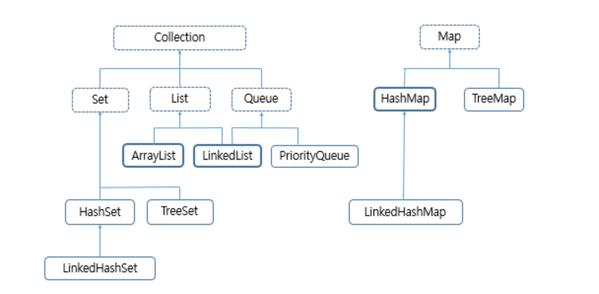

### Map이란?
키와 값으로 이루어진 자료구조입니다.  
키와 값은 1:1로 매칭이 됩니다. 해당 키는 중복되지 않습니다.  
키가 다르고, 값이 동일한 것은 다른 것으로 간주합니다.  

### Map 메서드
키,값 데이터 저장 : put(K key, V value)  
Map의 모든 데이터를 저장 : putAll(Map<? extends K, ? extends V> m)  
매개 변수로 넘어온 키에 해당하는 값 넘김 : get(Object key)  
매개 변수로 넘어온 키에 해당하는 값을 넘겨주며, 해당 키와 값은 Map에서 삭제(Object key)  
키의 목록을 Set타입으로 리턴 : keySet()  
값의 목록을 Collection 타입으로 리턴 : value()  
Map 안에 Entry라는 타입의 Set을 리턴 : entrySet()  
Map의 크기를 리턴 : size()  
Map의 내용 삭제 : clear()  

### Map 구현 주요 클래스
HashMap, TreeMap, LinkedHashMap, Hashtable이 있습니다.

### Hashtable이란
Hashtable 클래스는 Map 인터페이스를 구현했지만 일반적인 Map 인터페이스를 구현한 클래스들과는 다릅니다.  
- Map은 컬렉션 뷰를 사용하지만, Hashtable은 Enumeration 객체를 통해서 데이터를 처리합니다.  
- Map은 키,값,키-값 쌍으로 데이터를 순환하여 처리할 수 있지만, Hashtalbe은 이 중에서 키-값 쌍으로 데이터를 순환하여 처리할 수 없습니다.  
- Map은 이터레이션을 처리하는 동중에 데이터를 삭제하는 안전한 방법을 제공하지만, Hashtable은 그런 기능을 제공하지 않습니다.  

### 멀티 쓰레드 동시 접근 Map
```java
Map m = Collections.synchronizedMap(new HashMap(...));
```
Hashtable을 제외한 Map으로 끝나는 클래스들은 여러 쓰레드에서 동시에 접근하여 처리할 필요가 있을 때에는 위 코드처럼 선언해 주어야 합니다.  
Hashtable, Vector 클래스는 Thread-safety하게 개발되어 있습니다.  

### HashMap 알아가기
대부분 HashMap 객체를 생성할 때에는 매개 변수가 없는 생성자를 사용합니다.    
하지만, HashMap에 담을 데이터의 개수가 많은 경우에는 초기 크기를 지정해주는 것이 좋습니다.    
주의할 점은 직접 어떤 클래스를 만들어서 그 클래스를 키로 사용하는 경우엔 Object 클래스의 hashCode() 메소드와 equals() 메소드를 잘 구현해 놓아야만 합니다.  


HashMap에 객체가 들어가면 hashCode() 메서드의 결과 값에 따른 버켓이라는 목록 형태의 바구니가 만들어집니다.
서로 다른 키가 저장되어 있는데, hashCode() 메소드의 결곽가 동일하다면, 이 버켓에 여러 개의 값이 들어갈 수 있습니다.
그러므로, get() 메서드가 호출되면 hashCode()의 결과를 확ㅇ니하고, 버켓에 들어간 목록에 데이터가 여러 개일 경우 equals()메서드를 호출해 동일한 값을 찾게 됩니다. 
**키가 되는 객체를 직접 작성할 때**에는 hashCode()와 equals() 메소드를 꼭 구현해 놓아야합니다. 

### HashMap 값 추가
```java
public class MapSample {
    public static void main(String[] args) {
        MapSample mapSample = new MapSample();
        mapSample.checkHashMap();
    }
    
    public void checkHashMap() {
        HashMap<String, String> map = new HashMap<>();
        map.put("A", "a");

        System.out.println(map.get("A"));
        System.out.println(map.get("B"));
    }
}
```
출력결과
```
a
null
```

### HashMap 값 업데이트
```java
import java.util.HashMap;

public class MapSample {
    public static void main(String[] args) {
        MapSample mapSample = new MapSample();
        mapSample.checkHashMap();
    }

    public void checkHashMap() {
        HashMap<String, String> map = new HashMap<>();
        map.put("A", "a");
        map.put("A","b");
        System.out.println(map.get("A"));
        System.out.println(map.get("B"));
    }
}
```
출려결과
```
b
null
```

### HashMap 키 확인하기
```java
public void checkKeySet() {
        HashMap<String, String> map = new HashMap<>();
        map.put("A", "a");
        map.put("C","d");
        Set<String> keySet = map.keySet();

        for(String key: keySet) {
            System.out.println(key + "=" + map.get(key));
        }
    }
```
출력 결과
```
A=a
C=d
```
Set은 순서가 보장되지 않기때문에, 출력할때마다 값이 다르게 나옵니다.  


### HashMap 값 확인하기
```java
public void checkValues() {
        HashMap<String, String> map = new HashMap<>();
        map.put("A", "a");
        map.put("C","d");

        Collection<String> values = map.values();
        for(String value: values) {
            System.out.println(value);
        }
    }
```
출력 결과
```
a
d
```

### HashMap key,value 값 전부 확인하기
```java
public void checkHashMapEntry() {
        HashMap<String, String> map = new HashMap<>();
        map.put("A", "a");
        map.put("C","d");

        Set<Map.Entry<String,String>> entrySet = map.entrySet();
        for(Map.Entry<String, String> tempEntry: entrySet) {
            System.out.println(tempEntry.getKey()+"="+tempEntry.getValue());
        }
    }
```
출력 결과
```
A=a
C=d
```

### HashMap containsKey(), containsValue()
```java
public void checkContains() {
        HashMap<String, String> map = new HashMap<>();
        map.put("A", "a");
        map.put("C","d");

        System.out.println(map.containsKey("A"));
        System.out.println(map.containsKey("B"));
        System.out.println(map.containsValue("a"));
        System.out.println(map.containsValue("b"));
    }
```
출력 결과
```
true
false
true
false
```

### HashMap remove()
```java
public void checkRemove() {
        HashMap<String, String> map = new HashMap<>();
        map.put("A","a");
        map.remove("A");
        System.out.println(map.size());
    }
```
출력 결과
```
0
```

### TreeMap
TreeMap은 HashMap 객체의 키를 정렬해 줍니다.  
문자열 기준 정렬되는 순서는 숫자 > 알파벳 대문자 > 알파벳 소문자 > 한글 순입니다.

```java
public void checkTreeMap() {
        TreeMap<String, String> map = new TreeMap<>();
        map.put("A", "a");
        map.put("가", "e");
        map.put("1", "f");
        map.put("a", "g");

        Set<Map.Entry<String, String>> entries = map.entrySet();
        for(Map.Entry<String, String> entry: entries) {
            System.out.println(entry.getKey() + "=" + entry.getValue());
        }
    }
```
출력 결과
```
1=f
A=a
a=g
가=e
```
매우 많은 데이터를 TreeMap을 이용해서 보관하여 처리하는 경우는 정렬에 대한 추가 리소스로 인해 HashMap보다 느립니다.  

### Map을 구현한 Properties 클래스
Properties 클래스는 Hashtalbe을 확장했습니다. 따라서, Map 인터페이스에서 제공하는 모든 메서드를 사용할 수 있습니다.  
Properties는 키-값 쌍으로 구성된 설정 정보를 관리하는데 사용이 됩니다.
```java
public void checkProperties() {
        Properties prop = System.getProperties();
        Set<Object> keySet = prop.keySet();
        for(Object object: keySet) {
            System.out.println(object +"="+ prop.get(object));
        }
    }
```
출력 결과
```
java.runtime.version=17.0.7+7-LTS
user.name=developer
path.separator=:
os.version=13.5.1
java.runtime.name=OpenJDK Runtime Environment
file.encoding=UTF-8
java.vm.name=OpenJDK 64-Bit Server VM
java.vendor.version=Corretto-17.0.7.7.1
등등
```
### Properties를 사용한 IO 작업
```java
public void saveAdnLoadProperties() {
        try {
            String fileName = "test.properties";
            File propertiesFile = new File(fileName);
            FileOutputStream fos = new FileOutputStream(propertiesFile);
            Properties prop = new Properties();
            prop.setProperty("Writer", "Sangmin, Lee");
            prop.setProperty("WriterHome", "http://www.GodOfJava.com");
            prop.store(fos, "Basic Properties file"); // 주석 처리
            fos.close();

            FileInputStream fis = new FileInputStream(propertiesFile);
            Properties propLoaded = new Properties();
            propLoaded.load(fis);
            fis.close();
            System.out.println(propLoaded);
        } catch (Exception e) {
            e.printStackTrace();
        }
    }
```
FileOutputStream은 파일에 저장할 때, FileInputStream은 파일에서 읽을 때, File 클래스는 파일을 다룰 때 사용합니다.  
Properties 클래스를 사용하면 저장과 읽기 한 줄에 끝납니다.  

test.properties
```
#Basic Properties file
#Fri Jan 10 11:24:36 KST 2025
WriterHome=http\://www.GodOfJava.com
Writer=Sangmin, Lee
```

### Java 자료구조

Collection을 구현한 것은 List, Set, Queue이고 Map은 별도의 인터페이스로 되어 있습니다.


배열처럼 목록을 처리하기 위한 List의 대표적인 클래스는 ArrayList와 LinkedList가 있습니다.


List처럼 목록을 처리하긴 하지만, 데이터 중복이 없고, 순서가 필요 없는 Set의 대표적인 클래스는 HashSet, TreeSet, LinkedHashSet이 있습니다.


FIFO를 수행하는 Queue의 대표적인 클래스는 LinkedList와 PriorityQueue가 존재합니다. List는 Queue에도 속하고 List에도 속하는 특이한 클래스 입니다.


Map의 대표적인 클래스는 HashMap, TreeMap, LinkedHashMap이 있습니다.

Collection의 데이터 처리를 위해선 for 루프, iterator를 사용해 처리할 수 있습니다.  
