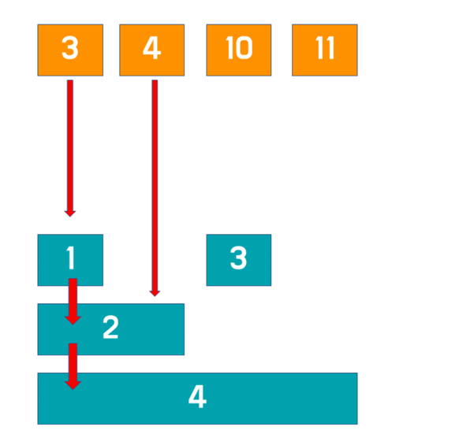

### 펜윅 트리란?
최하위 켜저있는 비트를 기반으로 트리를 만들어 동적배열에서 구간합을 효율적으로 구할 수 있는 자료구조  
구간합을 구하는 쿼리와 값을 갱신하는 작업을 O(logN)만에 할 수 있습니다.

참고할 점
최하위 켜져있는 비트는 비트마스킹 방식인 아래 코드를 사용합니다.
```java
int idx = (S & -S);
```

### 원리


그림과 같이 3,4,10,11 이라는 배열이 주어졌을 때 그림에서 파란색 노드를 만들어 구간합을 구하는 트리입니다.  
3이라는 요소는 파란색 1,2,4에 더해집니다. 4라는 요소는 파란색 2,4에 더해지고, 10이라는 요소는 3,4에 더해집니다.
이렇게 더해져 만들어진 파란색노드를 기반으로 보게 되면 4,10,11의 합은 파란색노드 4 - 파란색 노드 1이 됩니다.

### 코드
```java
public class FenwicTree {
    static int n;
    static int[] tree;
    
    // 값 업데이트
    static void update(int index, int value) {
        while(index < tree.length) {
            tree[index] += value;
            index += index & -index; // 현재 인덱스에서 가장 오른쪽의 1비트를 더해 다음 노드로 이동합니다.
        }
    }
    
    // 1부터 index까지의 합 계산
    static int sum(int index) {
        int ret = 0;
        while(index > 0) {
            ret += tree[index];
            index -= index &-index; // 현재 인덱스에서 가장 오른쪽의 1비트를 추출합니다.
        }
        
        return ret;
    }
    
    // 구간[left,right]의 합 계산
    static int rangeQuery(int left, int right) {
        return sum(right) - sum(left - 1);
    }
    
    public static void main(String[] args) {
        int[] data = {3,4,10,11};
        n = data.length;
        tree = new int[n + 1]; // 트리 배렬의 크기는 n + 1 (1-based index)
        
        for(int i = 0; i < n; ++i) {
            update(i + 1, data[i]); // 1 - based index 사용 
        }

        // 결과 출력
        System.out.println("1 ~ 4 sum: " + rangeQuery(1, 4)); // 28
        System.out.println("2 ~ 3 sum: " + rangeQuery(2, 3)); // 14

        // index 2에 5 더하기 (data[1] = 4 + 5 = 9)
        update(2, 5);
        System.out.println("1 ~ 4 sum: " + rangeQuery(1, 4)); // 33
        System.out.println("2 ~ 3 sum: " + rangeQuery(2, 3)); // 19
    }
}
```

index & -index를 해주는 이유  
트리 구조에서 상위 범위와 하위 범위로 이동하기 위한 인덱스를 효율적으로 계산하는 방법으로 사용됩니다.
상위 범위 이동 : index += index & -index  
하위 범위 이동 : index -= index & -index  
