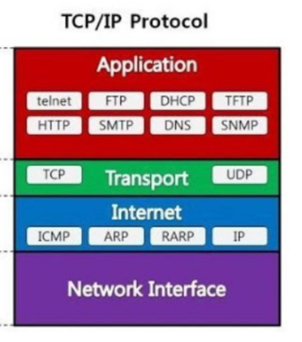

### 네트워크 프로그래밍이란?
스마트폰, 노트북 등으로 인터넷을 사용해왔습니다. 텔넷이나 FTP 등을 사용해서 서버와 통신을 해본 사람도 있습니다.  
사용자들이 바로 옆에 있는 장비와 데이터를 주고 받는 작업을 보통 네트워킹이라고 합니다.  

네트워킹은 레이어로 구분하도록 되어 있습니다.  

HTTP, FTP, Telnet들은 모두 TCP 통신을 합니다.  
Java에서 TCP 통신을 하려면 자바에서 제공하는 API를 사용하면 됩니다.  

TCP(Transmission Controll Protocal) : 상대방이 데이터를 받았는지 확실히 보장할 수 있습니다.
내부적으로 처리되는 절차가 복잡하게 되어있어 비용이 비싸고 느립니다.  
TCP 통신은 스트림 객체를 얻어 데이터를 주거나 받습니다.  

UDP(User Datagram Protocol) : 다른 장비가 데이터를 제대로 받았는지에 대해 보장할 수 없습니다.
TCP에 비해 절차가 간단해 비용이 저렴하고 빠릅니다.  
UPD 통신을 할 때는 스트림을 사용하지 않고, DatagramPacket이라는 클래스를 사용합니다.  

세상에 존재하는 모든 데이터가 꼭 전송이 보장되어야 할 필요는 없습니다.
100만개 중에 몇 개는 유실되어도 큰 문제가 되지 않는 시스템들이 있을 수 있습니다.  

### 포트란?
포트는 네트워크에서 데이터를 주고받는 출입구 또는 논리적 통신 채널입니다.
포트는 16비트로 구성되어 있으므로, 총 65,535까지 사용할 수 있습니다.

### 소켓 통신이란?
TCP 통신을 자바에서 수행하기 위해선 Socket 클래스를 사용하면 됩니다.  
Socket 클래스는 데이터를 보내는 쪽(보통 클라이언트)에서 객체를 생성하여 사용합니다.  
데이터를 받는 쪽(보통 서버)에서 클라이언트 요청을 받으면, 요청에 대한 Socket 객체를 생성하여 데이터를 처리합니다.  
Socket 클래스는 서버 쪽이 되었든, 클라이언트 쪽이 되었든 원격에 있는 장비와의 연결 상태를 보관하고 있다고 생각하면 됩니다.  

서버에서는 ServerSocket이라는 클래스를 사용해서 데이터를 받습니다.  
서버에서 요청에 대한 Socket 객체를 만든다고 한 부분은 별도로 new 키워드를 사용하여 만들 필요는 없고, ServerSocket 클래스에서 제공하는 메서드에서 클라이언트 요청이 생기면 Socket 
객체를 생성해서 전달해 줍니다.  

backlog란?
큐의 개수라고 생각하면 됩니다.  
ServerSocket 객체가 바빠서 연결 요청을 처리 못하고 대기시킬 때 필요한 최대 대기 개수를 의미합니다.  
backlog를 지정하지 않는 경우엔 기본값이 50개가 됩니다. 애플리케이션의 접속이 원활하지 못한 경우엔 이 개수를 적절히 증가시키는 것이 좋습니다.  

매개 변수가 없는 ServerSocket 클래스를 제외한 나머지 클래스들은 객체가 생성되자 마자 연결을 대기할 수 있는 상태가 됩니다.  
ServerSocke() 생성자는 별도로 연결 작업을 해야만 대기가 가능합니다.  

데이터를 받는 서버에서는 클라이언트에서 접속을 하면 Socket 객체를 생성하지만, 데이터를 보내는 클라이언트에서는 Socket 객체를 직접 생성해야만 합니다. 

UDP는 TCP와 다르게 데이터가 성공적으로 전송되지 않아도 예외를 발생시키지 않습니다.  
서버 프로그램을 종료하고, 클라이언트 프로그램을 수행해도 오류가 발생하지 않습니다.  
이와 반대로 TCP는 ConnectionException이 발생합니다.  