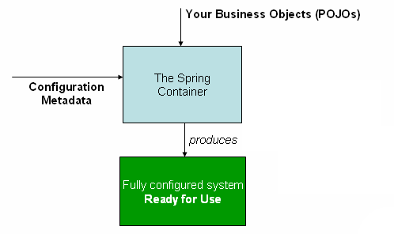

### Container Overview

**The org.springframework.context.ApplicationContext interfase represents the Spring IoC container and is 
responsible for instantiating.**
The org.springframework.context.ApplicationContext 인터페이스는 Spring IoC 컨테이너를 나타내며, 빈을 생성, 설정 및 구성하는 역할을 담당 합니다.

IoC 컨테이너의 구현체
Spring IoC 컨테이너는 2가지 주요 인터페이스를 기반으로 구성됩니다.  
(1) BeanFactory, (2) ApplicationContext  
BeanFactory는 가장 기본적인 IoC 컨테이너로, Bean 생성 및 의존성 관리만 수행하고, Lazy Initialization으로 동작합니다.  
ApplicationContext는 BeanFactory를 확장한 고급 IoC 컨테이너이고, Eager initialization 방식으로 동작합니다.  

IoC 컨테이너는 더 큰 개념이고,ApplicationContext는 그 중 하나의 구체적ㅇ니 구현체입니다. 

**The container gets its instruction on the components to instantiate, configure, and assemble by reading 
configuration metadata.** 
컨테이너는 설정 메타데이터를 읽어 컴포넌트를 생성, 설정 및 구성하는 데 필요한 지침을 얻습니다.


**The configuration metadata can be represented as annotated component classes, configuration classes with factory 
methods, or external XML files or Groovy scripts.**
설정 메타 데이터는 어노테이션이 적용된 컴포넌트 클래스, 팩토리 메서드를 포함한 설정 크래스, 외부 XML파일 또는 Groovy 스크립트로 표현될 수 있습니다.


팩토리 메서드를 포함한 설정 클래스 : @Configuration을 사용한 설정 클래스에서 @Bean 메서드를 통해 Bean을 정의하는 클래스를 말합니다. 


**With either format, you may compose your application and the rich interdependencies between those components**
어떤 형식을 사용하든 애플리케이션과 그 구성 요소 간의 복잡한 의존 관계를 구성할 수 있습니다.  

**Several implementations of the ApplicationContext interface are part of core Spring.**
ApplicationContext 인터페이스의 여러 구현체들은 core Spring에 포함되어 있습니다.  

**In stand-alone applications, it is common to create an instance of AnnotationConfigApplicationContext or 
ClassPathXmlApplicationContext.**
독립 실행형 어플리케이션에서는 AnnotationConfigApplicationContext 또는 ClassPathXmlApplicationContext의 인스턴스를 생성하는 것이 일반적입니다.


왜 일반적인가?  
스프링 프레임워크는 Spring IoC 컨테이너를 통해 애플리케이션의 Bean을 관리하고, 의존성을 주입합니다.  
AnnotationConfigApplicationContext와 ClassPathXmlApplicationContext는 Spring IoC 컨테이너의 구현체로, 애플리케이션 싫행 시 컨테이너를 초기화하고 
필요한 Bean을 생성/관리 합니다. 독립 실행형 애플리케이션은 서버 환경 없이 애플리케이션 내부에서 직접 컨테이너를 초기화해야 하기 때문에, 두 컨텍스트를 사용하는 것이 일반적 입니다.  
(1) AnnotationConfigApplicationContext는 Java Config 기반 설정을 할 때 주로 사용합니다.  
(2) ClassPathXmlApplicationContext는 XML 기반 설정을 사용할 때 주로 사용됩니다.  

**In most application scenarios, explicit user code is not required to instantiate one or more instances of a Spring IoC container**
대부분 어플리케이션 시나리오에서는 명시적인 사용자 코드가 하나 이상의 Spring IoC 컨테이너 인스턴스를 생성할 필요가 없습니다.  

자동 컨테이너 관리 방식을 강조하려고 하는 표현이다. -> 개발자가 명시적으로 코드에 IoC 컨테이너를 생성하지 않아도 되는 이유를 말하고 있습니다.


**For example, in a plain web application scenario, a simple boilerplate web descriptor XML in the web.xml file of the 
application suffices (see Convenient ApplicationContext Instantiation for Web Applications).**
예를 들어, 일반적인 웹 어플리케이션 시나리오에서는 애플리케이션의 web.xml파일에 간단한 기본적인 설정용 XML(web descriptor)을 작성하는 것으로 충분합니다.  

- plain web application scenario : 복잡한 설정이나 구성이 없는 웹 애플리케이션
- a simple boilerplate web descriptor XML : boilerplate는 최소한의 필수 코드 또는 설정을 의미합니다.  
- suffices : 충분하다.


**In a Spring Boot scenario, the application context is implicitly bootstrapped for you based on common setup 
conventions.**
Spring Boot 환경에서는 일반적인 설정 관례를 기반으로 애플리케이션 켄텍스트가 암묵적으로 부트스트랩(초기화) 됩니다.

- implicitly bootstrapped : Spring Boot가 기본 설정을 기반으로 자동으로 애플리케이션 컨텍스트를 초기호 해줍니다.  
- common setup conventions : 일반적으로 많이 사용하는 관례  

SpringBoot의 자동 설정(Auto-Configuration) 철학을 강조한 내용입니다. 


**The following diagram shows a high-level view of how Spring works.**  
다이어그램은 스프링이 작동하는 방식을 큰 그림으로 보여줍니다.


Your application classes are combined with configuration metadata so that, after the ApplicationContext is created 
and initialized, you have a fully configured and executable system or application.  
어플리케이션 클래스는 설정 메타데이터와 결합되어, ApplicationContext가 생성되고 초기화된 후에 완전히 구성되고 실행 가능한 시스템 또는 어플리케이션이 됩니다.  



Figure1. The Spring Ioc Container


### Configuration Metadata
**As the preceding, diagram shows, the Spring IoC container consumes a form of configuration metadata.
앞선 다이아 그림에서 보이듯이, Spring IoC Container는 설정 메타데이터의 한 형태를 사용합니다.**  

- As the preceding : 앞선, 이전의


**This configuration metadata represents how you, as an application developer, tell the Spring container to 
instantiate, configure and assemble the components in your application.**  
설정 메타데이터는 애플리케이션 개발자가 애플리케이션 내의 컴포넌트를 생성, 구성, 조립하는 방법을 스프링 컨테이너에게 전달하는 방식을 나타냅니다.


**The Spring IoC container itself is totally decoupled from the format in which this configuration metadata is 
actually written.**
Spring IoC 컨테이너 자체는 구성 메타데이터가 실제로 작성된 형식으로부터 완전히 분리되어 있습니다.  

- 의미 : Spring IoC 컨테이너는 구성 정보를 어떤 형식으로 작성했는지에 의존하지 않는다는 뜻입니다.  
- 형시에는 XML파일, Java기반 구성 파일, 프로퍼티 파일 또는 YAML 파일, 어노테이션 등이 있습니다.  


**These days, many developers choose Java-based configuration for their Spring applications:**
오늘날, 많은 개발자들이 스프링 애플리케이션을 자바 기반 구성으로 설정하는 것을 선택합니다.


**Annotation-based configuration : define beans using annotation-based-configuration metadata on your application's 
component classes.**
어노테이션을 기반 구성 : 어플리케이션의 컴포넌트 클래스에 어노테이션 기반의 메타데이터를 사용하여 빈들을 정의합니다.


**Java-based configuration: define beans external to your application classes by using Java-based configuration 
classes.**
Java기반 구성 : 자바 기반의 구성 클래스를 사용하여 애플리케이션 클래스 외부에 빈을 정의합니다.


**To use theses features, see the @Configuration, @Bean, @Import, and @DependsOn annotations.**
이 기능들을 사용하기 위해서, @Configuration, @Bean, @Import, and @DependsOn 어노테이션을 참조하세요


자바 기반 구성 클래스란?  
```java
@Configuration
public class AppConfig {

    @Bean
    public UserService userService() {
        return new UserService(userRepository());
    }

    @Bean
    public UserRepository userRepository() {
        return new UserRepository();
    }
}
```
자바 기반 구성이 어노테이션 기반 구성보다 더 큰 개념이라고 불 수 있습니다.  


**Spring configuration consists of at least one and typically more than one bean definition that the container 
must manage.**  
스프링 구성은 컨테이너가 관리해야 하는 최소 하나 이상의 빈 정의로 구성됩니다.  


**Java configuration typically uses @Bean annotated methods within a @Configuration class, each corresponding to one 
bean define.** 
Java 구성에서는 일반적으로 @Configuration 클래스 안에서 각 빈 정의에 해당하는 @Bean으로 어노테이션된 메서드를 사용합니다.  

- each corresponding to one bean define : 각 빈에 정의에 해당하는 
- correspond : 해당하다.


**These bean definitions correspond to the actual objects that make up your application.**
이 빈의 정의들은 어플리케이션을 구성하는 실제 객체에 해당됩니다.  


**Typically, you define sevice layer objects, persistence layer objects such as repositories or data access objects,
(DAOs), presentation objects such as Web controllers, infrastructure objects such as a JPA EntityMangerFactory, JMS 
queues, and so forth.**
전형적으로, 서비스 계층 객체, 레포지토리나 데이터 접근 객체와 같은 영속성 계층의 객체, Web 컨트롤러와 같은 표현 계층 객체, JPA 엔티티 매니저팩터리.JMS queue등과 같은 인프라스트럭쳐 
객체를 정의합니다.

- 인프라스트럭처 객체 : 애플리케이션의 주요 비즈니스 로직을 지원하는 데 필요한 시스템 수준의 구성 요소를 의미합니다.
ex) 데이터베이스, 메시징 시스템, 파일 시스템, 기타 외부 시스템과 통신하거나 상호작용할 수 있도록 지원하는 역하을 하는 시스템을 의미합니다.  


