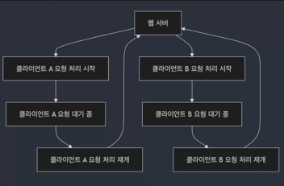
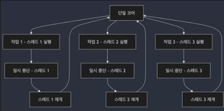
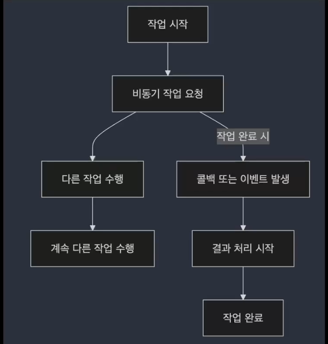
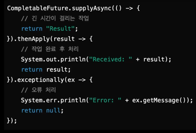
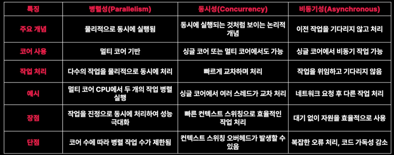

### 동시성 처리
- 동시성은 여러 작업이 동시에 실행되는 것처럼 보이도록 섥게된 시스템
- **실제로는 대부분의 경우 단일 코어에서 여러 작업이 분할되어 교차로 처리**
- 사용자는 각 작업이 동시에 실행되는 것처럼 느낌
- 멀티스레딩을 통해 각 작업을 독립적으로 실행 가능

### 동시성 처리의 실제 활용 : 웹 서버
웹 서버가 여러 클라이언트의 요청을 처리할 때, 각 요청에 대해 별도의 스레드를 생성하거나 작업을 교차적으로 처리하여 병렬성을 제공  

예시  
A사용자의 요청을 처리하다 잠시 중단하고,
B사용자의 요청을 처리한 후, 다ㅣㅅ A사용자의 요청을 처리하는 방식을 예시로 들 수가 있습니다.  
예시로는 Node.js가 있습니다. Node.js는 단일 스레드로 동작하지만, 비동기 I/O와 이벤트 루프를 통해서 동시성 처리를 할 수 있습니다.  

### 멀티스레딩(Multithreading) : 동시성 구현 방법
- 멀티 스레딩은 하나의 프로세스 내에서 여러 스레드를 사용하여 동시성 처리르 구현한다.
- 각 스레드는 독립적으로 실행되며, 자원을 효율적으로 사용하여 응답 시간을 단축한다.  

예시  
온라인 쇼핑몰에 주문 처리 시스템을 생각해 보자.  
수많은 고객이 동시에 주문을 처리하는 상황에서 멀티 스레딩을 사용하면, 각 **주문을 개별 스레드에서 처리** 할 수 있습니다.  
이부분을 통해서 고객들이 주문처리를 대기시간 없이 빠르게 주문을 완료하게 됩니다.  

### 병렬성(Parallenlism)과 동시성(Concurrency): 차이점과 활용 방식  

#### 병렬성
- 물리적인 개념으로, 멀티 코어에서 여러 작업이 동시에 처리되는 것
- 여러 코어가 동시에 각각의 작업을 처리하기 때문에 실제로는 작업이 동시에 수행 됨

대량의 데이터를 처리할 때, 데이터를 여러 코어에 나눠서 처리하면 처리 속도가 크게 향상됩니다.  
ex) 미디어 인코딩 작업에서 각 프레임을 여러 코어에서 병렬로 처리해서 인코딩 속도를 높일 수 있습니다.  

#### 동시성
- 동시성은 논리적인 개념으로, **싱글 코어**에서 여러 스레드를 번갈아가며 빠르게 실행해 마치 동시에 여러 작업이 수행되는 것처럼 보이게 만드는 방식  
- 

ex) 사용자 입력, 네트워크 요청, 애니메이션과 같은 이벤트를 동시적으로 처리하는 것처럼 보이지만, 실제로는 이벤트 루프를 사용해 각 이벤트를 빠르게 전환하여 처리할 수 있게 됩니다.  

### 동시성 처리의 이점과 고려 사항

#### 장점
- 자원 효율성 ; 시스템 자원을 최대한 활용하여 작업을 빠르게 처리
- 응답성 ; 여러 작업을 동시에 처리하여 대기시간을 줄이고, 특히 사용자 인터페이스에서 중요한 역할  

#### 단점
- 스레드 관리 문제 : 여러 스레드를 생성하고 관리하는 것은 복잡할 수 있으며, 잘못 관리하면 교착 상태(DeadLock)나 경쟁 상태(Race Condition)같은 문제가 발생  
- 동기화 문제 : 스레드가 공유 자원을 동시에 접근할 때, 적절한 동기화 매커니즘이 없다면 데이터 손상이 발생  
특히, 공유 자원을 여러 스레드가 동시에 접근할 때, 적절한 동기화 없이 처리를 하게되면, 데이터가 불완전하게 변경되거나 손실이 될 수 있습니다.  
이런 문제를 해결하기 위해서 Lock이나 세마포어와 같은 동기화 매커니즘을 사용해야 합니다. 

### 비동기 처리
- 특정 작업이 완료될 때까지 기다리지 않고 다른 작업을 계속 진행할 수 있는 처리 방식
- 작업이 **완료될 때까지 대기하지 않기 때문에, 시스템은 그 동안 CPU 자원을 다른 작업에 할당 할 수 있다.**
- 작업이 완료되면 콜백(Call Back)이나 이벤트(Event)를 통해 결과를 알리고, 그 결과에 대한 추가 작업이 수행

### 비동기 처리의 실제 예시 : 네트워크 요청과 UI
- 네트워크 요청 작업
- 파일 다운로드와 사용자 인터페이스

네트워크 요청은 서버와 통신하는데 시간이 걸릴 수 있으므로, 동시 처리 방식으로 하게 되면 어플리케이션이 느려지거나 멈출 수 있습니다.  
앱에서는 파일을 다운로드 하는 동안 다른 작업을 수행할 수 있습니다.  

### 동기와 비동기 처리의 차이점

#### 동기
- 작업이 순차적으로 실행됩니다. 하나이 작업이 완료되기 전까지 다른 작업을 시작하지 않으며, 작업 완료를 기다린 후 다른 작업을 수행합니다.  

## 비동기
- 작업을 요청한 후 기다리지 않고 다른 작업을 처리할 수 있습니다. 작업이 완료되면 그 결과를 나중에 처리할 수 있고, 작업이 완료될 때 콜백 또는 이벤트를 통해 알림니다.  

### 비동기 처리의 이점과 한계
#### 장점
- 병목 현상 완화 : 비동기 처리는 긴 시간이 소요되는 작업(네트워크 동신, 파일 읽기/쓰기)이 진행되는 동안 시스템 자원을 더 효율적으로 사용할 수 있게 합니다.  
- 성능 개선 : 네트워크 요청이나 파일 입출력 같은 작업에서 비동기 처리는 매우 유용합니다.  

#### 단점
- 코드 복잡성 : 비동기 처리르 사용하면 코드의 흐름이 복잡해집니다.
- 오류 처리의 어려움 : 비동기 작업 중 발생하는 오류(Exception)는 즉시 감지하기가 어렵습니다.  

