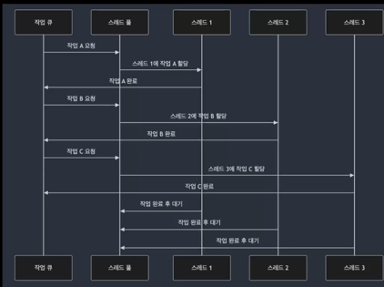
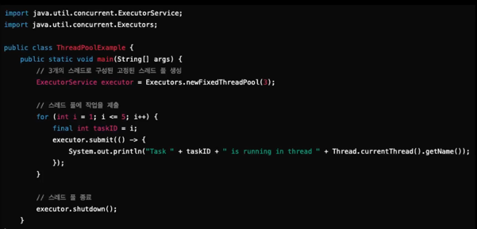
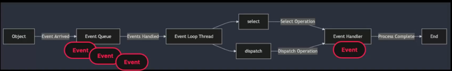
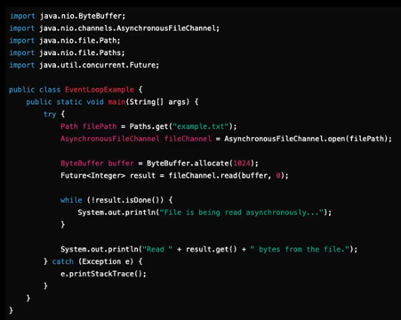
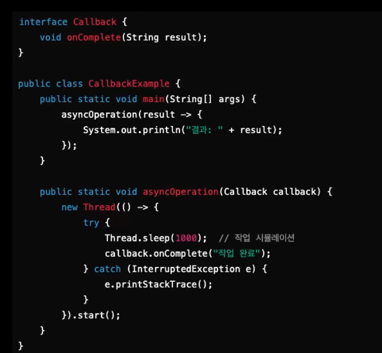
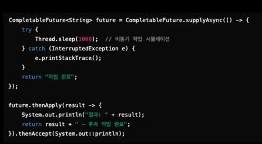
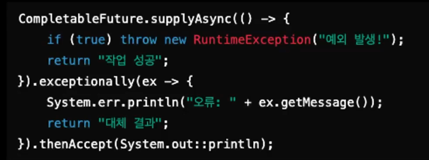

### 동시성 처리 개념(Concurrency)

- 동시성은 여러 작업이 동시에 진행되는 것처럼 보이도록 설계된 시스템
- 실제로는 대부분의 단일 코어에서 여러 작업이 분할되어 교차로 처리
- 사용자는 각 작업이 동시에 실행되는 것처럼 느낌
- 멀티스레딩을 통해 각 작업을 돌깁적으로 실행 가능

### 스레드 풀의 구조 및 활용
- 미리 생성된 스레드의 집합으로, 작업이 들어올 때마다 새로운 스레드를 생성하는 대신, 이미 생성된 스레드를 재사용하여 작업을 처리 합니다.
- 스레드 풀을 사용하면 스레드 생성 및 소멸에 따른 오버헤드를 줄일 수 있어서, 동시성 처리에서 자원을 효율적으로 관리합니다.

- 스레드 풀은 여러 작업을 동시에 처리하기 위해 미리 생성된 스레드의 집합을 유지
- 스레드 풀에 작업을 제출하면, 해당 작업이 스레드 풀의 사용 가능한 스레드에 할당
- 스레드가 작업을 마치면, 그 스레드는 다른 작업에 할당되기 전까지 대기 상태

스레드 풀을 사용할 때는 적절한 크기를 조절하는 것이 중요합니다.

Java의 Executors API

newFixedThreadPool() -> 고정된 크기의 스레드 풀을 생성 가능
스레드 풀이 너무 작으면 작업량 처리 제한, 너무 많은경우 메모리 리소스 낭비

### 스레드 풀 사용시, 고려해야 할 점
- 스레드 풀의 크기
- 작업의 종류
- 스레드 생성과 파괴의 비용
- 메모리 사용량
- 동기화 문제
- 응답 시간과 처리량

CPU 집약적인 작업인 경우 스레드 갯수를 CPU 코어 수에 맞춰놔야 한다.  
I/O 집약적인 작업은 스레드가 대기하는 시간이 많기 때문에, 더 많은 스레드를 할당해서 다른 작업을 하도록 만들어야 합니다.  

스레드를 생성하고 파괴하는 것은 비용이 많이드는 작업입니다. 
스레드 풀 설정을 통해 초기 스레드 수, 최대 스레드 수, 유효시간등을 조절해서 스레드 시간을 동적으로 조절하는 것도 좋은 방법입니다.  

각 스레드는 자신의 stack 메모리를 필요로 하게 된다. 스레드 수가 많아지면 필요한 메모리 용량이 증가합니다.  
여러 스레드가 공유 자원에 접근을 할때 동기화 문제가 발생할 수 있습니다. 

동기화 메커니즘을 잘 사용하면, 성능이 저하될 수 있으므로, 가능한 락 경쟁률을 최소화하고, 락 프리 알고리즘을 고려하는 것이 좋다.  

스레드 풀 설정을 조절해서 최적화를 해야합니다.
빠른 응답시간이 중요한 경우 스레드 풀 설정 증가  

### 비동기 처리 개념
비동기 처리는 특정 작업이 완료될 때까지 기다리지 않고 다른 작업을 계속 진행할 수 있는 처리 방식  

이는 작업이 완료될 때까지 대기하지 않기 때문에, 시스템은 그동안 CPU자원을 다른 작업에 할당할 수 있습니다.  
작업이 완료되면 **콜백(Call Back)이나 이벤트(Event)**를 통해 결과를 알리고, 그 결과에 대한 추가 작업이 수행됩니다.

### 비동기 처리와 이벤트 루프

- 이벤트 루프 : 비동기 처리를 위한 구조로, 하나의 스레드가 여러 작업을 순차적으로 처리하는 방식
- 입출력(I/O) 작업에서 매우 효율적
- 이벤트 루프는 단일 스레드 기반으로 동작하며, 비동기 작업이 완료될 때마다 이벤트 큐에 있는 작업을 처리합니다.

### 비동기 처리와 이벤트 루프 : Java

### 이벤트 루프가 입출력 작업에 적합한 이유
- 논블로킹(Non-Blocking) I/O 모델
- 효율적인 자원 사용
- 반응성 유지(실시간 반응 application)

### 비동기 작업의 오류 처리 및 콜백 패턴
콜백 패턴
- 콜백 함수는 비동기 작업이 완료된 후 실행될 작업을 미리 등록해 두는 방식
- 단순하고 효율적이지만, 콜백 지옥이라 불리는 복잡한 구조가 될 수 있다.

#### Java의 비동기 API 디자인
CompletableFuture
- 비동기 작업의 결과를 비동기적으로 처리할 수 있는 Java의 강력한 API
- JavaScript의 Promise와 유사하며, 비동기 작업이 완료되면 그 결과를 사용해 후속 작업을 정의 가능

### 비동기 처리시 유의사항
- 스레드 안정성 : 스레드가 공유 자원에 접근할 때, 적절한 **동기화 매커니즘**(ex: synchroized를 사용)

예외처리 필요 : CompletableFuture에서 exceptionally()를 사용해여 비동기 작업에서 발생한 예외를 처리  

