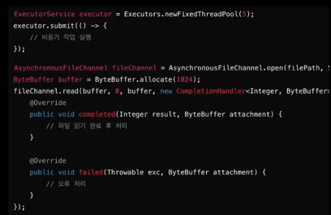
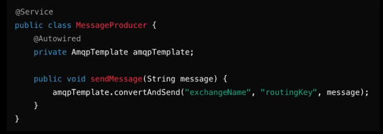
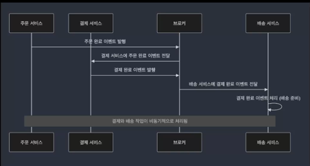

### 비동기 처리 시스템의 이해 : 비동기 처리의 개념 

- 비동기 처리는 작업을 병렬로 수행하는 개념으로, 하나의 작업이 완료되기까지 기다리지 않고 다른 작업을 시작할 수 있는 방식
- 대표적으로 I/O 작업에서 대기 시간이 길어질 경우, 프로그램은 다른 작업을 처리하며 대기 시간을 효율적으로 사용

### 비동기 처리 시스템의 이해 : 비동기 처리의 필요성
- 동기 처리는 작업이 완료될 때까지 호출자가 대기하는 방식, 한 작업이 끝나기 전까지 다른 작업을 수행할 수 없음
- 비동기 처리는 호출자가 대기하지 않고, 작업이 끝났을 때 콜백이나 이벤트를 통해 작업 완료를 알림

대용량 트래픽은 비동기적으로 요청을 처리해야 합니다.  

### 비동기 처리 시스템의 규모 확장 : 단일 프로세스에서 비동기 처리
- 작은 시스템에서는 자원의 효율적 사용이 중요하다.
- I/O 작업(파일 읽기, 네트워크 요청 등)은 처리 시간이 길어질 수 있다.
- 비동기 처리를 통해 그 대기 시간을 활용하여 다른 작업을 진행함으로써 전체 성능을 향상시킬 수 있다.
- CPU 자원이 놀지 않고 계속 작업을 처리하도록 돕는 것이 비동기 처리의 핵심 장점이다.  

### Java에서 비동기 처리의 기본 구성
- 스레드 풀(Thread Pool)
- 이벤트 루프(Event Loop)를 활용한 비동기 처리

### 대규모 시스템에서의 비동기 처리
- 대규모 시스템에서는 많은 요청이 동시에 들어오고, 이러한 요청을 효율적으로 처리하기 위해서는 비동기 처리가 필수적
- 트래픽이 많은 환경에서 비동기 처리를 통해 시스템의 확장성과 안전성을 보장할 수 있음
- 이때 비동기 메시징 시스템 사용하여 아키텍처를 확장

### 비동기 메시징 시스템 이해
- 비동기 메시징 시스템은 시스템 간 또는 애플리케이션 내부의 여러 구성 요소 간 **통신을 비동기적으로 처리**하는 방식
- 작업이 비동기적으로 처리되기 때문에 각 구성 요소가 독립적으로 작업을 수행할 수 있어, 시스템의 확장성과 성능을 크게 향상 시킬 수 있다.
- 메시지 큐(Message Queue)와 메시지 브로커(Messsage Broker)가 이러한 비동기 메시징 시스템의 핵심 요소 

### 메시지 큐와 메시지 브로커
- 메시지 큐(Message Queue) : 메시지를 큐에 저장해 두고, 소비자가 준비되면 메시지를 비동기적으로 처리하는 역할
  이메일 전송, 배치 작업, 데이터 처리 작업처럼 시간을 걸리는 작업을 비동기 처리할 때 사용
  시스템간 이벤트가 발생할 때, 즉각적인 응답을 줄 필요 없이 나중에 해당 이벤트를 처리할 수 있는 환경을 제공해 줍니다.

- 메시지 브로커(Message Broker) : 이벤트 브로커는 발행-구독 패턴을 기반으로 여러 서비스가 이벤트를 구독하고, 특정 이벤트가 발생할 때 이 이벤트를 비동기적으로 구독자에게 전달

### 비동기 메시징 시스템 이해: 메시징 시스템을 통한 비동기 처리
- 한 서비스가 작업을 완료하기 전에 메시지 큐에 넣고, 다른 서비스가 비동기적으로 이를 처리함으로써 시스템의 부하를 줄일 수 있습니다.
- 간단 적용

RabbitMQ

### Messsage Queue
- 비동기 처리에서 자주 사용되는 작업 큐는 요청을 처리하기 위해 순차적으로 저장된 작업을 관리
- Producer가 메시지 큐를 넣고, Consumer는 큐에서 메시지를 꺼내 비동기적으로 처리
- 큐는 작업을 병렬로 분산 처리하는 데 중요한 역할

트래픽이 몰리면 consumer 수를 늘려 메시지를 더 빨리 처리할 수 도 있습니다.  
트래픽이 몰려 순간적으로 폭주를 하더라도 모든 요청을 실시간으로 처리하지 않아도 되기 때문에, 시스템 안정성을 유지할 수 있습니다.

### Event-Driven Architecture
- 서비스 간 느슨한 결합과 실시간 반응성을 제공하는 또 다른 비동기 메시징 시스템
- 이벤트 기반 아키텍처는 시스템 내에서 발생하는 상태 변화를 이벤트로 처리하고, 각 서비스는 이 이벤트에 비동기적으로 반응하는 구조  

### 비동기 메시징 시스템의 확장성과 안전성 보장
- 확장성 : 메시지 큐나 이벤트 버스는 필요에 따라 소비자 또는 서비스 인스턴스를 동적으로 추가할 수 있어, 대규모 트래픽을 처리하기 위한 확장성을 보장
- 안정성 : 각 서비스가 독립적으로 동작을 할 수 있어 시스템의 한 부분에 문제가 생기더라도 전체 시스템이 중단되지 않고 작동  
