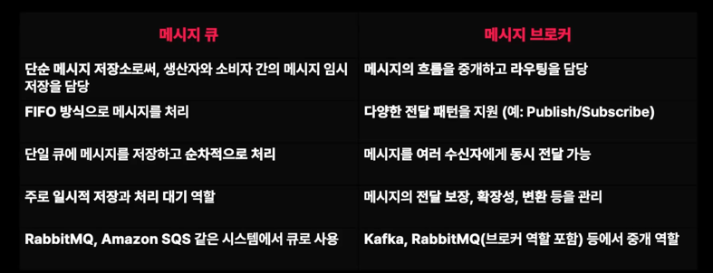
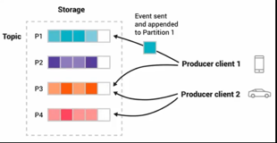

### 비동기 메시징 시스템이란?

- 프로듀서와 컨슈머가 독립적으로 동작하며, 서로 직접적으로 데이터를 주고받지 않고 메시지 큐나 이벤트 버스와 같은 중간 매체를 통해 통신하는 시스템  

**비동기 메시징 시스템의 필요성**
- 대규모 시스템에서는 매 순간 수많은 요청이 동시에 들어오며, 이를 모두 동기적으로 처리하게 되면 시스템에 과부하가 발생할 수 있다.
- 이때 비동기 메시징 시스템은 트래픽을 효율적으로 분산하고, 확장성을 보장하는 데 중요한 역할
- 주요 목적은 시스템 간 느슨한 결합과 작업의 병렬 처리를 통해 효율성을 극대화

### 이벤트 버스
- 이벤트 버스는 시스탬 내에서 발생하는 이벤트를 전달하는 비동기 메시징 시스템
- 이벤트는 시스템 내의 상태 변화나 사용자 액션에 의해 발생하며, 이를 처리하기 위해 비동기적으로 여러 서비스 간에 전달

이벤트 버스의 동작 원리
- Event Producer : 이벤트를 발생시키는 주체
- Event Bus : 이벤트를 구독하고 있는 여러 서비스로 전달하는 역할
- Event Consumer : 이벤트를 구독하고 있는 서비스

### 메시지 큐(Messsage Queue)
- 메시지 큐는 프로듀서가 생성한 메시지를 큐에 넣고, 이를 소비자가 준비된 후에 처리하는 구조
- 이 방식은 서비스 간 느슨한 결합을 가능하게 하고, 확장을 높이는데 유용

메시지 큐의 동작 원리
- Producer : 메시지를 생성하여 큐에 넣는 주체
- Queue : 메시지가 일시적으로 저장되는 공간 
- Consumer : 큐에서 메시지를 가져가 처리하는 주체

순간적인 트래픽을 올리더라도 큐에 메시지가 저장되어 순차적으로 처리가 될 수 있고,
consumer수를 늘리면, 메시지를 더 빨리 처리할 수 있으므로 트래픽 증가를 유연하게 처리할 수 있습니다.  

### 메시지 브로커
- 메시지 브로커는 메시지 큐나 이벤트 버스와 비슷한 개념이지만, 더 큰 범위에서 시스템 간 통신을 중개하는 역할
- 메시지 브로커는 서로 다른 애플리케이션이나 시스템 간에 비동기 메시지를 전달
- RabbitMQ, KafKa와 같은 도구가 여기에 해당

브로커의 주요 역할
- 메시지 저장 : 메시지를 큐에 저장하여, 시스템이 메시지를 손실하지 않고 안정적으로 전달
- 트래픽 분산 : 브로커는 트래픽을 효율적으로 분산시켜 시스템에 과부하가 발생하지 않도록 도와줌
- 서비스 간 중재 : 서로 다른 시스템 간의 메시지를 중개하여, 각 시스템이 독립적으로 동작할 수 있도록 함

시스템의 안정성을 높입니다.  
메시지 브로커는 장애 발생시 메시지를 손실하는 것이 아닌, 시스템이 복구될 때까지 메시지를 다시 처리할 수 있습니다.  

Message Queue vs Message Broker

### 주요 비동기 메시징 시스템 : Apache Kafka
분산 처리 : Kafka는 클러스터로 구성되어 대규모 데이터 분산 처리하며, 수평적으로 확장 가능
높은 처리량과 지연 시간 최소화 : Kafka는 고속의 데이터 처리량을 제공하며, 식시간 데이터 스트리밍 처리에 매우 적합하다.  
토픽(Topic) 기반 구조 : Kafka는 데이터를 토픽으로 관리합니다.  
프로듀서가 메시지를 특정 토픽에 게시하면, 이를 구독한 여러 소비자가 동시에 데이터를 처리할 수 있습니다.  
순서 보장 : Kafka는 각 파티션 내에서 메시지의 순서를 보장하며, 메시지의 손실 없이 내구성을 보장하는 로그 저장 방식을 채택합니다.  
내구성 보장 : Kafka는 데이터를 디스크에 저장하며, 메시지의 손실을 방지하기 위해 복제(replication)지원 합니다.  

카프카를 사용한 다양한 예시
실시간 로그 분석, 데이터 스트리밍, 이벤트 소싱
카프카는 시스템 로그를 실시간으로 수집하고 분석하는데 적합하고, 대규모 스트리밍 데이터를 처리하는데 사용되고, 소셜미디어, 피드, 센서 데이터 수집 등에도 활용이 됩니다.  

### 주요 비동기 메시징 시스템 : RabbitMQ
- 큐 기반 구조 : 프로듀서가 메시지를 큐에 넣고, 컨슈머가 그 큐에서 메시지를 가져가 처리하는 방식, 이는 메시지를 비동기적으로 처리하는 데 적합함
- 메시지 라우팅 : RabbitMQ는 메시지 라우팅 옵션을 제공하여, Direct Exchange, Fanout Exchange, Topic Exchange 등을 통해 조건에 맞는 메시지 큐로 전달  
- 스케줄링 및 우선 순위 메시징 : RabbitMQ는 메시지 우선순위를 설정할 수 있으며, 메시지의 스케줄링도 지원
- 내구성 있는 메시지 저장 : 메시지를 디스크에 저장하여 시스템 장애 발생 시에도 메시지 손실을 방지
- 확장성 : 클러스터링을 통해 RabbitMQ를 확장할 수 있으며, 분산 처리 환경에서 높은 가용성을 제공  

