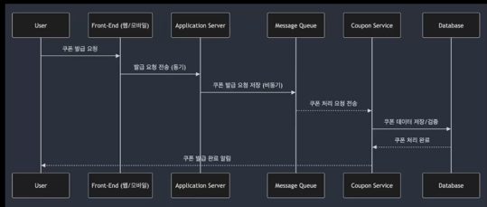

### 비동기 처리의 주요 장점
- 높은 확장성
- 시스템 리소스 최적화(I/O대기 시간 감소)
- 높은 응답성

### 높은 확장성
- 비동기 처리 시스템은 시스템이 동시에 처리할 수 있는 작업의 수를 크게 늘리는 것이 가능  
- 특히 트래픽이 증가하는 상황에서도 시스템이 효율적으로 확장 가능합니다.  

### 시스템 리소스 최적화(I/O 대기 시간 감소)
- 비동기 시스템은 I/O 대기 시간을 줄여 시스템 리소스를 최적화
- 동기적 방식에서는 작업 완료를 기다리면서 CPU나 메모리 자원을 낭비할 수 있지만, 비동기 방식에서는 대기 중에도 다른 작업을 처리합니다. 

### 높은 응답성
- 비동기 시스템은 사용자에게 빠른 응답을 제공할 수 있음
- 실시간 시스템에서는 비동기 처리는 사용자 경험을 크게 향상

### 비동기 처리의 주요 단점
- 복잡한 오류 처리 및 디버깅
- 순서 보장 문제(Message Ordering)
- 상태 관리의 어려움(State Management)

### 복잡한 오류 처리 및 디버깅
- 비동기 시스템은 비동기적인 흐름에서 발생하는 오류를 처리하고 디버깅하는 것이 복잡할 수 있습니다.
- 작업이 병렬로 처리되기 때문에 오류가 발생한 시점과 원인을 정확히 파악하기 어렵습니다.  
사가 패턴으로 보상작업을 하더라도 보상작업에서 문제가 생길 수 있습니다.

### 순서 보장 문제(Message Ordering)
- 비동기 처리에서는 메시지 순서 보장이 어렵습니다.
- 여러 작업이 동시에 실행되면서, 처리 순서가 중요한 경우 문제가 발생할 수 있습니다.
데이터 불일치가 발생할 수 있습니다.  
특히, 돈과 관련된 문제를 해결하는 경우 ex) 입금과 출금이 바뀌는 경우  

### 상태 관리의 어려움
- 비동기 작업이 병렬로 처리되므로, 공유 상태에 대한 접근과 관리가 복잡해질 수 있습니다.
- 잘못된 상태 관리로 인해 **데이터 일관성**이 깨질 가능성이 존재합니다.

### 실제 비동기 처리 시스템의 예시
- 푸시 알림 시스템에서의 비동기 처리
- 쿠폰 발급 시스템에서의 비동기 처리
- 채팅 시스템에서의 비동기 처리
- 실시간 주문 처리 시스템에서의 비동기 처리
- 이메일 발송 시스템에서의 비동기 처리

### 푸시 알림시스템에서의 비동기 처리
- 이벤트 기반 비동기 처리
- 메시지 큐와 푸시 시스템
- 실시간 알림 처리

뉴스 앱에서 새로운 기사가 업데이트 될 때 실시간으로 푸시 알림을 발송하거나, 메시징 앱에서 새로운 메시지가 왔을 때 알림을 제공하는 시스템에서 비동기 처리  

### 쿠폰 발급 시스템에서의 비동기 처리
- 쿠폰 발급 요청 비동기 처리
- 쿠폰 발급 중복 방지 및 순차 처리
- 비동기 작업으로 백엔드 처리 최적화

온라인 쇼핑몰에서 특정 이벤트 기간 동안 수많은 사용자에게 동시에 쿠폰을 발급하는 시스템에서 사용  
타임 세일이나 이벤트 쿠폰 발행 시에 사용자가 빠르게 쿠폰을 받을 수 있도록 비동기 처리를 통해 부하를 분산  

### 채팅 시스템에서의 비동기 처리
- 메시지 큐 기반 처리
- 실시간 데이터 전송
- 다중 사용자 동시 처리

메신저 애플리케이션에서 사용자의 채팅 메시지를 실시간으로 전달하는 시스템  
Slack이나 WhatsApp과 같은 서비스는 비동기 메시징 시스템을 통해 다수의 사용자 간의 빠른 메시지 전송을 보장  

### 실시간 주문 처리 시스템에서의 비동기 처리
- 주문 요청 비동기 처리
- 재고 관리 시스템과의 비동기 통신
- 결제 처리 비동기화

배달 앱이나 전자 상거래 시스템에서 수백 개의 주문을 동시에 처리하는 상황에서 사용
주문 폭주 시에도 서버가 안정적으로 주문을 처리할 수 있도록 비동기 처리 시스템이 적용

### 이메일 발송 시스템에서의 비동기 처리
- 이메일 발송 큐 관리
- 실시간 이메일 발송과 대기 처리
- SMTP 서버와 비동기 통신

마케팅 캠페인 이메일이나 주문 확인 이메일을 대량으로 발송하는 시스템에서 비동기 큐를 사용하여 부하를 관리하고, 안정적인 이메일 발송을 보장  

