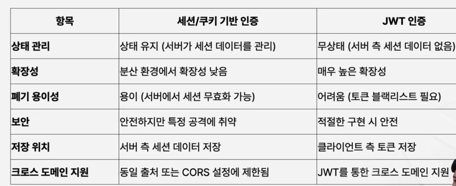
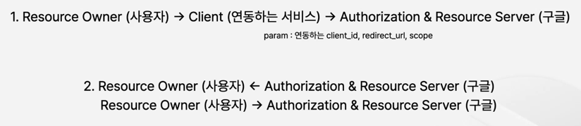
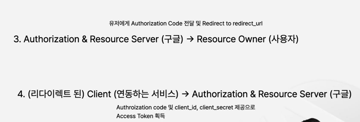

## JWT 인증과 인가, Oauth개념

### JWT란
Json Web Token, 서버와 클라이언트 사이 통신에서 사용 되는 Json 형태의 웹 토큰  

왜 사용할까?  
서버의 확장성이 높고, 특정 db나 서버에 의존하지 않아도 된다.  

### JWT구성
헤더, 페이로드, 서명으로 구성

서명
aaaa.bbbb.cccc //  헤더, 페이로더, 시그나처  

헤더 : 토큰 유형, 사용되는 서명 알고리즘  
페이로드 : 사용자에 대한 데이터(사용자 id, 만료시간, 역할)  
서명 : 토큰의 무결성과 인증을 보장, 인코딩된 헤더 + 페이로드 + 비밀키

### JWT 인증 방식
1. 사용자가 로그인하면 서버에서는 JWT키 값을 반환
2. 전송된 JWT 주로 로컬스토리지나 쿠키에 저장
3. 이후 서버로 요청할 때에 클라이언트에서 Header에 담아서 내보냄(Authroization)
4. 토큰을 받은 서버는 서명을 확인하고 내용을 파싱해서 데이터를 이용  

추가적인 토큰이 만료되면 refresh Token으로 재발급  

### 세션과 JWT

### 인증과 인가의 차이
인증 : 사용자를 식별하는 프로세스  
인가 : 권한을 확인하는 프로세스  

인증은 로그인 같은 사용자를 확인하는 과정인 것에 반해
인가는 유저가 이 API를 사용할 수 있는 권한을 확인하는 것이다.  

JWT에 User의 권한과 Role base로 추가해 admin과 일반 유저를 구분합니다.  

### Oauth
third-party 애플리케이션에서 유저의 정보에 접근할 수 있게해준 프로토콜  
단, 비밀번호와 같은 것을 같이 공유 하지 않고 제한된 정보만 제공하게 합니다.  

### Resource Owner
1. ResourceOwner - 데이터를 가지고 있는 유저
2. Client - 데이터 접근을 하려는 서드파티 애플리케이션
3. Authorization & Resource Server - 토큰을 만들고 데이터를 제공하는 서버  

### Oauth 동작방식

우리가 만든 서비스에서 구글 로그인 화면이 띄워지고, 로그인을 하게 되면 Redirect URL로
Authorization 코드와 함께 이동이 되고, 우리가 만든 서비스는 마지막으로 이 코드를 가지고 구글에 
토큰을 요청하는 방식입니다.  