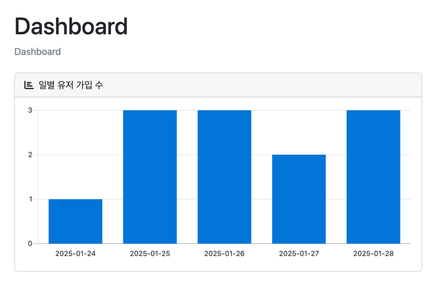
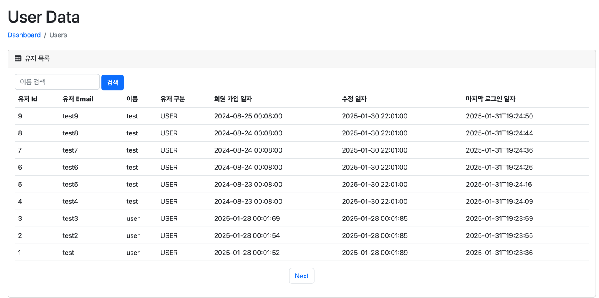

```java
package org.sangyunpark99.admin.ui;

import lombok.RequiredArgsConstructor;
import org.sangyunpark99.admin.ui.dto.GetTableListResponse;
import org.sangyunpark99.admin.ui.dto.users.GetUserTableRequestDto;
import org.sangyunpark99.admin.ui.dto.users.GetUserTableResponseDto;
import org.sangyunpark99.admin.ui.query.AdminTableQueryRepository;
import org.sangyunpark99.admin.ui.query.UserStatsQueryRepository;
import org.springframework.web.bind.annotation.GetMapping;
import org.springframework.web.bind.annotation.RequestMapping;
import org.springframework.web.bind.annotation.RestController;
import org.springframework.web.servlet.ModelAndView;

@RestController
@RequestMapping("/admin")
@RequiredArgsConstructor
public class AdminController {

    private final UserStatsQueryRepository userStatsQueryRepository;
    private final AdminTableQueryRepository adminTableQueryRepository;

    @GetMapping("/index")
    public ModelAndView index() {
        ModelAndView modelAndView = new ModelAndView();
        modelAndView.setViewName("index");

        modelAndView.addObject("result", userStatsQueryRepository.getDailyRegisterUserStats(100));

        return modelAndView;
    }

    @GetMapping("/users")
    public ModelAndView users(GetUserTableRequestDto dto) {
        ModelAndView modelAndView = new ModelAndView();

        modelAndView.setViewName("users");

        GetTableListResponse<GetUserTableResponseDto> result = adminTableQueryRepository.getUserTableData(dto);

        modelAndView.addObject("requestDto", dto);
        modelAndView.addObject("userList", result.getTableData());
        modelAndView.addObject("totalCount", result.getTotalCount());

        return modelAndView;
    }
}
```

유저 상태 그래프로 조회
```java
package org.sangyunpark99.admin.repository;

import com.querydsl.core.types.Projections;
import com.querydsl.jpa.impl.JPAQueryFactory;
import lombok.RequiredArgsConstructor;
import org.sangyunpark99.admin.ui.dto.users.GetDailyRegisterUserResponseDto;
import org.sangyunpark99.admin.ui.query.UserStatsQueryRepository;
import org.sangyunpark99.common.TimeCalculator;
import org.sangyunpark99.user.repository.entity.QUserEntity;
import org.springframework.stereotype.Repository;

import java.util.List;

@Repository
@RequiredArgsConstructor
public class UserStatsQueryRepositoryImpl implements UserStatsQueryRepository {

    private final JPAQueryFactory queryFactory;
    private static final QUserEntity userEntity = QUserEntity.userEntity;


    @Override
    public List<GetDailyRegisterUserResponseDto> getDailyRegisterUserStats(int beforeDays) {
        return queryFactory
                .select(
                        Projections.fields(
                                GetDailyRegisterUserResponseDto.class,
                                userEntity.regDt.as("date"),
                                userEntity.count().as("count")
                        )
                ).from(userEntity)
                .where(userEntity.regDt.after(TimeCalculator.getDateDaysAgo(beforeDays)))
                .groupBy(userEntity.regDt)
                .orderBy(userEntity.regDt.asc())
                .fetch();
    }
}
```

유저 정보 조회
```java
package org.sangyunpark99.admin.repository;

import com.querydsl.core.types.Projections;
import com.querydsl.core.types.dsl.BooleanExpression;
import com.querydsl.jpa.impl.JPAQueryFactory;
import lombok.RequiredArgsConstructor;
import org.sangyunpark99.admin.ui.dto.GetTableListResponse;
import org.sangyunpark99.admin.ui.dto.users.GetUserTableRequestDto;
import org.sangyunpark99.admin.ui.dto.users.GetUserTableResponseDto;
import org.sangyunpark99.admin.ui.query.AdminTableQueryRepository;
import org.sangyunpark99.auth.repository.entity.QUserAuthEntity;
import org.sangyunpark99.user.repository.entity.QUserEntity;
import org.springframework.stereotype.Repository;

import java.util.List;

@Repository
@RequiredArgsConstructor
public class AdminTableQueryRepositoryImpl implements AdminTableQueryRepository {

    private final JPAQueryFactory queryFactory;
    private static final QUserAuthEntity userAuthEntity = QUserAuthEntity.userAuthEntity;
    private static final QUserEntity userEntity = QUserEntity.userEntity;

    @Override
    public GetTableListResponse<GetUserTableResponseDto> getUserTableData(GetUserTableRequestDto dto) {

        int total = queryFactory.select(userEntity.id)
                .from(userEntity)
                .where(likeName(dto.getName()))
                .fetch()
                .size();
        List<GetUserTableResponseDto> result =  queryFactory
                .select(
                        Projections.fields(
                                GetUserTableResponseDto.class,
                                userEntity.id.as("id"),
                                userAuthEntity.email.as("email"),
                                userEntity.name.as("name"),
                                userAuthEntity.role.as("role"),
                                userEntity.regDate.as("createdAt"),
                                userEntity.modDate.as("updatedAt"),
                                userAuthEntity.lastLoginDt.as("lastLoginAt")
                        )
                ).from(userEntity)
                .join(userAuthEntity).on(userAuthEntity.userId.eq(userEntity.id))
                .where(likeName(dto.getName()))
                .orderBy(userEntity.id.desc())
                .offset(dto.getOffset())
                .limit(dto.getLimit())
                .fetch();

        return new GetTableListResponse<>(total, result);
    }

    private BooleanExpression likeName(String name) {
        if(name == null || name.isBlank()) {
            return null;
        }

        return userEntity.name.like(name + "%"); // 'name%' 패턴과 일치하는 조건 생성
    }
}

```

### 실행 결과


