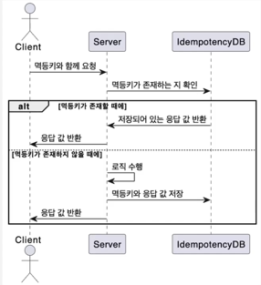

### 멱등성이란?

어떤 연선을 여러번 수행해도 동일하게 유지되는 성질 

get 요청은 멱등성을 가지며 동일한 get 요청을 여러번 보내도 서버 상태나 응답 데이터는 변하지 않습니다.  
반면 post 요청은 멱등성을 가지지 않으며 여러 번 데이터 요청을 보낼경우 서버 상태가 바뀔 수 있습니다.   

멱등성은 네트워크 통신, 데이터 트랜잭션에서 필요하다.  
- 네트워크 에러로 인해서 여러번 돈이 차감되는 경우?
- 같은 요청이 두 번 송금이 되는 경우?

멱등성을 보장하지 않으면 중복처리로 인해 데이터가 잘못 수정될 수 있다.
따라서, 멱등성을 보장 함으로써 시스템의 신뢰성을 높이고 예기치 않은 오류를 줄일 수 있다.  

같은 요청을 두번 처리하지 않도록 체크할 수 있기 때문입니다. 

### 멱등성 키란?
멱등키는 이러한 멱등성을 유지하기 위해 사용되는 고유한 키  

주로 post나 patch같이 비멱등성 연산에서 사용이 됩니다.  

클라이언트가 서버로 요청을 보낼 때, 멱등 키를 함께 보내면 서버가 이 키를 통해 요청의 중복 여부를 확인할 수 있게 됩니다.  

같은 요청이 중복되어 오는 경우 중복된 요청은 무시하거나 이전 결과 값을 반환할 수 있습니다.  

### 멱등키를 구현
IETF 에서는 헤더에 멱등키를 추가를 표준으로 제안  
Idempotency-Key : {IDEMPOTENCY_KEY}

주로 멱등키 같은 경우에는 UUID를 통한 랜덤한 값을 생성해서 요청을 해주게 됩니다.  

원래는 레디스 같은 메모리 캐시를 사용하지만, 현재는 MySQL로 구현합니다.  

### 멱등키 기능 시퀀스 다이어그램

AOP를 사용해 멱등키 기능을 만들 수 있습니다.  
