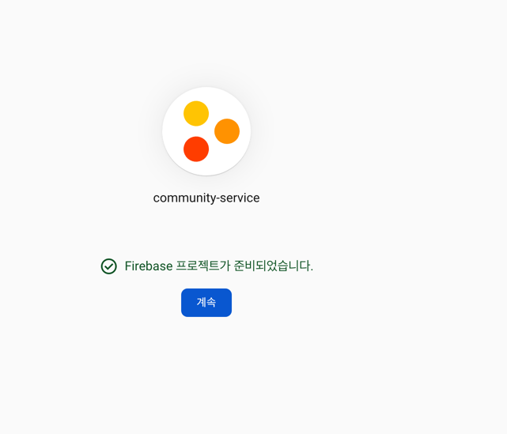

### 알림 기능
FCM(Firebase Cloud Messaging)을 통한 알림 기능 구현  

### FCM 알림 프로세스
1. 서버와 클라이언트 모두 설정 값 추가
2. 클라이언트 쪽에서 로그인 할 때에 유저의 토큰 값 firebase에 요청
3. 서버에서는 토큰과 유저 정보 저장, 이후 알림이 필요할 때 정송

프로젝트 만들기  



### Config
```java
package org.sangyunpark99.common.config;

import com.google.auth.oauth2.GoogleCredentials;
import com.google.firebase.FirebaseApp;
import com.google.firebase.FirebaseOptions;
import lombok.extern.slf4j.Slf4j;
import org.springframework.beans.factory.annotation.Value;
import org.springframework.core.io.ClassPathResource;
import org.springframework.stereotype.Component;

import javax.annotation.PostConstruct;
import java.io.IOException;
import java.io.InputStream;

@Slf4j
@Component
public class FcmConfig {

    @Value("${fcm.certificate]")
    private String fcmApplicationCredentials;

    @PostConstruct
    public void initialize() throws IOException {
        ClassPathResource resource = new ClassPathResource(fcmApplicationCredentials);
        try(InputStream is = resource.getInputStream();) {
            FirebaseOptions options = FirebaseOptions.builder().setCredentials(GoogleCredentials.fromStream(is)).build();

            if(FirebaseApp.getApps().isEmpty()) {
                FirebaseApp.initializeApp(options);
                log.info("FirebaseApp initialzed!");
            }
        }
    }
}
```

포스트 컨스턱트를 통해서 설정값을 불러오고 옵션을 파라미터로 전달해서 토큰을 통해서 구글로 메시지를 보낼 수 있게 준비를 합니다.