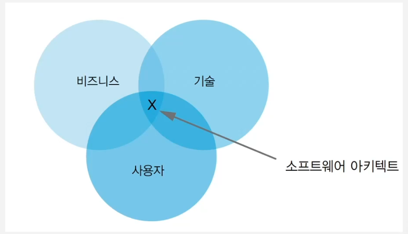
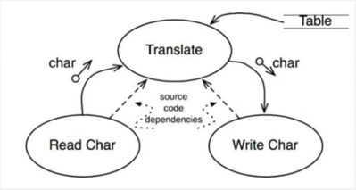
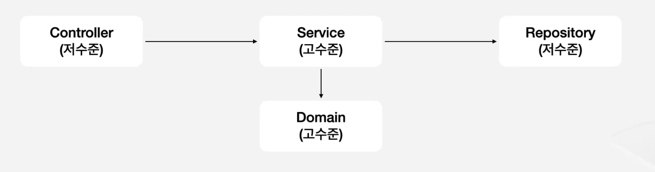
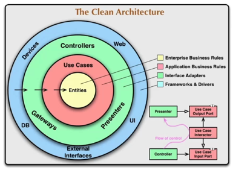

### 소프트웨어 아키텍트

소프트웨어 아키텍트는 소프트웨어가 언제 어떻게 구성 되어야 할지 결정하는 사람, 비즈니스 목표에 부합하도록 만드는 사람입니다.  

기능만 빨리 만드는 것보단 문제를 본질적으로 해결하는 것, 코딩 뿐만 아니라 소프트 스킬도 중요합니다.  
아키텍트로 나아가지, 관리자가 되어봐야지 하는 생각으로 임하는 것도 중요합니다.  

### 클린아키텍처
로버트 C.마틴이라는 사람이 소프트웨어 **시스템의 구조를 설계할 때에 지켜야 할 원칙과 방법**을 정의한 개념  

### 왜 클린아키텍처를 사용해야 하는가?
소프트웨어 아키텍트에 있어서 중요한 포인트 중 하나인 비용을 클린 아키텍처가 줄여줍니다.  
어떻게? 선택지를 넓힘으로 유연하게 대응할 수 있게 만들어주자!  

### 선택지를 늘린다는 것 무엇을 의미하는가?
어떤 저장 방식을 선택하던, 어떤 프레임워크, 하드웨어를 선택하던 상관없다.
우선적으로 비즈니스 로직을 만들면 그 위에 이식 할 수 있게 만듭니다.

ex) 온프로미스 DB -> 클라우드 DB로 변경하는 상황 + RDBMS 사용 x
좋은 구조를 갖고 있었다면, DB관련된 기능을 나중에 개발하고 비즈니스 로직을 먼저 개발할 수 있게 만들었을 것입니다.  

소프트웨어 아키텍트는 좋은 구조를 가진 어플리케이션을 통해서 비용을 줄일 수 있습니다.  

### 컴포넌트

시스템의 구성 요소로 배포할 수 있는 가장 작은 단위 (java - jar)

저수준 컴포넌트 : 비지니스 로직보다 유저와 **외부에 가까움**  
ex) 컨트롤러 레이어, 레포지토리 레이어

고수준 컴포넌트 : **비즈니스 로직**이 포함  
ex) 서비스 레이어, 도메인 레이어  

translate : 고수준 컴포넌트  
Read Char, Write Char : 저수준 컴포넌트  

### 의존성
A클래스는 B클래스를 의존하고 있다.
A클레스에서 B클래스를 import해서 사용하고 있습니다.

### 클린아키텍처를 한 문장으로 표현한다면?
**고수준 컴포넌트는 저수준 컴포넌트를 의존해서는 안됩니다.**

### 왜 고수준 컴포넌트는 저수준 컴포넌트를 의존해선 안될까?
저수준 컴포넌트는 쉽게 변경이 되기 때문입니다!

ex) 커뮤니티 피드 서비스의 본질인 글을 쓸 수 있다는 변경이 잘 안되지만, 유저가 늘어남에 따라 db는 캐싱을 도입하거나
테이블의 형태가 쉽게 바뀌어야 합니다.

ex) 레디스가 추가가 되거나 DB가 바뀐다고 해서 영향을 받게 되면 안됩니다.

클린 아키텍처에서 말하는 의존성 역전 원칙(DIP: Dependency Inversion Principle)**의 핵심은 "의존하되, 추상화(인터페이스)를 통해 의존하라"입니다.
즉, 구체적인 구현체(저수준 컴포넌트)가 아니라 추상화된 인터페이스에 의존함으로써, 변경에 유연하게 대처할 수 있도록 설계하는 것입니다.

고수준의 Service 레이어가 Repository의 저수준에 의존을 하고있습니다.  
이 부분은 Interface를 추가해서 의존성을 역전시켜 DIP를 달성해 줍니다.    
의존성이 역전이 되면, 데이터 베이스 자체가 바뀌어도 문제가 없게됩니다.  

결론 : 고수준 컴포넌트가 저수준 컴포넌트를 의존해서는 안된다!

DB 레파지토리 인터페이스를 실무에서 만들때, 간단한 팁은
조회 부분과 저장 부분 2개를 인터페이스를 분리해서 나눠놓습니다.

왜 조회와 저장 인터페이스를 분리하는가?  
DB 속성과 관련이 있습니다. DB에 저장과 조회가 하나일땐 상관 없지만, 사용자나 데이터가 기하급수적으로 늘면, 저장과 조회를 다른 DB에서 하게 되는 경우가 많습니다.  
