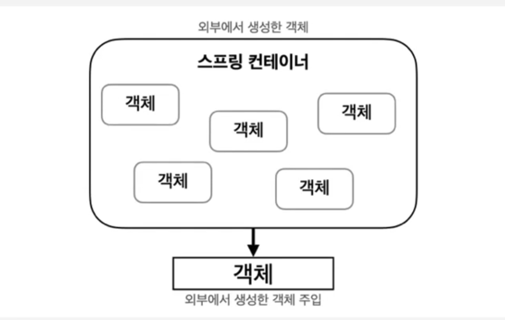

### 스프링이란?
Java기반 application framework

### 스프링을 사용하는 이유
좋은 객체 지향, 클린 아키텍처를 유지 할 수 있게 해주는 프레임워크  

### 스프링은 어떻게 객체 지향과 클린 아키텍처를 지키는가?
**싱글톤** : **인스턴스가 1개만 생성되는 것을 보장하는 디자인 패턴**
ex) FakeObjectFactory!

- 이미 만들어진 것을 계속 효율적으로 사용  
- 웹 요청 같이 여러 요청이 올때에 효율적으로 대응 가능

구현 방법
- 생성자를 private하게 만들어 줍니다.
- 객체 인스턴스를 static으로 선언합니다.

### 스프링 컨테이너
싱글톤 원리가 적용된 스프링에서 제공하는 객체 제장소



### Bean 객체
**스프링 컨테이너에 저장되는 스프링에서 관리되는 객체**

Bean annotaion
```java
@Bean
public UserFactory userFactory() {
    return new UserFactory();
}
```

Component annotation
```java
@Component
public class UserFactory {
    public UserFactory() {
    }
}
```
주로 클래스에 사용이 된다.


Spring은 컴포넌트 스캔으로 Bean객체가 될 것들을 찾습니다.  
**Spring Container가 알맞은 빈 객체의 의존성에 맞게 주입해줍니다.**  
이러한 걸 DI(Dependency Injection)이라고 부릅니다.  

### 만약 스프링이 존재하지 않았다면?

스프링이 존재하지 않았더라면, 서비스 레이어가 직접적으로 Repository 레이어에 의존하게 되어,
클린 아키텍처 원칙을 위배하게 되고, 여러개를 주입해주는 경우, 유지보수가 어렵게 됩니다.

Spring이 존재하지 않은 경우엔 일일히 하나씩 다 작성해서 넣어주어야 합니다.  
그러나, **스프링은 스프링 컨테이너가 알아서 해줍니다.**

즉, 제어는 스프링에게 넘겼기 때문에 IOC(Inversion of Control)이라고 부릅니다.


Spring이 존재하기 때문에 구현체를 의존하지 않아도 됩니다.
DB가 변경이 되어도 서비스 로직에 변경이 일어나지 않습니다. 즉, 클린아키텍처의 핵심인 다형성을 SpringFramework로 완전히 구현해 낼 수 있게 되었습니다.  


### 스프링 부트란?
스프링 프레임워크에서 필요했던 각종 설정들을 간편하게 사용 가능하게 해줍니다.  
내장 톰캣 이용으로 개발을 더 편리하게 해줍니다. 기존 스프링은 외부 톰캣을 이용해야 했지만, 스프링 부트는 내장 톰캣을 이용해 편리하게 사용할 수 있게 해줍니다.  

### 질문과 과제
(1) 싱글톤 패턴 외에도 스프링에 적용된 수 많은 디자인 패턴들이 있습니다. 어떤 디자인 패턴들이 있을까요?
- 팩토리 패턴 : 객체 생성 로직을 캡슐화하여 클라이언트 코드가 구체적인 클래스에 의존하지 않도록 합니다.
  - BeanFactory, ApplicationContext
- 프로토타입 패턴 : 기존 객체를 복제하여 새로운 객체를 생성하는 패턴
  - @Scope("prototype")
- 전략 패턴 : 의존성 주입(DI)
- 프록시 패턴 : 실제 객체에 대한 접근을 제어하거나 추가적인 기능을 제공하기 위해 대리 객체를 사용하는 패턴
  - Spring AOP : 프록시 객체를 생성하여 메서드 실행 전후에 부가 로직을 추가됩니다. ex) @Transactional 어노테이션은 트랜잭션 관리 로직을 프록시 객체에 위임
- 템플릿 메서드 패턴 : 알고리즘의 구조를 정의하고 세부 구현은 하위 클래스에서 구현하도록하는 패턴
  - JdbcTemplate, RestTemplate
- 옵저버 패턴 : 객체의 상태 변화를 관찰하는 객체를 만들어, 상태 변화가 있을 때마다 메서드를 호출하는 패턴
  - ApplicationListener, @EventListener
- 데코레이터 패턴 : 기존 객체에 새로운 기능을 동적으로 추가하는 패턴
  - Spring AOP를 활용하여 데코레이터처럼 메서드 실행 전후에 부가적인 기능 추가. 예: 메서드 호출 전에 로깅을 추가하거나, 권한 검사를 수행.
- 프론트 컨트롤러 패턴 : 하나의 진입점을 통해 모든 요청을 처리하고, 요청을 세부 핸들러로 전달하는 패턴
  - DispatcherServlet
- 빌더 패턴 : 복잡한 객체를 단계적으로 생성하는 패턴
  - ResponseEntity.BodyBuilder, MockMvcRequestBuilders
- 어댑터 패턴 : 호환되지 않는 인터페이스를 변화하여 기존 코드와 연결하는 패턴
  - HandlerAdapter, HandlerInterceptorAdapter

Spring은 디자인 패턴이 사용되는 집합체입니다.  


(2) 스프링에서 외부 웹 요청이 왔을 때 어떤 프로세스를 통해서 응답을 반환하는 전체 프로세스를 설명해 보세요.

1. 클라이언트 요청
클라이언트(브라우저, REST API, 호출 등)가 HTTP 요청을 보냅니다. 이 요청은 URL,HTTP 메서드(GET, POST, PUT, DELETE)등을 포함합니다.
2. DispatcherServlet
SpringMVC의 핵심 컴포넌트인 **DispatcherServlet이 요청**을 받습니다. 이 서블릿은 요청을 처리할 컨트롤러를 찾아주는 역할을 합니다.
3. HandlerMapping
DispatcherServlet은 요청 URL과 매핑되는 Handler(Controller 메서드)를 찾기 위해서 HandlerMapping에게 요청을 위임합니다.
4. HandlerAdapter
요청을 처리하기 위해 매핑된 핸들러(Controller)가 결정되면, 해당 핸들러를 실행하기 위해 적합한 HandlerAdapter를 찾습니다.  
5. Controller Execution
HandlerAdapter가 매핑된 컨트롤러(ex @RestController, @Controller)의 메서드를 호출합니다.  
컨트롤러 메서드 내부에서 요청 데이터를 처리하고, 서비스 계층(Service Layer)을 호출하여 필요한 비즈니스 로직을 수행합니다.  
데이터 처리 결과를 ModelAndView(View + 데이터) 또는 ResponseEntity(JSON 응답 등)로 반환합니다.  
6. ViewResolver
컨트롤러가 반환한 결과가 뷰(View) 를 통해 렌더링되어야 할 경우, ViewResolver가 실행됩니다.
7. Response Render
뷰가 선택되거나, 데이터가 JSON 형식으로 변환된 후, 최종 응답이 생성됩니다.
- 뷰(View)는 모델 데이터를 렌더링하여 클라이언트가 볼 수 있는 HTML 페이지를 생성하거나, JSON 데이터를 클라이언트에 전달합니다.
- HttpMessageConverter:JSON이나 XML과 같은 데이터 직렬화를 처리, Spring Boot에서는 MappingJackson2HttpMessageConverter를 기본 사용하여 객체를 
  JSON으로 변환합니다.
8. HTTP 응답 반환 (HTTP Response)
-DispatcherServlet이 최종 결과(HTML, JSON, XML 등)를 HTTP 응답으로 클라이언트에게 반환합니다.


