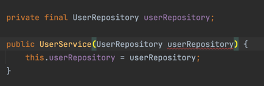

### build.gradle 설정 

```java
plugins {
    id 'java'
    id 'org.springframework.boot' version '3.3.1' // Spring Boot 플러그인
    id 'io.spring.dependency-management' version '1.1.5' // 의존성 버전 관리 플러그인
}
```
dependency-management는 의존성 버전 관리 플로그인 입니다.  
어던 역할을 하나요? Spring과 다른 Dependency의 버전을 관리해주는 역할을 합니다.  

### Main Application 수정
```java
import org.springframework.boot.SpringApplication;
import org.springframework.boot.autoconfigure.SpringBootApplication;

@SpringBootApplication
public class Application {
    public static void main(String[] args) {
        SpringApplication.run(Application.class);
    }
}
```

정상적으로 잘 실행이 되는지 확인해보기 위해, HealthCheckController를 선언해서 확인해줍니다.
```java
package org.sangyunpark99.common.ui;

import org.springframework.web.bind.annotation.GetMapping;
import org.springframework.web.bind.annotation.RestController;

@RestController
public class HealthCheckController {

    @GetMapping
    public String healCheck() {
        return "health Check";
    }
}
```

### 접속 결과


### UserService 빈 객체 등록
```java
@Service
public class UserService {
```
@Service 어노테이션을 사용해서 Bean객체로 등록해줍니다.
 
Bean객체를 선언할땐, @Bean 어노테이션을 사용하거나 @Component 어노테이션을 사용하는데, @Service는 뭘까요?  
@Service 내부에는 @Component가 존재합니다.  
```java
@Target(ElementType.TYPE)
@Retention(RetentionPolicy.RUNTIME)
@Documented
@Component
public @interface Service {

	/**
	 * Alias for {@link Component#value}.
	 */
	@AliasFor(annotation = Component.class)
	String value() default "";

}
```

### UserService 오류


왜 오류가 발생하는 걸까요? 기존 테스트 코드 환경에서는 Fake 객체를 만들어서 주입을 일일히 해주었지만,
UserService에서 사용되는 repository는 현재 빈 객체로 등록이 되어 있지 않기 때문에 Spring Container에서 주입을 해줄 수 없게 됩니다.  
아래와 같이 @Repository 어노테이션을 사용해서 빈 객체로 등록해줍니다.  
```java
@Repository
public interface UserRepository {
    User save(User user);

    Optional<User> findById(Long id);
}
```
interface로 구현된 Repository의 구현체를 만들고,  @Repository 어노테이션도 마찬가지로 내부를 들어가면, @Component 어노테이션이 존재합니다.  
```java

```

