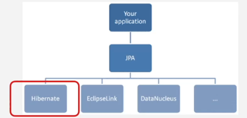
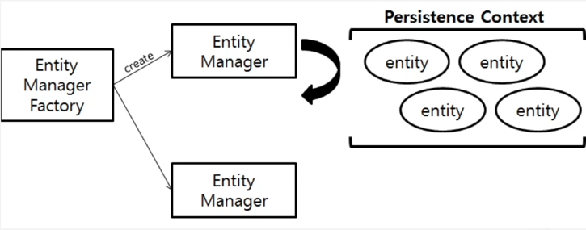
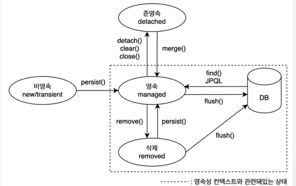

### JPA란?
Java Persistence API  
Java 진영에서 제공하는 ORM 기술 표준으로 사용하는 방법을 정의한 인터페이스의 모음입니다.

인터페이스 : 객체의 행동을 정의한 것으로, 객체의 행동에 대한 구현은 클래스가 담당합니다.

### ORM이란?
Class객체와 RDB의 테이블을 매핑해주고 영속화해줍니다.


### 왜 JPA를 사용하는가?
테이블에 들어가 있는 데이터와 객체의 형태가 많이 다르기 때문입니다.  
JPA를 사용하지 않는 경우, 레코드를 일일히 Java 객체와 수동으로 매핑시켜주어야 합니다.  

(1) 추상화
추상 계층을 제공해서 객체를 테이블 형태로 변환해 주기 때문에 SQL문을 사용하지 않고도 개발이 가능합니다.  

(2) 생산성
반복되는 CRUD 코드가 줄어들어 생산성이 증가됩니다.  

(3) 유지보수
DB 시스템 변경에 유연하고, 데이터 접근 중심의 로직으로 ERD 의존도를 낮추어 유지보수가 증가합니다.  

ERD의존도를 낮추는 것이란?  
애플리케이션의 데이터 접근 로직과 데이터베이스 설계를 분리하여 변경에 유연하도록 만드는 것을 의미합니다.  

ERD의존도가 높은 코드 예시는 아래와 같습니다.
```java
public List<User> getActiveUsers() {
    String query = "SELECT id, name, email FROM users WHERE status = 'ACTIVE'";
    List<User> users = new ArrayList<>();
    try (Connection connection = dataSource.getConnection();
         PreparedStatement statement = connection.prepareStatement(query);
         ResultSet resultSet = statement.executeQuery()) {

        while (resultSet.next()) {
            User user = new User();
            user.setId(resultSet.getLong("id"));
            user.setName(resultSet.getString("name"));
            user.setEmail(resultSet.getString("email"));
            users.add(user);
        }
    } catch (SQLException e) {
        e.printStackTrace();
    }
    return users;
}
```

ERD의존도가 낮은 예시는 아래와 같습니다.  
```java
@Entity
public class User {
    @Id
    @GeneratedValue(strategy = GenerationType.IDENTITY)
    private Long id;

    private String name;
    private String email;
    private String status; // ACTIVE, INACTIVE

    // Getters and Setters
}
```

```java
@Repository
public interface UserRepository extends JpaRepository<User, Long> {
    List<User> findByStatus(String status);
}
```

```java
@Service
public class UserService {

    private final UserRepository userRepository;

    public UserService(UserRepository userRepository) {
        this.userRepository = userRepository;
    }

    public List<UserDto> getActiveUsers() {
        List<User> activeUsers = userRepository.findByStatus("ACTIVE");
        return activeUsers.stream()
                .map(user -> new UserDto(user.getId(), user.getName(), user.getEmail()))
                .collect(Collectors.toList());
    }
}

```
Spring Data JPA, Service 계층, DTO를 활용하면 코드와 데이터베이스 간 결합도를 낮추어 유연하고 유지보수하기 쉬운 구조를 만들 수 있습니다.

(4) 보안
SQL Injection, 쿼리 조작 등 보안 문제에서 자유로워 집니다.  


### Hiberante
여러 JPA의 구현체 중 하나이고, JPA의 인터페이스들을 구현해 실제 DB에 연결합니다.  


interface만 있던 JPA가 실질적으로 동작하도록 만들어주는 것이 Hibernate입니다.

### Entity Manager, Entity
엔티티 매니저 - 엔티티들을 관리하는 객체  
엔티티 - DB에 영속적으로 저장된 데이터를 **자바 객체**로 매핑해 인스턴스로 존재하는 객체

### 영속성 컨텍스트
엔티티 매니저가 엔티티를 관리하는 영역을 영속성 컨텍스트라고 합니다.
보통 하나의 엔티티 매니저는 하나의 영속성 컨텍스트를 관리합니다.  


### 엔티티 라이프 사이클


엔티티 매니저가 엔티티를 관리하기 위해서는 영속성 컨텍스트 내부에 존재해야 합니다.  
