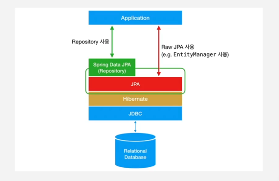

### 영속성 컨텍스트의 특징

(1) 영속 상태의 객체는 Id(식별자) 값이 반드시 있습니다.  


**id가 없는 경우 db에 객체를 저장한 후, id를 생성하여 객체를 영속성 컨텍스트 내에서 관리하게 됩니다.**

(2) 1차 캐시


**id를 기준으로 1차 캐시에서 엔티티 값을 반환해 줍니다.**
따라서, 한 트랜잭션 안에서는 같은 조회 쿼리를 두 번 호출하지 않습니다.  

조회시 영속성 컨텍스트에 id값이 없는 경우는 어떻게 할까요?  


DB에서 조회헤서 영속성 컨텍스트(1차 캐시에) 저장을 하고, 반환을 하게 됩니다.


(3) 쓰기 지연


트랜잭션 시작 후, 생성한 엔티티 멤버 2명을 persist하여 영속화 해줍니다.
그와 동시에 SQL 쿼리문을 생성하여, **쓰기 지연 SQL 저장소에 저장**을 합니다.  


트랜잭션 커밋을 하게 되면, 저장 되었던 2개의 insert sql문이 db에 한번에 요청이 됩니다.
즉, sql 플러시가 발생하게 됩니다. 그 후, DB내에서 쿼리를 실행시키고 트랜잭션 commit으로 트랜잭션을 마무리합니다.  
단, id가 없는 경우에는 DB에 바로 insert를 한 후, 1차 캐시에 저장을 하기 때문에 쓰기 지연이 발생하지 않은 것입니다.  
**id 없이는 영속성 컨텍스트에 들어갈 수 없습니다.**  
앞서 나온 예시들은 엔티티가 모두 id값을 갖고 있습니다.  

항상 id가 null값이라고 해서 insert문을 수행하는 것은 아닙니다.  
DB에서 자동으로 생성되는 autoincrement 같은 것을 코드에 미리 설정을 해두어야만 자동으로 id값을 가져오기 위해 DB에 insert문을 실행합니다.  

```java
@GeneratedValue(strategy = GenerationType.IDENTITY)
```
이 전략은 데이터베이스에 강하게 의존하며, 즉시 INSERT 문이 실행되므로 영속성 컨텍스트를 활용한 일괄 작업에는 적합하지 않을 수 있습니다.  
Identity 전략 덕분에 id 값이 null인 상태로 영속성 컨텍스트에 엔티티를 저장할 수 있습니다.  

왜 쓰기 지연 저장소를 사용하는가?
DB와의 connection을 줄일 수 있습니다. 한번씩 따로 insert문을 보내는 것이 아닌, 한번에 두개의 insert문을 보내기 때문입니다.

(4) 동일성 보장

1차 캐시에서 저장된 값은 항상 같은 값을 반환해줍니다.  
ex) 1L이라는 id값을 가지는 엔티티를 **같은 트랜잭션 내에서 조회 해도 같은 값을 반환**해 줍니다.  
(실제 메모리 주소도 같다는 것을 보장해 줍니다.)  

(5) 변경 감지(dirty checking)
1차 캐시를 미리 스냅샷을 찍어, 변경된 부분을 찾아내어 update 쿼리를 생성합니다.
트랜잭션이 커밋되면 update 쿼리를 DB로 flush하게 되고, DB는 query를 실행한 후 commit을 하게 됩니다.


매번 이렇게 EntityManager를 선언해서 매번 호출해서 엔티티를 관리해주어야 할까요? 어떻게 하면 안해줄 수 있을까요?
Spring Data Jpa를 사용해서 번거로움을 좀 더 줄일 수 있습니다. 

### Spring Data JPA


JPA를 사용하기 쉽게 만들어 놓은 Spring제공 해놓은 모듈로 직접 Hibernate를 구현한 EntityManager를 사용하지 않아도 됩니다.
EntityManger를 따로 선언해 줄 필요가 없고, persist(), remove(), detach()를 선언해 줄 필요가 없고, 트랜잭션을 선언해서 따로 구현할 필요도 없습니다.  
편리하게 JpaRepository를 사용하면 됩니다.


### 질문과 과제
(1) JPA를 이용하면 성능적인 이점이 있을까요?
생산성이 증가합니다. DB 시스템 변경에 유연 해서 유지보수하기 좋습니다.

강사님 답변 : ORM의 단점은 많은 것을 알아야 한다는 단점이 존재합니다, 커밋되는 시점이 우리의 예상과 다를 수 있습니다. 작성한 쿼리가 우리가 예상한 쿼리와 다르게 나가는 일이 빈번합니다.  

(2) JPA를 적용하는 프로젝트와 SQL을 직접 사용해야 하는 프로젝트의 차이점을 말해주세요.
복잡한 쿼리나 대규모 데이터 처리에서 최적화된 SQL을 직접 사용해야 하는 프로젝트는 비교적 복잡한 쿼리문이 필요한 프로젝트라고 생각을 하고, JPA를 적용하는 프로젝트는 비교적 간단한 쿼리문이 필요한 프로젝트라고 생각을 합니다.

(3) 우리가 만든 Post 객체에 @Entity를 붙여서 객체를 만들어야 할까요, 아니면 따로 PostEntity 객체를 만들어서 분리하는게 좋을까요?
Post 객체에 @Entity를 붙여서 객체를 만들어야 합니다.
이유 : 코드를 더 작성하지 않아도 됩니다.

