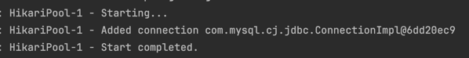

### build.gradle
```java
plugins {
    id 'java'
    id 'org.springframework.boot' version '3.3.1' // Spring Boot 플러그인
    id 'io.spring.dependency-management' version '1.1.5' // 의존성 버전 관리 플러그인
}

group = 'org.sangyunpark99'
version = '1.0-SNAPSHOT'

repositories {
    mavenCentral()
}

dependencies {

    //spring
    implementation 'org.springframework.boot:spring-boot-starter'
    implementation 'org.springframework.boot:spring-boot-starter-web'
    implementation 'org.springframework.boot:spring-boot-starter-data-jpa'
    implementation 'org.springframework.boot:spring-boot-starter-validation'

    //mysql
    runtimeOnly 'mysql:mysql-connector-java'

    //lombok
    implementation 'org.projectlombok:lombok'
    annotationProcessor("org.projectlombok:lombok")

    // test
    testImplementation 'org.springframework.boot:spring-boot-starter-test'
    testImplementation platform('org.junit:junit-bom:5.9.1')
    testImplementation 'org.junit.jupiter:junit-jupiter'
}

test {
    useJUnitPlatform()
}
```

### application.yml
```java
spring:
  datasource:
    driver-class-name: com.mysql.cj.jdbc.Driver
    url: jdbc:mysql://localhost:3306/communityfeed
    username: root
    password:

  jpa:
    hibernate:
      ddl-auto: update
    show-sql: true
    properties:
      hibernate:
        format_sql: true
      open-in-view: false
```

open-in-view : Spring에서는 데이터베이스 요청을 처리하기 위해 데이터 소스에서 커넥션을 가져오고, 이는 현재 요청을 처리하는 스레드와 연결됩니다.  
true로 설정하면, 트랜잭션이 종료된 후에도 영속성 컨텍스트가 열려 있기 때문에, View 렌더링(ViewResolver) 또는 JSON 직렬화 시점까지 **데이터베이스 커넥션이 유지**됩니다.
이 커넥션은 현재 요청을 처리하는 스레드에 묶여(Thread-bound) 있으므로, 트랜잭션이 끝난 후에도 해당 스레드는 커넥션을 반납하지 않고 유지합니다.  

스레드 풀에 있는 스레드 갯수가 쉽게 부족해지고 성능에 영향이 가기 쉽습니다.  
거의 대부분의 DB connection thread 부족이 발생하는 경우엔 open-in-view를 false로 설정하면 됩니다.  

show-sql : DB로 전송이 되는 sql문을 콘솔에 출력하는 옵션입니다.  
ddl-auto : Entity에 맞추어서 spring이 동작을 할때 JPA가 자동으로 테이블을 생성해주는 옵션입니다.  

format-sql : sql문을 라인에 맞게 예쁘게 출력해줍니다.  


### DB Connection Thread Pool 확인하기

HikariCP는 커넥션 풀(Connection Pool) 입니다. Spring Boot에서 데이터베이스 연결을 관리하기 위해 기본적으로 사용하는 JDBC 커넥션 풀 라이브러리입니다.  


