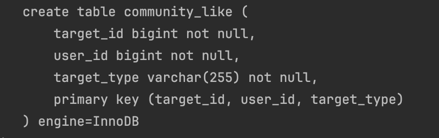

### Post 엔티티
Post는 User와 연관관계를 갖습니다.  

테이블은 한쪽에서만 상대방의 정보를 갖고 있으면, 양뱡향 참조가 가능하지만 객체는 그럴 수 없습니다.  
User와 Post의 관계는 1대다 관계이다. 

UserEntity
```java
package org.sangyunpark99.post.repository.entity;

import jakarta.persistence.*;
import org.sangyunpark99.user.repository.entity.UserEntity;

@Entity
@Table(name = "community_post")
public class PostEntity {

    @Id @GeneratedValue(strategy = GenerationType.IDENTITY)
    private Long id;

    private String content;
    private Integer likeCount;

    @ManyToOne(fetch = FetchType.LAZY)
    @JoinColumn(name = "author_id")
    private UserEntity author;


}
```

PostEntity
```java
package org.sangyunpark99.user.repository.entity;

import jakarta.persistence.*;
import lombok.NoArgsConstructor;
import org.sangyunpark99.common.domain.PositiveIntegerCounter;
import org.sangyunpark99.common.repository.entity.TimeBaseEntity;
import org.sangyunpark99.post.domain.Post;
import org.sangyunpark99.post.repository.entity.PostEntity;
import org.sangyunpark99.user.domain.User;
import org.sangyunpark99.user.domain.UserInfo;

import java.util.ArrayList;
import java.util.List;

@Entity
@Table(name = "community_user")
@NoArgsConstructor
public class UserEntity extends TimeBaseEntity {

    @Id @GeneratedValue(strategy = GenerationType.IDENTITY)
    private Long id;

    private String name;

    private String profileImageUrl;

    private Integer followingCount;

    private Integer followerCount;

    @OneToMany(mappedBy = "author")
    private List<PostEntity> posts = new ArrayList<>();

    public UserEntity(User user) {
        this.id = user.getId();
        this.name = user.getName();
        this.profileImageUrl = user.getProfileImageUrl();
        this.followingCount = user.getFollowingCount();
        this.followerCount = user.getFollowerCount();
    }

    public User toUser() {
        return User.builder()
                .id(id)
                .info(new UserInfo(name, profileImageUrl))
                .followingCount(new PositiveIntegerCounter(followingCount))
                .followerCount(new PositiveIntegerCounter(followerCount))
                .build();
    }
}
```
만약  @OneToMany(mappedBy = "author") 이부분에 FetchType이 EAGER인 경우엔 문제가 발생한다.  
User가 갖고 있는 글이 1000만개라고 가정한다면, 1000만개의 글을 메모리에 들고 있는 것이나 마찬가지이다. 즉, 서비스 리소스를 너무 많이 차지하게 됩다.


실무에서는 @OneToMany를 잘 사용하는 편은 아닙니다.  
유저가 작성한 글을 불러오게 하는 경우는 레파지토리를 통해 데이터를 불러오는 걸 선택합니다.  
특히, 많은 다수의 데이터를 가져올 때에는 페이징 처리도 해야하고, 어떠한 인덱스를 타야할지 생각해주어야 하므로 단방향 맵핑 방법을 조금 더 선호하게 됩니다.

```java
@Entity
public class User {
    @Id
    @GeneratedValue(strategy = GenerationType.IDENTITY)
    private Long id;

    private String name;
}

@Entity
public class Post {
    @Id
    @GeneratedValue(strategy = GenerationType.IDENTITY)
    private Long id;

    @ManyToOne(fetch = FetchType.LAZY)
    @JoinColumn(name = "user_id")
    private User author;

    private String title;
}
```
이렇게 선언을 해주고, repository에서 가져오게 됩니다.  
또한, @OneToMany를 사용하는 경우 getPost() 메서드를 호출하는 경우 1000만개인 경우엔 1000만 + 1번 즉 N + 1번 문제가 발생하게 됩니다.
기본 쿼리 1개에 추가쿼리 N번이 발생하여 N+1 문제라고 합니다.  


한정된 데이터를 가지고 있거나 필수적으로 같이 조회되어야 하는 데이터가 아니라면, @OneToMany를 사용하는 것은 지양하는게 좋다.  


DDL 생성시 foreignKey 생성 제한을 걸어줍니다.  
그 이유는 실무에서도 외래키를 많이 사용하지 않습니다. 데이터 연관관계를 강제해주긴 하지만, 원치 않는 인덱스를 걸기도 하고, 제약조건 때문에 데이터 수정도 조금 더 어려워집니다.
```java
@JoinColumn(name = "author_id", foreignKey = @ForeignKey(ConstraintMode.NO_CONSTRAINT))
    private UserEntity author;
```

Convert를 사용해서 Enum과 String을 더 유연하게 변경하도록 해줍니다.  
JPA가 기본적으로 Enum 타입을 처리하는 방식이 제한적이기 때문입니다.  
@Convert를 사용하면, Enum을 데이터베이스에 저장하거나 조회할 때 더 유연하게 변환 로직을 커스터마이징할 수 있습니다.  

JPA 기본 EnumType(ORDINAL, STRING)만으로는 데이터베이스 저장 및 조회 시 원하는 매핑을 적용하기 어려운 경우가 있습니다.  
```java
package org.sangyunpark99.post.repository.entity;

import jakarta.persistence.AttributeConverter;
import org.sangyunpark99.post.domain.content.PostState;

public class PostStateConverter implements AttributeConverter<PostState, String> {
    @Override
    public String convertToDatabaseColumn(PostState postState) {
        return postState.name();
    }

    @Override
    public PostState convertToEntityAttribute(String s) {
        return PostState.valueOf(s);
    }
}
```

```java
 @Convert(converter = PostStateConverter.class)
    private PostState state;
```

데이터가 저장이 될때, 자동을 convert를 통해서 데이터를 불러오게 됩니다.  


마지막으로 TimeBaseEntity를 추가해줍니다.  
```java
package org.sangyunpark99.post.repository.entity;

import jakarta.persistence.*;
import org.sangyunpark99.common.repository.entity.TimeBaseEntity;
import org.sangyunpark99.post.domain.content.PostState;
import org.sangyunpark99.user.repository.entity.UserEntity;

@Entity
@Table(name = "community_post")
public class PostEntity extends TimeBaseEntity {

    @Id @GeneratedValue(strategy = GenerationType.IDENTITY)
    private Long id;

    private String content;

    @Convert(converter = PostStateConverter.class)
    private PostState state;

    private Integer likeCount;

    @ManyToOne(fetch = FetchType.LAZY)
    @JoinColumn(name = "author_id", foreignKey = @ForeignKey(ConstraintMode.NO_CONSTRAINT))
    private UserEntity author;
}

```

PostEntity에 Post로 반환해주는 메서드와 생성자를 만들어줍니다.
```java
package org.sangyunpark99.post.repository.entity;

import jakarta.persistence.*;
import lombok.NoArgsConstructor;
import org.sangyunpark99.common.repository.entity.TimeBaseEntity;
import org.sangyunpark99.post.domain.Like;
import org.sangyunpark99.post.domain.Post;
import org.sangyunpark99.post.domain.content.PostContent;
import org.sangyunpark99.post.domain.content.PostState;
import org.sangyunpark99.user.repository.entity.UserEntity;

@Entity
@Table(name = "community_post")
@NoArgsConstructor
public class PostEntity extends TimeBaseEntity {

    @Id @GeneratedValue(strategy = GenerationType.IDENTITY)
    private Long id;

    private String content;

    @Convert(converter = PostStateConverter.class)
    private PostState state;

    private Integer likeCount;

    @ManyToOne(fetch = FetchType.LAZY)
    @JoinColumn(name = "author_id", foreignKey = @ForeignKey(ConstraintMode.NO_CONSTRAINT))
    private UserEntity author;

    public PostEntity(Post post) {
        this.id = post.getId();
        this.content = post.getContentText();
        this.likeCount = post.getLikeCount();
        this.author = new UserEntity(post.getAuthor());
        this.state = state;
    }

    public Post toPost() {
        return Post.builder()
                .id(id)
                .content(new PostContent(content))
                .state(state)
                .likeCount(new Like(likeCount))
                .build();
    }
}
```

CommentEntity
```java
package org.sangyunpark99.post.repository.entity;

import jakarta.persistence.*;
import lombok.NoArgsConstructor;
import org.sangyunpark99.post.domain.Like;
import org.sangyunpark99.post.domain.comment.Comment;
import org.sangyunpark99.post.domain.content.CommentContent;
import org.sangyunpark99.user.repository.entity.UserEntity;

@Entity
@Table(name="community_comment")
@NoArgsConstructor
public class CommentEntity {

    @Id @GeneratedValue(strategy = GenerationType.IDENTITY)
    private Long id;

    @ManyToOne(fetch = FetchType.LAZY)
    @JoinColumn(name = "post_id", foreignKey = @ForeignKey(ConstraintMode.NO_CONSTRAINT))
    private PostEntity post;

    @ManyToOne(fetch = FetchType.LAZY)
    @JoinColumn(name = "user_id", foreignKey = @ForeignKey(ConstraintMode.NO_CONSTRAINT))
    private UserEntity user;

    private String content;

    private Integer likeCount;

    public CommentEntity(Comment comment) {
        this.id = comment.getId();
        this.likeCount = comment.getLikeCount();
        this.post = new PostEntity(comment.getPost());
        this.user = user;
    }

    public Comment toComment() {
        return Comment.builder()
                .id(id)
                .post(post.toPost())
                .author(user.toUser())
                .content(new CommentContent(content))
                .likeManager(new Like(likeCount))
                .build();
    }
}
```

복합키를 사용하는 이유  
복합키를 해주는 이유가 mysql은 primary id를 클러스터드 인덱스 방식으로 값을 찾게되서 더 빠르게 됩니다.  
유니크 키를 primary키로 해줌으로써 유니크 키와 관련도니 값을 더 빨리 찾을 수 있게 해주게 됩니다. 
복합키를 primary key로 설정하면 복합키와 관련된 데이터 더 빠르게 조회할 수 있습니다.  
MySQL의 InnoDB 스토리지 엔진을 사용하는 경우, 모든 테이블이 반드시 클러스터드 인덱스를 가지게 됩니다.  


```java
package org.sangyunpark99.post.repository.entity.like;

import jakarta.persistence.Embeddable;
import lombok.AllArgsConstructor;
import lombok.EqualsAndHashCode;
import lombok.NoArgsConstructor;

import java.io.Serializable;

@Embeddable
@EqualsAndHashCode
@AllArgsConstructor
@NoArgsConstructor
public class LikeEntityId implements Serializable {
    private Long targetId;
    private Long userId;
    private String targetType;
}
```

이번엔 복합키를 적용하는 방식을 @EmbeddedId를 사용해서 하게 됩니다.  
```java
package org.sangyunpark99.post.repository.entity.like;

import jakarta.persistence.*;
import lombok.NoArgsConstructor;
import org.sangyunpark99.post.domain.Post;
import org.sangyunpark99.post.domain.comment.Comment;
import org.sangyunpark99.user.domain.User;

@Entity
@Table(name = "community_like")
@NoArgsConstructor
public class LikeEntity {

    @EmbeddedId
    private LikeIdEntity id;

    public LikeEntity(Post post, User likedUser) { // Post인 경우
        this.id = new LikeIdEntity(post.getId(), likedUser.getId(),LikeTarget.POST.name());
    }

    public LikeEntity(Comment comment, User likedUser) { // Comment인 경우
        this.id = new LikeIdEntity(comment.getId(), likedUser.getId(), LikeTarget.COMMENT.name());
    }
}
```
좋아요는 댓글과 게시물 두 군데에서 사용되기 때문에 오버로딩을 이용해서 Post와 Comment인 경우를 둘다 고려할 수 있게 생성자를 만들어주었습니다.  
또한 테이블명을 community_like로 지정해준 이유는 **like는 DB의 예약어로 지정되어 있기 때문에 테이블이 정상적으로 생성이 되지 않는 경우를 예방**해 줍니다.  

기존 UserEntity는 다음과 같이 각각 @Id 어노테이션을 붙여서 사용해주었습니다.  
@EmbeddedId를 사용하는 경우에는 상속을 받지 않고, 사용합니다.  

@EmbeddedId, @Id 이렇게 2가지 방식이 존재합니다.  

출력 결과를 보면 복합키가 잘 설정된 것을 확인할 수 있습니다.  
