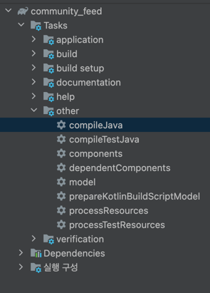
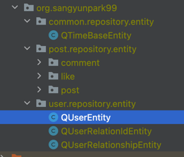

### 조회 레포지토리 작성

(1) Spring Data Jpa Query Method 기능 활용  

JPA사용해서 JpaUserRepository를 만들어 줍니다.  
JpaRepository 인터페이스는 아래와 같습니다.  
```java
/*
 * Copyright 2008-2024 the original author or authors.
 *
 * Licensed under the Apache License, Version 2.0 (the "License");
 * you may not use this file except in compliance with the License.
 * You may obtain a copy of the License at
 *
 *      https://www.apache.org/licenses/LICENSE-2.0
 *
 * Unless required by applicable law or agreed to in writing, software
 * distributed under the License is distributed on an "AS IS" BASIS,
 * WITHOUT WARRANTIES OR CONDITIONS OF ANY KIND, either express or implied.
 * See the License for the specific language governing permissions and
 * limitations under the License.
 */
package org.springframework.data.jpa.repository;

import java.util.List;

import jakarta.persistence.EntityManager;

import org.springframework.data.domain.Example;
import org.springframework.data.domain.Sort;
import org.springframework.data.repository.ListCrudRepository;
import org.springframework.data.repository.ListPagingAndSortingRepository;
import org.springframework.data.repository.NoRepositoryBean;
import org.springframework.data.repository.query.QueryByExampleExecutor;

/**
 * JPA specific extension of {@link org.springframework.data.repository.Repository}.
 *
 * @author Oliver Gierke
 * @author Christoph Strobl
 * @author Mark Paluch
 * @author Sander Krabbenborg
 * @author Jesse Wouters
 * @author Greg Turnquist
 * @author Jens Schauder
 */
@NoRepositoryBean
public interface JpaRepository<T, ID> extends ListCrudRepository<T, ID>, ListPagingAndSortingRepository<T, ID>, QueryByExampleExecutor<T> {

	/**
	 * Flushes all pending changes to the database.
	 */
	void flush();

	/**
	 * Saves an entity and flushes changes instantly.
	 *
	 * @param entity entity to be saved. Must not be {@literal null}.
	 * @return the saved entity
	 */
	<S extends T> S saveAndFlush(S entity);

	/**
	 * Saves all entities and flushes changes instantly.
	 *
	 * @param entities entities to be saved. Must not be {@literal null}.
	 * @return the saved entities
	 * @since 2.5
	 */
	<S extends T> List<S> saveAllAndFlush(Iterable<S> entities);

	/**
	 * Deletes the given entities in a batch which means it will create a single query. This kind of operation leaves JPAs
	 * first level cache and the database out of sync. Consider flushing the {@link EntityManager} before calling this
	 * method.
	 *
	 * @param entities entities to be deleted. Must not be {@literal null}.
	 * @deprecated Use {@link #deleteAllInBatch(Iterable)} instead.
	 */
	@Deprecated
	default void deleteInBatch(Iterable<T> entities) {
		deleteAllInBatch(entities);
	}

	/**
	 * Deletes the given entities in a batch which means it will create a single query. This kind of operation leaves JPAs
	 * first level cache and the database out of sync. Consider flushing the {@link EntityManager} before calling this
	 * method.
	 * <p>
	 * It will also NOT honor cascade semantics of JPA, nor will it emit JPA  lifecycle events.
	 *</p>
	 * @param entities entities to be deleted. Must not be {@literal null}.
	 * @since 2.5
	 */
	void deleteAllInBatch(Iterable<T> entities);

	/**
	 * Deletes the entities identified by the given ids using a single query. This kind of operation leaves JPAs first
	 * level cache and the database out of sync. Consider flushing the {@link EntityManager} before calling this method.
	 *
	 * @param ids the ids of the entities to be deleted. Must not be {@literal null}.
	 * @since 2.5
	 */
	void deleteAllByIdInBatch(Iterable<ID> ids);

	/**
	 * Deletes all entities in a batch call.
	 */
	void deleteAllInBatch();

	/**
	 * Returns a reference to the entity with the given identifier. Depending on how the JPA persistence provider is
	 * implemented this is very likely to always return an instance and throw an
	 * {@link jakarta.persistence.EntityNotFoundException} on first access. Some of them will reject invalid identifiers
	 * immediately.
	 *
	 * @param id must not be {@literal null}.
	 * @return a reference to the entity with the given identifier.
	 * @see EntityManager#getReference(Class, Object) for details on when an exception is thrown.
	 * @deprecated use {@link JpaRepository#getReferenceById(ID)} instead.
	 */
	@Deprecated
	T getOne(ID id);

	/**
	 * Returns a reference to the entity with the given identifier. Depending on how the JPA persistence provider is
	 * implemented this is very likely to always return an instance and throw an
	 * {@link jakarta.persistence.EntityNotFoundException} on first access. Some of them will reject invalid identifiers
	 * immediately.
	 *
	 * @param id must not be {@literal null}.
	 * @return a reference to the entity with the given identifier.
	 * @see EntityManager#getReference(Class, Object) for details on when an exception is thrown.
	 * @deprecated use {@link JpaRepository#getReferenceById(ID)} instead.
	 * @since 2.5
	 */
	@Deprecated
	T getById(ID id);

	/**
	 * Returns a reference to the entity with the given identifier. Depending on how the JPA persistence provider is
	 * implemented this is very likely to always return an instance and throw an
	 * {@link jakarta.persistence.EntityNotFoundException} on first access. Some of them will reject invalid identifiers
	 * immediately.
	 *
	 * @param id must not be {@literal null}.
	 * @return a reference to the entity with the given identifier.
	 * @see EntityManager#getReference(Class, Object) for details on when an exception is thrown.
	 * @since 2.7
	 */
	T getReferenceById(ID id);

	/*
	 * (non-Javadoc)
	 * @see org.springframework.data.repository.query.QueryByExampleExecutor#findAll(org.springframework.data.domain.Example)
	 */
	@Override
	<S extends T> List<S> findAll(Example<S> example);

	@Override
	<S extends T> List<S> findAll(Example<S> example, Sort sort);
}

```

단순하게 JpaRepository를 사용하는 것이 아닌, Repository 패턴을 사용해서 구현합니다.  
Repository 패턴을 사용하는 의도는?  
- 데이터 접근 로직을 분리해 도메인 계층과 데이터 계층을 느슨하게 사용합니다.  
- 인터페이스를 통해 데이터 접근 방식을 추상화 합니다.  
- 데이터베이스나 ORM(JPA) 라이브러리를 변경해도 인터페이스를 통해서 유연성을 유지합니다.  

Repository 패턴의 장점은? 
- 테스트가 용이합니다. UserRepository의 Mock 구현체를 쉽게 만들어 사용이 가능합니다. 
- 유지보수성이 좋습니다. 데이터 접근 로직과 비즈니스 로직이 분리되어있어 유지보수가 용이합니다.
- 유연성이 좋습니다.  JPA 외에 다른 데이터 소스로 변경이 가능합니다.  

Decorater 패턴  
- UserRepositoryImpl이 내부적으로 JpaUserRepository를 사용하면서, 추가적인 기능을 제공하는 데코레이터 역할을 합니다.
의도
- 기존 클래스의 기능을 확장하거나 추가적인 작업을 수행합니다.
- 기존 구현체를 수정하지 않고 기능을 확장할 수 있습니다.
장점
- Spring Data JPA의 기본 기능을 유지하면서, 필요한 비즈니스 로직을 추가가 가능합니다.
- 기존 코드의 수정 없이 확장이 가능합니다.(개방-폐쇄 원칙)

```java
package org.sangyunpark99.user.repository;

import lombok.RequiredArgsConstructor;
import org.sangyunpark99.user.application.interfaces.UserRepository;
import org.sangyunpark99.user.domain.User;
import org.sangyunpark99.user.repository.entity.UserEntity;
import org.sangyunpark99.user.repository.jpa.JpaUserRepository;
import org.springframework.stereotype.Repository;

@Repository
@RequiredArgsConstructor
public class UserRepositoryImpl implements UserRepository {

    private final JpaUserRepository jpaUserRepository;

    @Override
    public User save(User user) {
        UserEntity entity = new UserEntity(user);
        entity = jpaUserRepository.save(entity);
        return entity.toUser();
    }

    @Override
    public User findById(Long id) {
        UserEntity entity = jpaUserRepository.findById(id).orElseThrow(IllegalArgumentException::new);
        return entity.toUser();
    }
}
```
이 코드는 도메인 모델과 데이터베이스 접근 로직을 분리하고, 유지보수성과 확장성을 높이기 위해 설계된 Repository 패턴을 활용한 구현입니다.  
UserRepositoryImpl 클래스는 도메인 계층 User와 데이터 계층 UserEntity, JpaUserRepository 사이에 중간 다리 역할을 합니다.  

도메인 모델이 데이터베이스 모델에 의존하지 않도록 보장합니다.  

도메인 로직과 엔티티를 분리하는 개념은 유지보수성, 테스트용이성 그리고 비즈니스의 독립성을 높이는 데 중요한 역할을 합니다.  

왜 도메인 로직과 엔티티 로직을 분리하는가?  
엔티티는 데이터 저장/조회에만 집중해야 합니다.  
비즈니스 로직은 데이터베이스와 무관해야 합니다. (ex. 이메일 유효성 검증, 주문 상태 변경), 엔티티와 결합하게 되는 경우 DB 설계 변경이나 ORM 교체 비즈니스 로직에 영향을 줍니다.  


데이터베이스를 변경하거나 대체하기 쉬워집니다.  
도메인 모델과 엔티티를 분리하면, 데이터베이스 저장 방식을 JPA에서 MongoDB나 Redis등으로 변경할 때 도메인 로직에 영향을 주지 않습니다.  
ex) JPA를 사용하다가 NoSQL로 변경하는 경우, 엔티티 클래스만 수정하면 되고, 도메인 모델은 변경할 필요가 없습니다.  


테스트 용이성  
도메인 모델은 데이터베이스에 의존하지 않으므로, 단위 테스트를 쉽게 작성할 수 있습니다.  
데이터베이스를 사용하지 않고도 비즈니스 로직만 독립적으로 검증할 수 있습니다.  


위 방식은 도메인 중심 설계와 레이어드 아키텍처의 핵심 원리를 따르는 좋은 설계 방식이고, 큰 규모의 프로젝트나 복잡한 비즈니스 로직이 많은 애플리케이션에서 매우 유용합니다.


때론, 조회의 성능을 위해서 쿼리를 직접 작성하는 경우가 생깁니다.  
JPQL을 사용해서 작성해보도록 하겠습니다. 기존 인터페이스를 사용하는 것 보단 유저의 팔로워 팔로잉 유저를 조회만 하는 인터페이스를 따로 추가해주었습니다.
```java

```

JPQL을 사용한 조회 전용 인터페이스를 추가하고 구현체를 분리한 설계는 CQRS 패턴의 핵심 원칙을 따릅니다. 갖고 있는 장점은 다음과 같습니다.  
(1) 조회와 변경의 분리로 코드의 책임이 명확해집니다.  
(2) 조회 로직의 최적화가 용이하며, 읽기 전용 트랜잭션을 적용할 수 있습니다.  


복잡한 쿼리를 사용할때는 JPA보다는 @Query 어노테이션으로 JPQL을 사용해서 하면 됩니다.  
```java
interface JpaUserListQueryRepository extends JpaRepository<UserEntity, Long> {

    @Query(value = "SELECT ur FROM UserRelationshipEntity ur " +
            "INNER JOIN UserEntity u ON ur.followerUserId = u.id " +
            "WHERE ur.followingUserId =: userId")
    List<GetUserListResponseDto> getFollowingUserList(Long userId);

    @Query(value = "")
    List<GetUserListResponseDto> getFollowerUserList(Long userId);
}
```

코드 설명을 하면 다음과 같습니다.
```java
package org.sangyunpark99.user.repository.entity;

import jakarta.persistence.*;
import lombok.NoArgsConstructor;
import org.sangyunpark99.common.repository.entity.TimeBaseEntity;

@Entity
@Table(name = "community_user_relation")
@NoArgsConstructor
@IdClass(UserRelationIdEntity.class)
public class UserRelationshipEntity extends TimeBaseEntity {

    @Id
    private Long followingUserId;

    @Id
    private Long followerUserId;
}

```
followerUserId를 기준으로 UserEntity와 innerJoin을 한 뒤, where 조건절을 통해 전달받은 userId를 팔로잉하는 유저들만 조회하게 됩니다.    
여기서 followingUserId는 팔로잉하고 있는 id를 의미하고, followerUserId는 팔로워 아이디를 의미합니다.  
followingUserId가 1이고 followerUserId가 2인 경우엔 2번 유저가 1번유저를 팔로잉하고 있는 것입니다.  
쿼리를 다시 해석하자면, 팔로워 유저들의 UserEntity를 innerJoin한 후에 팔로워 들이 팔로잉 하고 있는 유저가 userId인 정보만 조회한 것입니다.  


JPA에서 DTO로 데이터를 가져올 경우 영속성 컨텍스트에 저장하지 않고, 직접 조회흘 하기 때문에 성능이 더 좋아질 수 있습니다.  
DTO 직접 조회의 장점은 다음과 같은 점들이 있습니다.  

DTO 직접 조회   
필요한 데이터만 쿼리로 조회하므로, 불필요한 데이터 로딩이나 추가 쿼리를 줄일 수 있습니다.  
영속성 컨텍스트에 저장되지 않으므로, 1차 캐시와 관련된 오버헤드가 줄어듭니다.  
쿼리 결과를 바로 메모리에 매핑하므로 최소한의 리소스 사용으로 데이터를 처리할 수 있습니다.  

DTO 직접 조회 방법  
@Query로 DTO를 직접 반환하면 JPA의 영속성 컨텍스트에 저장되지 않습니다.  

```java
    @Query(value = "SELECT new org.sangyunpark99.user.application.dto.GetUserListResponseDto(u.name, u.profileImageUrl)  FROM " +
            "UserRelationshipEntity ur " +
            "INNER JOIN UserEntity u ON ur.followerUserId = u.id " +
            "WHERE ur.followingUserId =: userId")
    List<GetUserListResponseDto> getFollowingUserList(Long userId);
```
이렇게 @Query 어노테이션을 사용해서 직접 DTO로 데이터를 변환해서 가져오게 됩니다.  
JPQL로 쿼리르 작성할때의 단점은 동적쿼리를 사용하게 되는 경우, 복잡해진다는 점이 존재합니다.  


잠깐 질문, JPQL과 JDBC의 차이점이 무엇일까요?   
JPQL은 JPA에서 사용하는 쿼리 언어입니다.  
```java
@Query("SELECT u FROM UserEntity u WHERE u.name = :name")
List<UserEntity> findUsersByName(@Param("name") String name);
```
JDBC는 Java에서 쿼리를 직접 작성하고 실행하기 위한 표준 API입니다.  
```java
Connection connection = DriverManager.getConnection("jdbc:mysql://localhost:3306/mydb", "username", "password");

PreparedStatement preparedStatement = connection.prepareStatement("SELECT * FROM users WHERE name = ?");
preparedStatement.setString(1, "John");

ResultSet resultSet = preparedStatement.executeQuery();
while (resultSet.next()) {
    System.out.println("User ID: " + resultSet.getInt("id"));
    System.out.println("User Name: " + resultSet.getString("name"));
}
```

JPQL을 극복하기 위해서 사용하는 기술은 무엇일까요?  
바로 QueryDSL입니다.  

QueryDSL을 사용하기 위해서 아래와 같이 build.gradle에 설정을 해줍니다.  
```java
// queryDSL
    implementation 'com.querydsl:querydsl-jpa:5.0.0:jakarta'
    annotationProcessor "com.querydsl:querydsl-apt:5.0.0:jakarta"
    annotationProcessor "jakarta.annotation:jakarta.annotation-api"
    annotationProcessor "jakarta.persistence:jakarta.persistence-api"
```

QueryDSL Build options을 설정해줍니다.  
```java
def querydslDir = "${project.buildDir}/generated/querydsl";

sourceSets {
    main.java.srcDirs += querydslDir
}

tasks.withType(JavaCompile).configureEach {
    options.generatedSourceOutputDirectory = file(querydslDir)
}

tasks.named("clean").configure {
    doLast {
        file(querydslDir).deleteDir();
    }
}

configurations {
    querydsl.extendsFrom compileClasspath

```
각 코드는 어떤 역할을 해줄까요?  
```java
def querydslDir = "${project.buildDir}/generated/querydsl";
```
QueryDSL이 생성하는 파일을 저장할 디렉토리 경로를 지정합니다.    
${project.buildDir}는 Gradle 프로젝트의 build/ 디렉토리를 나타냅니다.  
QueryDSL로 생성된 파일이 build/generated/querydsl에 저장됩니다.  

```java
sourceSets { main.java.srcDirs += querydslDir }
```
QueryDSL이 생성한 파일을 프로젝트의 소스 디렉토리로 추가합니다.  
Gradle의 sourceSets는 애플리케이션의 소스 코드 경로를 관리하는데, 기본적으로 src/main/java 경로가 포함됩니다.  
이 설정을 통해 build/generated/querydsl 디렉토리를 소스 코드의 일부로 포함합니다.  


```java
tasks.withType(JavaCompile).configureEach {
    options.generatedSourceOutputDirectory = file(querydslDir)
}
```
JavaCompile 작업(Java 파일 컴파일)을 설정합니다.  
options.generatedSourceOutputDirectory는 QueryDSL과 같은 코드 생성기가 생성하는 파일의 출력을 관리합니다.  
이 설정은 QueryDSL이 생성한 파일을 build/generated/querydsl 디렉토리에 출력하도록 지정합니다.
QueryDSL이 Q 클래스를 생성하면, 이 파일들이 build/generated/querydsl에 저장됩니다.  

```java
tasks.named("clean").configure {
    doLast {
        file(querydslDir).deleteDir();
    }
}
```
Gradle의 clean 작업을 설정합니다.  
clean 작업은 기본적으로 build/ 디렉토리를 삭제합니다. 
여기서는 추가적으로 build/generated/querydsl 디렉토리도 삭제하도록 설정합니다.  
./gradlew clean을 실행하면, QueryDSL이 생성한 파일들이 저장된 build/generated/querydsl 디렉토리가 삭제됩니다.


```java
sourceSets { main.java.srcDirs += querydslDir }
sourceSets { main.java.srcDirs querydslDir }
```
이 두개의 코드는 차이가 존재합니다. 맨 윗줄 코드는 querydslDir를 새로 생성하는 것이고, 두번째 줄 코드는 querydslDir는 기존 소스 디렉토리를 덮어쓰게 됩니다.  

### 쿼리 DSL의 특징
프로젝트가 컴파일 될때 엔티티 어노테이션들을 검색해서 새로운 Q엔티티를 만들어줍니다.  
자동 생성된 Q객체들은 쿼리 DSL라이브러에서도 **손쉽게 쿼리문을 작성할 수 있도록 도와**줍니다.


사진과 같이 컴파일을 해주면,


QEntity가 생성되게 됩니다.  

```java
package org.sangyunpark99.user.repository.entity;

import static com.querydsl.core.types.PathMetadataFactory.*;

import com.querydsl.core.types.dsl.*;

import com.querydsl.core.types.PathMetadata;
import javax.annotation.processing.Generated;
import com.querydsl.core.types.Path;


/**
 * QUserEntity is a Querydsl query type for UserEntity
 */
@Generated("com.querydsl.codegen.DefaultEntitySerializer")
public class QUserEntity extends EntityPathBase<UserEntity> {

    private static final long serialVersionUID = 1991375029L;

    public static final QUserEntity userEntity = new QUserEntity("userEntity");

    public final org.sangyunpark99.common.repository.entity.QTimeBaseEntity _super = new org.sangyunpark99.common.repository.entity.QTimeBaseEntity(this);

    public final NumberPath<Integer> followerCount = createNumber("followerCount", Integer.class);

    public final NumberPath<Integer> followingCount = createNumber("followingCount", Integer.class);

    public final NumberPath<Long> id = createNumber("id", Long.class);

    //inherited
    public final DateTimePath<java.time.LocalDateTime> modDate = _super.modDate;

    public final StringPath name = createString("name");

    public final StringPath profileImageUrl = createString("profileImageUrl");

    //inherited
    public final DateTimePath<java.time.LocalDateTime> regDate = _super.regDate;

    public QUserEntity(String variable) {
        super(UserEntity.class, forVariable(variable));
    }

    public QUserEntity(Path<? extends UserEntity> path) {
        super(path.getType(), path.getMetadata());
    }

    public QUserEntity(PathMetadata metadata) {
        super(UserEntity.class, metadata);
    }

}
```
이런식으로 QEntity가 생기게 됩니다.

추가로 QueryDSL을 사용해주기 위해서 Configuration도 추가해줘야 합니다.  

```java
package org.sangyunpark99.common.config;

import com.querydsl.jpa.impl.JPAQueryFactory;
import jakarta.persistence.EntityManager;
import jakarta.persistence.PersistenceContext;
import org.springframework.context.annotation.Bean;
import org.springframework.context.annotation.Configuration;

@Configuration
public class QueryDslConfig {

    @PersistenceContext
    private EntityManager entityManager;

    @Bean
    public JPAQueryFactory jpaQueryFactory() {
        return new JPAQueryFactory(entityManager);
    }
}
```
왜 configuration을 작성해야 하는 걸까요?  
이 코드는 QueryDSL을 Spring 환경에서 사용하기 위해 필요한 설정 클래스입니다. 이 설정을 통해 QueryDSL의 주요 컴포넌트인 **JPAQueryFactory**를 **Spring의 빈(Bean)
**으로 등록하여, 애플리케이션 내에서 쉽게 사용할 수 있도록 해줍니다.  

JPAQueryFactory는 QueryDSL의 쿼리를 생성하는 데 필수적이며, 이를 여러 서비스나 리포지토리에서 사용하기 위해 **Bean으로 등록**합니다.  

EntityManager는 JPA 표준에서 데이터베이스와 상호작용하기 위한 객체이며, QueryDSL에서도 **JPAQueryFactory를 초기화할 때 반드시 필요**합니다.  


```java
package org.sangyunpark99.user.repository.jpa;

import org.sangyunpark99.user.application.dto.GetUserListResponseDto;
import org.sangyunpark99.user.repository.entity.UserEntity;
import org.springframework.data.jpa.repository.JpaRepository;
import org.springframework.data.jpa.repository.Query;

import java.util.List;

interface JpaUserListQueryRepository extends JpaRepository<UserEntity, Long> {

    @Query(value = "SELECT new org.sangyunpark99.user.application.dto.GetUserListResponseDto(u.name, u.profileImageUrl)  FROM " +
            "UserRelationshipEntity ur " +
            "INNER JOIN UserEntity u ON ur.followerUserId = u.id " +
            "WHERE ur.followingUserId =: userId")
    List<GetUserListResponseDto> getUserFollowerList(Long userId); // userId의 팔로워

    @Query(value = "SELECT new org.sangyunpark99.user.application.dto.GetUserListResponseDto(u.name, u" +
            ".profileImageUrl) FROM UserRelationshipEntity ur " +
            "INNER JOIN UserEntity u ON ur.followingUserId = u.id " +
            "WHERE ur.followerUserId =: userId")
    List<GetUserListResponseDto> getUserFolowingList(Long userId); // userId가 팔로잉하고 있는 유저 목록
}

```

### 복잡한 기능 구현
JPQL로 만든 JpaUserListQueryRepository 로직은 데이터 갯수가 수천만개여도 한번에 불러오게 됩니다.     
이렇게 되면, 불필요한 데이터까지 같이 불러올 수 있으므로 성능저하가 발생할 수 있습니다. 페이징 처리를 해서 원하는 갯수만큼 불러오게 할 수 있습니다.   

아이디 순서대로 100명씩 잘라서 불러오는 아이디 기반 페이징 기능을 추가해서 구현해봅시다.  


lastFollwerId보다 큰 값들을 계속해서 가지고 와주어야 합니다.  

```java
package org.sangyunpark99.user.repository.jpa;

import com.querydsl.core.types.Projections;
import com.querydsl.core.types.dsl.BooleanExpression;
import com.querydsl.jpa.impl.JPAQueryFactory;
import lombok.RequiredArgsConstructor;
import org.sangyunpark99.user.application.dto.GetUserListResponseDto;
import org.sangyunpark99.user.repository.entity.QUserEntity;
import org.sangyunpark99.user.repository.entity.QUserRelationshipEntity;
import org.springframework.stereotype.Repository;

import java.util.List;

@Repository
@RequiredArgsConstructor
public class JpaUserListPagingQueryRepository {

    private final JPAQueryFactory jpaQueryFactory;
    private static final QUserEntity user = QUserEntity.userEntity;
    private static final QUserRelationshipEntity relation = QUserRelationshipEntity.userRelationshipEntity;

    public List<GetUserListResponseDto> getFollwerList(Long userId, Long lastFollowerId) {
        return jpaQueryFactory
                .select(
                        Projections.fields(
                                GetUserListResponseDto.class
                        )
                )
                .from(relation)
                .join(user).on(relation.followerUserId.eq(user.id))
                .where(
                        relation.followingUserId.eq(userId),
                        hasLastData(lastFollowerId)
                )
                .orderBy(user.id.desc())
                .limit(20)
                .fetch();

    }


    private BooleanExpression hasLastData(Long lastId) {
        if(lastId == null) {
            return null;
        }

        return user.id.lt(lastId);
    }
}
```
마지막으로 조회한 id를 매개변수로 넘겨주는 경우, 조건문에 추가되고 아닌경우에는 null을 return해줍니다.  
이러한 방식으로 다이나믹 쿼리를 구현할 수 있게 됩니다.  DB조회시에 성능에 신경을 쓰고 강제성이 필요한 부분은 JPQL이나 QueryDSL을 사용하고, 아닌 경우는 JPA를 사용하도록 합니다.  

간단하게 코드를 분석 해보겠습니다.  
- jpaQueryFactory.select()를 사용하여 특정 데이터를 조회합니다.
- Projections.fields()를 통해 **GetUserListResponseDto 클래스로 반환되는 결과를 매핑**합니다.
- .from(relation)을 통해 relation 테이블(팔로우 관계 엔티티)을 조회 대상으로 설정합니다.
- .join(user).on(relation.followerUserId.eq(user.id))을 통해 relation과 user 테이블을 relation.followerUserId와 user.id를 
  기준으로 조인합니다.
- .where()를 통해 조회 조건을 추가합니다.
- relation.followingUserId.eq(userId): 주어진 userId를 팔로우하는 사용자(팔로워)를 찾습니다.
- hasLastData(lastFollowerId): **페이징 처리에서 마지막으로 조회된 팔로워 ID 이후 데이터를 가져옵니다.**
- lastFollowerId가 없으면 조건이 무시됩니다.
- 정렬 및 페이징 : **.orderBy(user.id.desc()): user.id를 기준으로 내림차순 정렬**합니다.
- limit(20): 한 번에 최대 **20개의 결과**만 가져옵니다.

왜 내림차순을 해주는가?  
가장 최근에 생성된 **팔로워 데이터를 먼저 가져오기 위함**입니다.


