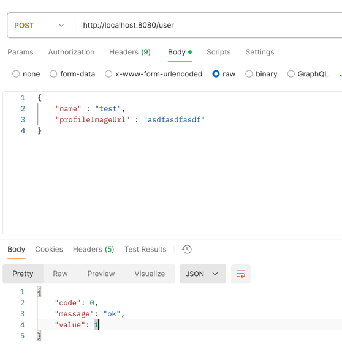
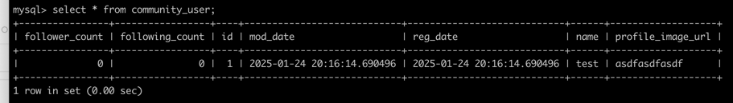
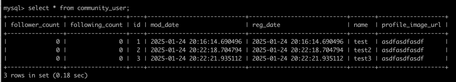

### Controller 작성하기

```java
package org.sangyunpark99.user.ui;

import lombok.RequiredArgsConstructor;
import org.sangyunpark99.user.application.UserService;
import org.springframework.web.bind.annotation.RequestMapping;
import org.springframework.web.bind.annotation.RestController;

@RestController
@RequiredArgsConstructor
@RequestMapping("/user")
public class UserController {

    private final UserService userService;


}

```
UserService의 Controller를 작성해줍니다.  

Controller를 작성하기 앞서서 Response의 공통된 형식을 레코드와 제너릭 타입을 사용해서 선언해줍니다.  
```java
package org.sangyunpark99.common.ui;

public record Response<T>(Integer code, String message, T value) {

    public static <T> Response<T> ok(T value) {
        return new Response<>(0, "ok", value);
    }
}
```

### 계층 구조
잠깐! 계층 분리를 왜 그렇게 하는지 먼저 알아보자.  
(1) Presentation Layer  
- 사용자의 요청을 처리하고 응답을 반환하는 역할을 합니다.  
- 주로 Controller가 위치하는 기술입니다.  
- 사용자가 보는 화면이나 API 요청/응답을 담당합니다.  
핵심 역할  
- HTTP 요청/응답 처리
- 요청 데이터를 검증 및 반환
- application 계층에 작업을 위임.  

(2) Application Layer  
- 비즈니스 흐름(Use Case)를 정의하고 조정하는 계층입니다.
- **도메인 계층**과 **UI 계층**을 연결하는 역할을 합니다.  
- 도메인 핵심 로직은 여기 위치하지 않고, 도메인 계층에서 처리합니다.  
핵심 역할
- 트랜잭션 관리
- 비즈니스 흐름 조정
- 여러 도메인 또는 외부 API 호출

(3) Domain Layer
- 핵심 비즈니스 로직을 담는 계층
- 애플리케이션의 도메인(Entity, ValueObject, Aggregate 등)을 정의하고, 비즈니스 로직을 검증합니다.
- application 계층에서 호출하며, **외부와의 의존성을 최소화합니다.**
핵심 역할  
- 비즈니스 로직 처리
- 상태 변화 관리(Entity 내부 로직)

(4) Persistent Layer
애플리케이션에서 데이터를 영구적으로 저장하거나 조회하는 역할을 담당하는 계층을 의미합니다.  
이 계층은 주로 데이터베이스의 상호 작용을 관리하며, 데이터를 읽고 쓰는 작업을 수행합니다.
핵심 역할  
- 데이터를 DB에 저장하거나, 저장된 데이터를 조회하는 기능을 제공합니다. 
- ORM을 사용해 도메인 객체(Entity)와 데이터베이스 테이블 간의 매핑을 처리합니다.
- 데이터베이스 연결 세션을 생성하고 관리합니다.
- 커넥션 풀 또는 트랜잭션을 활용해 데이터 일관성을 유지합니다.  
- 애플리케이션 코드와 데이터베이스 간의 의존성을 줄여 데이터베이 교체를 더 쉽게 만듭니다.  
- ORM, JDBC, Native Query, Repository Pattern

계층의 큰 흐름  
UI Layer (Controller)  
↓  
Application Layer (Service)  
↓
Domain Layer (Entity, 비즈니스 로직)  
↓
Persistent Layer (Repository, DAO)  
↓  
Database (SQL, NoSQL 등)  

### 에러 처리

```java
package org.sangyunpark99.common.domain.excepton;

import lombok.Getter;

@Getter
public enum ErrorCode {

    INVALID_INPUT_VALUE(400, "invalid input value"),
    NOT_FOUND(404,"not found data"),
    INTERNAL_ERROR(500, "unexpected error");
    
    private final Integer code;
    private final String message;

    ErrorCode(Integer code, String message) {
        this.code = code;
        this.message = message;
    }
}
```
enum을 사용해서 공통으로 사용될만한 에러 코드를 정의해줍니다.  


RestControllerAdvice를 통해 예외 처리를 해줍니다.  
```java
package org.sangyunpark99.common.ui;

import lombok.extern.slf4j.Slf4j;
import org.springframework.web.bind.annotation.ExceptionHandler;
import org.springframework.web.bind.annotation.RestControllerAdvice;

import static org.sangyunpark99.common.domain.excepton.ErrorCode.INVALID_INPUT_VALUE;

@Slf4j
@RestControllerAdvice
public class GlobalExceptionHandler {

    @ExceptionHandler(IllegalArgumentException.class)
    public Response<Void> handleIllegalException(IllegalArgumentException exception) {
        log.error(exception.getMessage());
        return Response.error(INVALID_INPUT_VALUE);
    }

    @ExceptionHandler(Exception.class)
    public Response<Void> handleException(Exception exception) {
        log.error(exception.getMessage());
        return Response.error(INVALID_INPUT_VALUE);
    }
}
```

```java
package org.sangyunpark99.user.ui;

import lombok.RequiredArgsConstructor;
import org.sangyunpark99.common.ui.Response;
import org.sangyunpark99.user.application.UserService;
import org.sangyunpark99.user.application.dto.request.CreateUserRequestDto;
import org.sangyunpark99.user.domain.User;
import org.springframework.web.bind.annotation.PostMapping;
import org.springframework.web.bind.annotation.RequestBody;
import org.springframework.web.bind.annotation.RequestMapping;
import org.springframework.web.bind.annotation.RestController;

@RestController
@RequiredArgsConstructor
@RequestMapping("/user")
public class UserController {

    private final UserService userService;

    @PostMapping
    public Response<Long> createUser(@RequestBody CreateUserRequestDto dto) {
        User user = userService.createUser(dto);
        return Response.ok(user.getId());
    }
}
```
UserController에서 유저를 생성해주는 코드를 작성한 후, postman으로 요청을 해줍니다.  




유저가 잘 등록이 되었는지 mysql을 확인해 봅니다.  

등록이 잘 되었습니다.  


팔로우 기능을 위해서 유저를 2명정도 더 생성합니다.  


2명의 유저가 추가로 생성된 것을 확인할 수 있습니다.  


### 팔로우 기능 구현

UserReationController를 만들어줍니다.  

왜 팔로우 팔로잉 하는 Entity객체를 따로 만들어주었을까?  
(1) N:M 관계를 명확히 하기 위해서
User엔티티에 직접 팔로워 목록을 포함하면 이러한 문제가 발생합다.  
- 한 User가 엔티티 팔로워 리스트와 팔로잉 리스트를 관리해야 합니다.
- 이로 인해 양방향 연관 관계가 복잡해지고, 객체 매핑이 어려워 집니다.  
- 데이터베이스에서 N:M 관계를 효율적으로 처리하기 어려워 집니다.

(2) 데이터 크기와 성능 문제
팔로워/팔로잉 관계 데이터 양은 사용자 수에 따라 급격히 증가할 수 있습니다.  
- 한 사용자가 1,000명의 팔로워를 가진다면, 이를 User 엔티티 컬렉션으로 관리할 경우 메모리 사용량이 급증합니다.  
필요한 데이터만 쿼리할 수 있어 성능과 리소스 사용량을 최적화할 수 있습니다.  
User 엔티티를 불러올 때 불필요하게 팔로워 정보를 로드하지 않아도 됩니다.  

(3) 복합키와 인덱스를 활용한 효율적인 쿼리  
데이터베이스 수준에서 복합 키에 인덱스를 추가하면, 팔로워를 조회하거나 추가/삭제할 때 성능이 향상 됩니다.  


(4) 관계의 독립성  
단순히 팔로우/언팔로우를 넘어서, 추가적인 정보를 포함할 가능성이 있습니다.  ex) 팔로우 날짜, 알림 여부, 친밀도 점수  
팔로워 정보를 별도의 엔티티로 분리하면, 이러한 확장 요구사항을 쉽게 처리할 수 있습니다.  
- User엔티티에 데이터를 포함하게 되는 경우, 새로운 속성을 추가할 때 User 엔티티의 크기가 불필요하게 커지고 복잡해질 수 있습니다.  


(5) 데이터 무결성 보장
팔로워 관계는 데이터 무결성을 유지하기 위해 정규화가 필요합니다.  
- User 엔티티에 팔로워 정보를 포함하면, 중복된 팔로워 관계 데이터를 처리하기 어려울 수 있습니다.


### UserRelationshipRepository 구현

JpaUserRelationRepository(JPA 레포지토리)
```java
package org.sangyunpark99.user.repository.jpa;

import org.sangyunpark99.user.repository.entity.QUserRelationshipEntity;
import org.sangyunpark99.user.repository.entity.UserRelationIdEntity;
import org.springframework.data.jpa.repository.JpaRepository;

public interface JpaUserRelationRepository extends JpaRepository<QUserRelationshipEntity, UserRelationIdEntity> {

}
```
복합키를 사용하므로  UserRelationIdEntity를 입력해줍니다.  


팔로우 기능을 마저 만들기 위해서는 팔로잉 수, 팔로워 수를 증가시켜 줘야 하기 때문에, User 객체도 필요하게 됩니다.  
@Transactional을 해줌으로써 데이터 조작 작업을 Atomic하게 해줍니다.  


@Transactional의 트랜잭션 내의 모든 작업은 하나의 단위로 실행됩니다.  
작업이 전부 성공하면 커밋되고, 중간에 예외가 발생하면 롤백됩니다.  
아토믹하게 유지됨을 보장하는 것은 트랜잭션 진행중일 때 예외가 발생하면 전부 롤백 됩니다.  
여기서 말하는 아토믹은 원자성이고 DB에서 원자 트랜잭션은 모두 성공하거나 또는 실패하는 데이터베이 운용의 집합을 의미합니다.  
쉽게 말해서, @Transactional은 한 가지 상태만 유지하도록 보장하는 것입니다.


UserRelationRepository(인터페이스)  
```java
package org.sangyunpark99.user.application.interfaces;

import org.sangyunpark99.user.domain.User;

public interface UserRelationRepository {

    boolean isAlreadyFollow(User user, User targetUser);

    void save(User user, User targetUser);

    void delete(User user, User targetUser);
}
```

UserRelationRepositoryImpl()
```java
import lombok.RequiredArgsConstructor;
import org.sangyunpark99.user.application.interfaces.UserRelationRepository;
import org.sangyunpark99.user.domain.User;
import org.sangyunpark99.user.repository.entity.UserEntity;
import org.sangyunpark99.user.repository.entity.UserRelationIdEntity;
import org.sangyunpark99.user.repository.entity.UserRelationshipEntity;
import org.sangyunpark99.user.repository.jpa.JpaUserRelationRepository;
import org.sangyunpark99.user.repository.jpa.JpaUserRepository;
import org.springframework.stereotype.Repository;
import org.springframework.transaction.annotation.Transactional;

import java.util.List;

@Repository
@RequiredArgsConstructor
public class UserRelationRepositoryImpl implements UserRelationRepository {

    private final JpaUserRelationRepository jpaUserRelationRepository;
    private final JpaUserRepository jpaUserRepository;

    @Override
    public boolean isAlreadyFollow(User user, User targetUser) {
        UserRelationIdEntity id = new UserRelationIdEntity(user.getId(), targetUser.getId());
        return jpaUserRelationRepository.existsById(id);
    }

    @Override
    @Transactional
    public void save(User user, User targetUser) {
        UserRelationshipEntity entity = new UserRelationshipEntity(user.getId(), targetUser.getId());
        jpaUserRelationRepository.save(entity);
        jpaUserRepository.saveAll(List.of(new UserEntity(user), new UserEntity(targetUser))); // 이때 팔로워 수는 갱신되어 있다.
        // 도메인으로 수정하기 때문에 더티체킹이 되지 않는다. 따라서 saveAll을 해준다.
    }

    @Override
    @Transactional
    public void delete(User user, User targetUser) {
        UserRelationshipEntity entity = jpaUserRelationRepository.findById(new UserRelationIdEntity(user.getId()
                , targetUser.getId())).orElseThrow(IllegalArgumentException::new);
        jpaUserRelationRepository.delete(entity);
        jpaUserRepository.saveAll(List.of(new UserEntity(user), new UserEntity(targetUser))); // 이때 팔로워 수는 갱신되어 있다.
    }
}
```
save메서드와 delete메서드는 각각 팔로우와 언팔로우를 의미한다. User객체의 팔로워 수를 늘리거나 팔로우 수를 줄이는 기능은 어디 있을까요?  
save메서드와 delete메서드를 호출하는 userRealitonService 레이어에서 처리를 해줍니다.

```java
public void follow(FollowUserRequestDto dto) {
        User user = userService.getUser(dto.userId());
        User targetUser = userService.getUser(dto.targetUserId());

        if(userRelationRepository.isAlreadyFollow(user, targetUser)) {
            throw new IllegalArgumentException();
        }

        user.follow(targetUser); // 업데이트
        userRelationRepository.save(user, targetUser);
    }

public void unfollow(FollowUserRequestDto dto) {
        User user = userService.getUser(dto.userId());
        User targetUser = userService.getUser(dto.targetUserId());

        if(!userRelationRepository.isAlreadyFollow(user, targetUser)) {
        throw new IllegalArgumentException();
        }

        user.unfollow(targetUser);
        userRelationRepository.delete(user, targetUser);
        }
```
엔티티와 도메인을 분리하면 책임과 역할이 더 분명해지지만, 엔티티의 상태 변경을 추적하는 JPA의 더티 체킹 기능은 사용할 수 없게 됩니다.  
따라서, 변경된 도메인을 갖고 새로운 엔티티를 만들어 줍니다.  


변경된 필드만 업데이트 해주는 것이 아닌, 모든 필드를 업데이트 해주는 것을 방지하기 위해선 @DynamicUpdate를 사용하면 됩니다.
```java
package org.sangyunpark99.user.repository.entity;

import jakarta.persistence.*;
import lombok.NoArgsConstructor;
import org.hibernate.annotations.DynamicUpdate;
import org.sangyunpark99.common.domain.PositiveIntegerCounter;
import org.sangyunpark99.common.repository.entity.TimeBaseEntity;
import org.sangyunpark99.user.domain.User;
import org.sangyunpark99.user.domain.UserInfo;

@Entity
@Table(name = "community_user")
@NoArgsConstructor
@DynamicUpdate
public class UserEntity extends TimeBaseEntity {

    @Id @GeneratedValue(strategy = GenerationType.IDENTITY)
    private Long id;

    private String name;

    private String profileImageUrl;

    private Integer followingCount;

    private Integer followerCount;

    public UserEntity(User user) {
        this.id = user.getId();
        this.name = user.getName();
        this.profileImageUrl = user.getProfileImageUrl();
        this.followingCount = user.getFollowingCount();
        this.followerCount = user.getFollowerCount();
    }

    public User toUser() {
        return User.builder()
                .id(id)
                .info(new UserInfo(name, profileImageUrl))
                .followingCount(new PositiveIntegerCounter(followingCount))
                .followerCount(new PositiveIntegerCounter(followerCount))
                .build();
    }
}
```
User객체를 Update할때, 모든 필드를 업데이트 하는 것이 아닌, 변경된 값의 필드만 업데이트 해줍니다.  
언팔로우 요청하는 api를 호출하면 udpate 쿼리는 다음과 같이 나가게 됩니다. 아래 user는 언팔로우를 당하는 user에게 해당되는 쿼리문 입니다.  
```java
update
        community_user 
    set
        follower_count=?,
        mod_date=? 
    where
        id=?
```


오류  
userId와 targetId를 사용해서 userRelationShipIdEntity를 만든 후, 조회를 할때 찾는 부분
```java
if(!userRelationRepository.isAlreadyFollow(user, targetUser)) {
            throw new IllegalArgumentException("user가 targetUser를 팔로우하고 있지 않습니다.");
        }
```
이 부분에서 false가 반환되어 오류가 발생합니다.  
오류가 발생한 주 원인은 followingUserId와 followerUserId가 제가 의도한대로 생성이 되지 않고, 두 개의 값이 바뀌어서 생성되었기 때문입니다.  


조회를 해주는 repository를 Presentation 계층에서 사용하면 어떨까..?
```java
package org.sangyunpark99.user.ui;

import lombok.RequiredArgsConstructor;
import org.sangyunpark99.common.ui.Response;
import org.sangyunpark99.user.application.UserService;
import org.sangyunpark99.user.application.dto.request.CreateUserRequestDto;
import org.sangyunpark99.user.application.dto.response.GetUserListResponseDto;
import org.sangyunpark99.user.domain.User;
import org.sangyunpark99.user.repository.jpa.JpaUserListQueryRepository;
import org.springframework.web.bind.annotation.*;

import java.util.List;

@RestController
@RequiredArgsConstructor
@RequestMapping("/user")
public class UserController {

    private final UserService userService;
    private final JpaUserListQueryRepository jpaUserListQueryRepository;

    @PostMapping
    public Response<Long> createUser(@RequestBody CreateUserRequestDto dto) {
        User user = userService.createUser(dto);
        return Response.ok(user.getId());
    }

    @GetMapping("/{userId}/follower")
    public Response<List<GetUserListResponseDto>> getFollowers(@PathVariable(name = "userId") Long userId) {
        List<GetUserListResponseDto> result = jpaUserListQueryRepository.getUserFollowerList(userId);
        return Response.ok(result);
    }
}
```
이러한 방식으로 Service 계층을 거쳐가는 것이 아닌 바로 repository를 통해 데이터를 전달합니다.  
참고로 JpaUserListQueryRepository는 QueryDSL을 사용하여 DB에서 가져오는 데이터를 바로 Dto로 변환해 줍니다.  

왜 이런 방식을 사용할까요?  
(1) 조회 성능 최적화  
(2) CQRS 패턴의 원칙, Command(쓰기)는 UserService에서 비즈니스 로직을 처리하며 데이터를 저장하거나 변경, Query(조회) : 데이터를 단순히 읽어오는 작업은 Repository에서 
처리합니다.    
(3) 단순화된 비즈니스 로직, 조회용 API는 비즈니스 로직이 복잡하지 않은 경우가 많습니다.
(4) 빠른 개발과 유지 보수, Repository를 직접 호출하면 코드가 간결하고, 단순한 조회 로직의 유지보수가 쉬워집니다.  

요약 : 성능 최적화와 단순화를 위함이다.  

추가로, 저수준 컴포넌트인 Controller가 저수준 컴포넌트인 Repository를 의존하므로 클린 아키텍처 관점에서도 문제가 존재하지 않습니다.  


팔로잉유저 리스트를 조회하는 api도 추가로 만들도록 하겠습니다.  

```java
    @GetMapping("/{userId}/following")
    public Response<List<GetUserListResponseDto>> getFollowings(@PathVariable(name = "userId") Long userId) {
        List<GetUserListResponseDto> result = jpaUserListQueryRepository.getUserFolowingList(userId);
        return Response.ok(result);
    }
```

다음으로는 프로필 조회 기능을 구현해보도록 하겠습니다.  
```java
package org.sangyunpark99.user.application.dto.response;

import org.sangyunpark99.user.domain.User;

public record GetUserResponseDto(Long id, String name, String profileImage, Integer followingCount,
                                 Integer followerCount) {

    public GetUserResponseDto(User user) {
        this();
    }
}
```
참고로 record는 생성자를 this로만 정의해줄 수 있습니다.  


UserService를 이용하건, repository를 사용하는 것은 정답이 없다.  
다만, 비즈니스 로직에 따라 데이터 변경이나 값이 추가가 되야 한다면, 서비스 레이어를 거쳐서 반환하는 것도 한가지 방법입니다.  