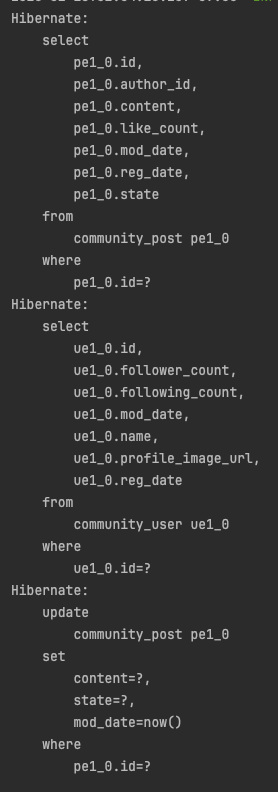
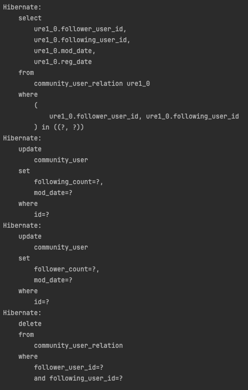

### 피드 서비스 구현

게시글 작성, 댓글 작성, 게시물 상호작용, 피드 보기를 구현하도록 하겠습니다.  

#### 어떻게 UserService의 UserRepository에 UserRepository의 구현체인 UserRepositoryImpl을 자동주입 해줄까?
Spring은 DI(Dependency Injection) 매커니즘을 통해 인터페이스(UserRepository)를 자동으로 매핑해 주입해 줍니다.  
Spring 컨테이너는 인터페이스(UserRepository)를 주입해야 할때, 해당 인터페이스의 구현체를 찾고 구현체가 하나면 존재하면 이를 자동으로 주입해줍니다.  

#### PostRepositoryImpl
```java
package org.sangyunpark99.post.repository;

import lombok.RequiredArgsConstructor;
import org.sangyunpark99.post.application.interfaces.PostRepository;
import org.sangyunpark99.post.domain.Post;
import org.sangyunpark99.post.repository.entity.post.PostEntity;
import org.sangyunpark99.post.repository.jpa.JpaPostRepository;
import org.springframework.stereotype.Repository;

@Repository
@RequiredArgsConstructor
public class PostRepositoryImpl implements PostRepository {

    private final JpaPostRepository jpaPostRepository;

    @Override
    public Post save(Post post) {
        PostEntity postEntity = new PostEntity(post);
        postEntity = jpaPostRepository.save(postEntity);
        return postEntity.toPost();
    }

    @Override
    public Post findById(Long id) {
        PostEntity postEntity = jpaPostRepository.findById(id).orElseThrow(IllegalArgumentException::new);
        return postEntity.toPost();
    }
}
```

#### PostService
```java
package org.sangyunpark99.post.application;

import lombok.RequiredArgsConstructor;
import org.sangyunpark99.post.application.dto.CreatePostRequestDto;
import org.sangyunpark99.post.application.dto.LikePostRequestDto;
import org.sangyunpark99.post.application.dto.UpdatePostRequestDto;
import org.sangyunpark99.post.application.interfaces.LikeRepository;
import org.sangyunpark99.post.application.interfaces.PostRepository;
import org.sangyunpark99.post.domain.Post;
import org.sangyunpark99.user.application.UserService;
import org.sangyunpark99.user.domain.User;
import org.springframework.stereotype.Service;

@Service
@RequiredArgsConstructor
public class PostService {

    private final PostRepository postRepository; // interface에 의존
    private final LikeRepository likeRepository;
    private final UserService userService;

    public Post get(final Long id) {
        return postRepository.findById(id);
    }

    public Post create(CreatePostRequestDto dto) {
        User user = userService.getUser(dto.userId());
        Post post = Post.createPost(null, user, dto.content() ,dto.state());
        return postRepository.save(post);
    }

    public Post update(Long id, UpdatePostRequestDto dto) {
        Post post = get(id);
        User user = userService.getUser(dto.userId());

        post.updatePost(user, dto.content(), dto.state());
        return postRepository.save(post);
    }

    public void likePost(LikePostRequestDto dto) {
        Post post = get(dto.postId());
        User user = userService.getUser(dto.userId());

        if(likeRepository.checkLike(post, user)) {
            return;
        }

        post.like(user);
        likeRepository.like(post, user);
    }

    public void unlikePost(LikePostRequestDto dto) {
        Post post = get(dto.postId());
        User user = userService.getUser(dto.userId());

        if(!likeRepository.checkLike(post, user)) {
            return;
        }

        post.unlike();
        likeRepository.unlike(post, user);
    }
}
```

#### PostController

```java
@RestController
@RequiredArgsConstructor
@RequestMapping("/post")
public class PostController {

    private final PostService postService;

    @PostMapping
    public Response<Long> createPost(@RequestBody CreatePostRequestDto dto) {
        Post post = postService.create(dto);
        return Response.ok(post.getId());
    }


    @PostMapping("/{postId}")
    public Response<Long> updatePost(@PathVariable(name = "postId") Long postId, @RequestBody UpdatePostRequestDto dto) {
        Post post = postService.update(postId, dto);
        return Response.ok(post.getId());
    }

    @PostMapping("/like")
    public Response<Void> likePost(@RequestBody LikePostRequestDto dto) {
        postService.likePost(dto);
        return Response.ok(null);
    }

    @PostMapping("/unlike")
    public Response<Void> unlikePost(@RequestBody LikePostRequestDto dto) {
        postService.unlikePost(dto);
        return Response.ok(null);
    }
}
```

#### 업데이트시 select 쿼리가 나가는 이유
영속성 컨텍스트해 업데이트 하고자 하는 해당 엔티티가 존재하지 않는 경우, JPA는 select 쿼리를 DB에 날려 엔티티를 저장한 후 가져오게 됩니다.  
즉, update 쿼리만 날리고 싶지만, 영속성 컨텍스트가 비어있다면, JPA에 의해서 select 쿼리를 한번 날리는 것입니다.


위 이미지에 select 조회 쿼리가 한번 나간 후, update 쿼리가 실행됨을 확인할 수 있습니다.  

```java
@Override
    public Post findById(Long id) {
        PostEntity postEntity = jpaPostRepository.findById(id).orElseThrow(IllegalArgumentException::new);
        return postEntity.toPost();
    }
```
postEntity는 실질적으로 사용되지 않으므로, 영속성 컨텍스트에 등록이 되지 않습니다.  
즉, 엔티티를 데이터베이스에서 조회하여 영속성 컨텍스트에 등록하고, 영속 상태로 반환한 뒤, 반환된 객체를 사용하지 않으면, JPA는 이를 관리하지 않는 비영속 상태로 간주합니다.  

사용하지 않고 DTO로 변환하는 방식(postEntity.toPost())을 사용하면, JPA의 영속성 컨텍스트와는 무관하게 비영속 상태의 객체로 동작합니다.  
**여기서, 엔티티를 사용한다느 것은 해당 엔티티 객체의 필드나 메서드에 접근하여 값을 읽거나 변경하는 작업을 의미합니다.**


그렇다면, 이러한 불필요한 조회를 없애는 방법이 무엇이 있을까요?  
방법은 크게 2가지가 존재합니다.  

(1) @Transactional을 사용해서 메서드 내부에 비즈니스 로직을 실행하면, JPA의 영속성 컨텍스트를 활용할 수 있습니다.  
트랜잭션이 시작되면 영속성 컨텍스트가 생성됩니다. 메서드가 끝날 때 까지 영속성 컨텍스트가 유지되므로, 메서드 내부에서 변경된 엔티티는 영속성 컨텍스트를 통해서 관리됩니다.  
즉, 영속성 컨텍스트는 변경 감지를 통해, 별도의 조회가 없어도 데이터베이스에 변경 사항을 반영할 수 있습니다.  

아래는 예시 코드입니다. 실제 로직과는 다릅니다.  
```java
@Override
@Transactional
public Post save(Post post) {
        PostEntity postEntity = new PostEntity(post); // 새로운 엔티티 생성
        postEntity = jpaPostRepository.save(postEntity); // INSERT 쿼리 실행

        // 비즈니스 로직: 필요하면 엔티티를 수정
        postEntity.setTitle("Updated Title"); // 변경 감지 (Dirty Checking)

        return postEntity.toPost(); // DTO로 변환 후 반환
        }
```

그러나, 이러한 로직은 한 메서드에 많은 코드를 작성하게 됩니다. 즉, 코드의 가독성과 유지보수성이 떨어지게 됩니다.(코드의 복잡성이 증가하고 변경이 어려워집니다.)  
변경사항이 너무 많아집니다.

JPA에서 구현되어 있는 save()메서드는 다음과 같습니다.
```java
@Override
	@Transactional
	public <S extends T> S save(S entity) {

		Assert.notNull(entity, "Entity must not be null");

		if (entityInformation.isNew(entity)) {
			entityManager.persist(entity);
			return entity;
		} else {
			return entityManager.merge(entity);
		}
	}
```
새로운 엔티티가 아닌 경우, entity를 merge하게 됩니다.  
merge를 하게 되는 경우, 만약 영속성 컨텍스트에 해당 엔티티가 없거나 데이터베이스에 존재하지 않는 경우, SELECT 쿼리를 실행해서 엔티티를 가져옵니다.  

영속성 컨텍스트에 동일한 ID를 가진 엔티티가 있는 경우, 그 엔티티와 전달된 엔티티를 병합합니다. 즉, SELECT 쿼리를 실행하지 않습니다.  

영속성 컨텍스트에 동일한 ID를 가진 엔티티가 없는 경우, JPA는 데이터베이스에서 해당 엔티티를 조회(SELECT)합니다.  
조회된 엔티티를 영속성 컨텍스트로 가져와 병합한 후, 변경 사항을 반영합니다.  

entityInformation.isNew(entity)는 JPA의 엔티티가 "새로운 엔티티"인지, 즉 데이터베이스에 아직 저장되지 않은 엔티티인지 판단하는 역할을 합니다. 이를 통해 JPA는 persist()
를 사용할지 merge()를 사용할지 결정할 수 있습니다.  
JPA는 기본적으로 엔티티의 **@Id 필드(Primary Key)**를 기준으로, 해당 엔티티가 데이터베이스에 존재하는지 판단합니다.  
새로운 엔티티란, @Id 값이 아직 설정되지 않은(또는 null인) 엔티티를 의미합니다.  

(2) update문을 JPQL Query문을 통해 따로 작성해주는 방법입니다.  
```java
package org.sangyunpark99.post.repository.jpa;

import org.sangyunpark99.post.repository.entity.post.PostEntity;
import org.springframework.data.jpa.repository.JpaRepository;
import org.springframework.data.jpa.repository.Modifying;
import org.springframework.data.jpa.repository.Query;

public interface JpaPostRepository extends JpaRepository<PostEntity, Long> {

    @Modifying
    @Query(value = "UPDATE PostEntity p SET " +
            "p.content = :#{#postEntity.getContent()}, " +
            "p.state = :#{#postEntity.getState()}," +
            "p.modDate = now()" +
            "WHERE p.id = :#{#postEntity.getId()}")
    void updatePostEntity(PostEntity postEntity);
}
```

save()메서드도 수정을 해줍니다.
```java
    @Override
    @Transactional
    public Post save(Post post) {
        PostEntity postEntity = new PostEntity(post);
        if(post.getId() != null) { 
            jpaPostRepository.updatePostEntity(postEntity);
            return postEntity.toPost();
        }
        postEntity = jpaPostRepository.save(postEntity);
        return postEntity.toPost();
    }
```
post의 Id를 기반으로 null인 경우는 DB에 데이터를 저장하므로 jpaRepository의 save를 호출해주고, 이미 id가 존재하는 경우는
JPQL로 짜준 updatePostEntity 메서드를 통해 직접 update 쿼리를 날려줍니다.  


주의할 점  
@Modifying 어노테이션과 @Transactional 어노테이션이 함께 사용되어야 변경이 됩니다.  
그 이유는 JPA의 데이터 변경 작업과 트랙잭션에 관계가 있습니다.  

@Query 어노테이션은 주로 읽기 전용 쿼리(SELECT)로 사용됩니다.  
@Modifying을 붙이면 해당 쿼리가 데이터 변경 작업(INSERT, UPDATE, DELETE)를 수행한다는 것을 Spring Data JPA에게 알려 줍니다.  
JPA에서는 **데이터 변경 작업을 할 때 트랜잭션 내에서 수행**되어야 합니다.  이때 @Modifying만 단독으로 사용하면 트랜잭션이 없으므로 변경 사항이 DB에 반영되지 않을 수 있습니다.  

@Transactional이 없는 경우, 변경 작업은 수행되지 않거나, 수행되더라도 데이터베이스에 반영(commit) 되지 않습니다.


추가로, 한번 더 조회하지 않고 update를 진행하게 됩니다.  

### 트랜잭션 종료 시점
트랜잭션이 종료 직전에 JPA는 flush()를 호출해서 영속성 컨텍스트의 변경 사항을 데이터베이스에 동기화합니다.  
이 시점에 UPDATE, INSERT, DELTE 등의 SQL 쿼리가 실행됩니다.  
flush()가 완료되면, JPA는 데이터베이스 드라이버를 통해 명시적으로 COMMIT 명령을 전달합니다.  

### flush()의 역할
JPA의 영속성 컨텍스트는 변경 내용을 SQL 쿼리로 변환해 데이터베이스에 전달합니다.  
flush()는 단순히 쿼리를 실행하는 작업이며, 데이터베이스에서 트랜잭션을 확정하지 않습니다.  

이 시점에 데이터베이스는 해당 쿼리르 수행하고, 변경 사항을 임시 저장합니다.  
DB 트랜잭션은 아직 commit 명령어를 받지 않았으므로, 변경 사항은 트랜잭션이 종료될 때까지 확정되지 않습니다.  

트랜 잭션이 성공적으로 완료되면, JPA는 DB Driver를 통해서 COMMIT 명령을 보냅니다.  
DB가 COMMIT 명령ㅇ르 수신하면, 이전에 실행된 모든 쿼리(flush())로 전달된 것의 결과를 확정, 트랜잭션을 종료
다른 세션에서 해당 변경 내용을 조회할 수 있도록 저정합니다.  
COMMIT 명령이 없는 경우 , DB는 이전 쿼리 내용을 확정하지 않습니다.


Post뿐만 아니라, User 도메인의 유저간의 팔로워, 팔로잉 관계를 관리하는 UserRelationRepository에도 동일한 방식으로 update가 사용됩니다.  
post와 같이 수정해주지 않는 경우, update시 select 조회 쿼리가 한번 더 발생하는 문제가 생길 수 있습니다.  

수정 전에는 이전에 조회가 됬음에도 불구하고 select 쿼리를 한번 더 사용하는 불상사가 발생합니다.  



### 영속성 컨텍스트의 범위
Spring에서는 보통 트랜잭션 단위로 영속성 컨텍스트가 관리됩니다.  
하나의 트랜잭션이 시작될 때 영속성 컨텍스트가 생성되고, 트랜잭션이 종료되면 영속성 컨텍스트도 종료됩니다.  

existById 메서드는 내부적으로 findById 메서드를 활용합니다.  
```java
@Override
	public boolean existsById(ID id) {

		Assert.notNull(id, ID_MUST_NOT_BE_NULL);

		if (entityInformation.getIdAttribute() == null) {
			return findById(id).isPresent();
		}
```
existsById 메서드 내부를 일부 발췌한 내용입니다.  

문제 : 도대체 existsById를 호출한 후에 왜 SELECT 쿼리문이 나가는가?  
해결 ~ id로 엔티티 생성 + merge  