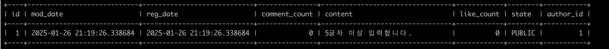

게시글에 대한 댓글의 갯수를 저장하고 있지 않다는 문제점  
내가 팔로우한 사람들의 글을 전부 불러온 뒤에 시간 순으로 정리해야 한다는 문제점  

### 댓글의 대한 개수 추가하기

좋아요는 도메인을 업데이트하는 형식으로 했으니, 이번에는 엔티티로만 구현해보자  
```java
package org.sangyunpark99.post.repository.entity.post;

import jakarta.persistence.*;
import lombok.Getter;
import lombok.NoArgsConstructor;
import org.hibernate.annotations.DynamicUpdate;
import org.sangyunpark99.common.repository.entity.TimeBaseEntity;
import org.sangyunpark99.post.domain.Like;
import org.sangyunpark99.post.domain.Post;
import org.sangyunpark99.post.domain.content.PostContent;
import org.sangyunpark99.post.domain.content.PostState;
import org.sangyunpark99.user.repository.entity.UserEntity;

@Entity
@Table(name = "community_post")
@NoArgsConstructor
@DynamicUpdate
@Getter
public class PostEntity extends TimeBaseEntity {

    @Id @GeneratedValue(strategy = GenerationType.IDENTITY)
    private Long id;

    private String content;

    @Convert(converter = PostStateConverter.class)
    private PostState state;

    private Integer likeCount;
    
    @ColumnDefault("0")
    private int commentCount;
    
    @ManyToOne(fetch = FetchType.LAZY)
    @JoinColumn(name = "author_id", foreignKey = @ForeignKey(ConstraintMode.NO_CONSTRAINT))
    private UserEntity author;

    public PostEntity(Post post) {
        this.id = post.getId();
        this.content = post.getContentText();
        this.likeCount = post.getLikeCount();
        this.author = new UserEntity(post.getAuthor());
        this.state = post.getState();
    }

    public Post toPost() {
        return Post.builder()
                .id(id)
                .content(new PostContent(content))
                .state(state)
                .author(author.toUser())
                .likeCount(new Like(likeCount))
                .build();
    }
}

```
commentCount는 DB에서 관리되는 값이므로 Wrapper Class가 아닌, Primitive Type으로 구현해줍니다.  
@ColumnDefault("0")을 선언해주는 경우 DB에서 자동으로 0값으로 기본값을 갖도록 합니다.  

테이블 삭제 후, 다시 생성하면 다음과 같이 됩니다. 
```sql
Hibernate: 
    create table community_post (
        id bigint not null auto_increment,
        mod_date datetime(6),
        reg_date datetime(6),
        comment_count integer default 0 not null,
        content varchar(255),
        like_count integer,
        state varchar(255),
        author_id bigint,
        primary key (id)
    ) engine=InnoDB
```
comment_count integer default 0 not null 이라는 쿼리문이 실행됩니다.  

  

기존처럼 likeCount를 증가하는 방식은 역할을 객체에 위임하고 유연하게 사용할 수 있다는 장점이 있지만, repository의 기능 만으로도 따로 만들어 주지 않아도 기능 구현이 가능했다.  

### 피드 조회 기능 구현하기

내가 팔로잉하고 있는 유저의 게시물을 갖고 오기 위해선 다음과 같은 플로우를 거치게 됩니다.  
(1) 팔로잉 유저 목록 조회
(2) 각 유저가 작성한 게시물 목록 조회
(3) 조회한 게시물을 시간순으로 정렬

이러한 플로우를 단축하는 것은 어떨까요?  
내가 팔로잉하고 있는 유저의 게시물 Id 목록을 갖고 있는 하나의 테이블을 만들어주는 것입니다.  

1번 유저가 2번 유저 팔로우
1번 유저가 3번 유저 팔로우

2번 유저의 글쓰기, 3번 유저의 글쓰기는 아래와 같습니다.

1번 유저의 글쓰기 -> 아무도 1번을 팔로우하지 않으므로 UserPostQueue에 쌓이지 않게 됩니다.  
조회할때는 User ID를 사용해서 조회를 하고, 순서대로 피드를 정렬할때는 Post ID를 기준으로 정렬하면 됩니다.  
UserPostQueue  
USER ID / POST ID / AUTHOR ID  
1 / 1 / 2  
1 / 2 / 3  

```java
package org.sangyunpark99.post.repository.post_queue;

import org.sangyunpark99.post.repository.entity.post.PostEntity;

public interface UserPostQueueCommentRepository {
    
    void publishPost(PostEntity postEntity);
    
    void saveFollowPost(Long userId, Long targetId);
    
    void deleteUnfollowPost(Long userid, Long targetId);
}
```
이 인터페이스를 레파지토리 하위에 넣은 이유는 이 인터페이스는 서비스 레이어에 노출이 되어서는 안되는 레파지토리이기 때문이다.  
서비스 레이어의 특징으로는 repo, domin, controller에서 오는 데이터를 전달하고, 가공하는 중간단의 역할로 생각을 했다.  

Command Repositroy와 Read Repository를 분리해서 구현해줍니다.  

팔로워를 찾는 로직은 아래와 같습니다.  
```java
package org.sangyunpark99.user.repository.jpa;

import org.sangyunpark99.user.repository.entity.UserRelationIdEntity;
import org.sangyunpark99.user.repository.entity.UserRelationshipEntity;
import org.springframework.data.jpa.repository.JpaRepository;
import org.springframework.data.jpa.repository.Query;

import java.util.List;

public interface JpaUserRelationRepository extends JpaRepository<UserRelationshipEntity, UserRelationIdEntity> {
    
    @Query("SELECT u.followingUserId FROM UserRelationshipEntity u WHERE u.followerUserId = :userId")
    List<Long> findFollowers(Long userId);
}
```

삭제 로직은 기존 방식처럼 엔티티에 들어갈 값들을 기준으로 하는 것이 아닌, 

```java
public interface JpaUserPostQueueRepository extends JpaRepository<UserPostQueueEntity, Long> {
    
    void deleteAllByUserIdAndAuthorId(Long userId, Long targetId);
}
```
이런방식으로 jpa의 장점을 활용해 userId와 targetId만으로 deleteAll 쿼리를 작성할 수 있습니다.  


DTO를 작성할 때, 반환하는 데이터의 값들이 유사하면서 몇부분만 다르다면, record 방식을 사용하는 것보다 Class로 상속으로 롬복을 이용하면 좀 더 쉽게 사용이 가능합니다.  

```java
package org.sangyunpark99.post.ui.dto;

import lombok.AllArgsConstructor;
import lombok.Getter;
import lombok.NoArgsConstructor;
import lombok.Setter;
import lombok.experimental.SuperBuilder;

import java.time.LocalDateTime;

@Getter
@Setter
@SuperBuilder
@NoArgsConstructor
@AllArgsConstructor
public class GetContentResponseDto {
    private Long id;
    private String content;
    private Long userId;
    private String userName;
    private String userProfileImage;
    private LocalDateTime createdAt;
    private LocalDateTime updatedAt;
    private Integer likeCount;
    private boolean isLikedByMe;
}

```

@SuperBuilder란 무엇인가?  
@SuperBuilder는 Lombok에서 제공하는 애너테이션으로, 클래스 및 그 상위 클래스의 빌더(Builder) 패턴을 간편하게 생성할 수 있도록 해줍니다. 이는 @Builder의 확장된 버전으로, 
상속 관계에 있는 클래스들에서도 빌더 패턴을 사용할 수 있게 설계되었습니다.  

아직 experimental인 실험중인 단계입니다. 혹시 모르니 저는 유의해서 사용하도록 하겠습니다.  

커뮤니티 피드를 조회하기 위한 조회 쿼리문을 QueryDSL로 구현하면 다음과 같습니다.  
```java
package org.sangyunpark99.post.repository.post_queue;

import com.querydsl.core.types.Projections;
import com.querydsl.core.types.dsl.BooleanExpression;
import com.querydsl.jpa.impl.JPAQueryFactory;
import lombok.RequiredArgsConstructor;
import org.sangyunpark99.post.repository.entity.like.QLikeEntity;
import org.sangyunpark99.post.repository.entity.post.QPostEntity;
import org.sangyunpark99.post.repository.entity.post.QUserPostQueueEntity;
import org.sangyunpark99.post.ui.dto.GetPostContentResponseDto;
import org.sangyunpark99.user.repository.entity.QUserEntity;
import org.springframework.stereotype.Repository;

import java.util.List;

@Repository
@RequiredArgsConstructor
public class UserPostQueueQueryRepositoryImpl implements UserPostQueueQueryRepository{

    private final JPAQueryFactory queryFactory;

    private static final QUserPostQueueEntity userPostQueueEntity = QUserPostQueueEntity.userPostQueueEntity;
    private static final QPostEntity postEntity = QPostEntity.postEntity;
    private static final QUserEntity userEntity = QUserEntity.userEntity;
    private static final QLikeEntity likeEntity = QLikeEntity.likeEntity;

    @Override
    public List<GetPostContentResponseDto> getPost(Long userId, Long lastContentId) {
        return queryFactory
                .select(
                        Projections.fields(
                                GetPostContentResponseDto.class,
                                postEntity.id.as("id"),
                                postEntity.content.as("content"),
                                userEntity.id.as("userId"),
                                userEntity.name.as("userName"),
                                userEntity.profileImageUrl.as("userProfileImage"),
                                postEntity.regDate.as("createdAt"),
                                postEntity.modDate.as("updatedAt"),
                                postEntity.commentCount.as("commentCount"),
                                postEntity.likeCount.as("likeCount"),
                                likeEntity.isNotNull().as("isLikedByMe")
                        )
                )
                .from(userPostQueueEntity)
                .join(postEntity).on(userPostQueueEntity.postId.eq(postEntity.id))
                .join(userEntity).on(userPostQueueEntity.authorId.eq(userEntity.id))
                .leftJoin(likeEntity).on(hasLike(userId))
                .where(
                        userPostQueueEntity.userId.eq(userId),
                        hasLastDate(lastContentId)
                )
                .orderBy(userPostQueueEntity.postId.desc())
                .limit(20)
                .fetch();
    }

    private BooleanExpression hasLastDate(Long lastId) {
        if(lastId == null) {
            return null;
        }

        return postEntity.id.lt(lastId);
    }

    private BooleanExpression hasLike(Long userId) {
        if(userId == null) {
            return null;
        }

        return postEntity.id
                .eq(likeEntity.id.targetId)
                .and(likeEntity.id.targetType.eq("POST"))
                .and(likeEntity.id.userId.eq(userId));
    }
}

```

여기서 잠깐, QueryDSL은 왜 사용하는 것일까요?
(1) 타입 안정성
(2) 가독성 향상
(3) 동적 쿼리 작성 용이 ✅
복잡한 조건이 있는 동적 쿼리를 간단하게 구현할 수 있게 해주므로 유지보수가 편리합니다.  

```java
package org.sangyunpark99.post.repository.post_queue;

import com.querydsl.core.types.Projections;
import com.querydsl.core.types.dsl.BooleanExpression;
import com.querydsl.jpa.impl.JPAQueryFactory;
import lombok.RequiredArgsConstructor;
import org.sangyunpark99.post.repository.entity.like.QLikeEntity;
import org.sangyunpark99.post.repository.entity.post.QPostEntity;
import org.sangyunpark99.post.repository.entity.post.QUserPostQueueEntity;
import org.sangyunpark99.post.ui.dto.GetPostContentResponseDto;
import org.sangyunpark99.user.repository.entity.QUserEntity;
import org.springframework.stereotype.Repository;

import java.util.List;

@Repository
@RequiredArgsConstructor
public class UserPostQueueQueryRepositoryImpl implements UserPostQueueQueryRepository{

    private final JPAQueryFactory queryFactory;

    private static final QUserPostQueueEntity userPostQueueEntity = QUserPostQueueEntity.userPostQueueEntity;
    private static final QPostEntity postEntity = QPostEntity.postEntity;
    private static final QUserEntity userEntity = QUserEntity.userEntity;
    private static final QLikeEntity likeEntity = QLikeEntity.likeEntity;

    @Override
    public List<GetPostContentResponseDto> getPost(Long userId, Long lastContentId) {
        return queryFactory
                .select(
                        Projections.fields(
                                GetPostContentResponseDto.class,
                                postEntity.id.as("id"),
                                postEntity.content.as("content"),
                                userEntity.id.as("userId"),
                                userEntity.name.as("userName"),
                                userEntity.profileImageUrl.as("userProfileImage"),
                                postEntity.regDate.as("createdAt"),
                                postEntity.modDate.as("updatedAt"),
                                postEntity.commentCount.as("commentCount"),
                                postEntity.likeCount.as("likeCount"),
                                likeEntity.isNotNull().as("isLikedByMe")
                        )
                )
                .from(userPostQueueEntity)
                .join(postEntity).on(userPostQueueEntity.postId.eq(postEntity.id))
                .join(userEntity).on(userPostQueueEntity.authorId.eq(userEntity.id))
                .leftJoin(likeEntity).on(hasLike(userId))
                .where(
                        userPostQueueEntity.userId.eq(userId),
                        hasLastDate(lastContentId)
                )
                .orderBy(userPostQueueEntity.postId.desc())
                .limit(20)
                .fetch();
    }

    private BooleanExpression hasLastDate(Long lastId) {
        if(lastId == null) {
            return null;
        }

        return postEntity.id.lt(lastId);
    }

    private BooleanExpression hasLike(Long userId) {
        if(userId == null) {
            return null;
        }

        return postEntity.id
                .eq(likeEntity.id.targetId)
                .and(likeEntity.id.targetType.eq("POST"))
                .and(likeEntity.id.userId.eq(userId));
    }
}
```
Q로 시작된 클래스는 QueryDSL에서 자동 생성된 클래스입니다. 이 클래스는 각 엔티티의 필들를 쉽게 참조할 수 있게 해줍니다.  

Projections.fields를 사용해 쿼리 결과를 DTO로 매핑합니다.  
ex) postEntity.id.as("id") → DTO의 id 필드에 postEntity.id 값을 매핑.  

hasLike메서드는 userId로 주어진 파라미터가 좋아요를 눌렀는지에 대해 확인하는 메서드입니다.  
.leftJoin(likeEntity).on(hasLike(userId))는 leftJoin이므로 엔티티가 존재하지 않는 경우에는 null로 반환됩니다.  
isNotNull()은 다은과 같습니다.  
```java
public BooleanExpression isNotNull() {
        if (isnotnull == null) {
            isnotnull = Expressions.booleanOperation(Ops.IS_NOT_NULL, mixin);
        }
        return isnotnull;
    }
```
notnull은 boolean 값을 return해줍니다. 

왜 LikeEntity를 leftJoin 해주었는가?  
```java
.leftJoin(likeEntity).on(hasLike(userId))
```
내가 누른 좋아요는 게시물마다 존자할 수도 존재하지 않을 수도 있습니다.  
내가 팔로잉 한 사람의 게시물 피드를 가져오는 부분에 있어서 inner join을 하게되면 좋아요를 누르지 않은 경우엔 게시물을 가져오지 않게 됩니다.  
left join을 사용해서 좋아요가 눌리지 않더라도 게시물을 가져오기 위해선 필수입니다.

```java
 if(userId == null) {
            return null;
        }
```
이 조건은 로그인 상태일 수도 있고, 로그인 상태가 아닐 수 도 있기 때문에 아닌 경우엔 null을 return해줍니다.  

잘 동작이 됩니다.  

### 내가 구현할 기능
나를 팔로우 한 사람들이 내 피드에 작성한 댓글 항목을