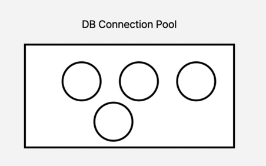
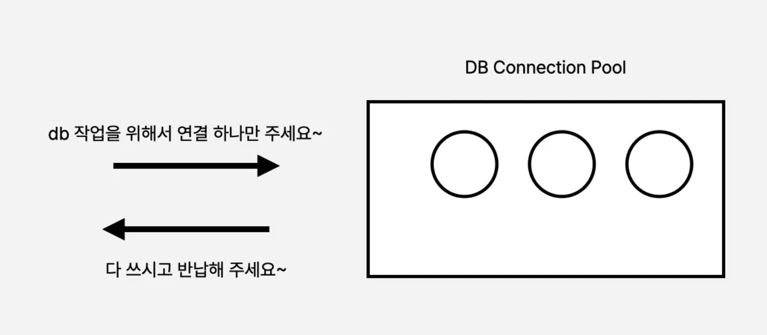
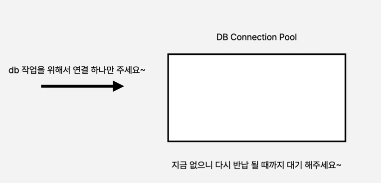
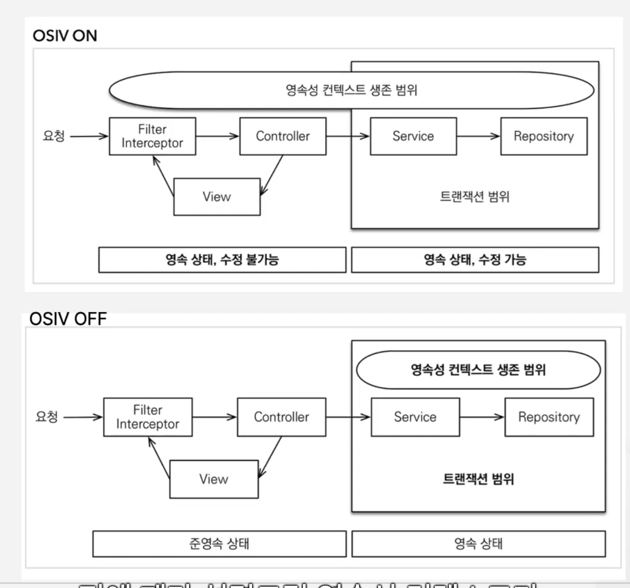

### DB 커넥션 스레드 풀
애플리케이션에서 DB로 연결하는 작업은 간단한 작업이 아닙니다.  
네트워크를 통해서 커넥션을 맺어야 하는 꽤 무겁고 오래 걸리는 작업입니다.  

"이 작업을 매번 유저 요청이 올때마다 한다면 어떻게 될까요?"
매 요청마다 연결하는 것만 해도 엄청난 병목이 될 것입니다.  

병목이란 무엇일까요?  
병목이란 시스템 내에서 전체적인 처리 속도를 떨어뜨리게 되는 특정한 부분을 가리키는 용어입니다.  
시스템의 CPU나 메모리, 디시크 등의 자원 중 하나가 다른 자원들에 비해 속도 처리가 느려서, 전체적인 성능을 제한하는 경우를 말합니다.

그래서 Spring은 DB Connection을 미리 연결을 해두고 필요할 때마다 연결이 되어있는 Connection Thread들에게 요청을 하는 방식으로,
재사용하는 방식으로 구현이 되어 있습니다.  이런 Connection들이 모아져 있는 곳은 Connection Pool이라고 합니다. 

애플리케이션을 실행할 때, 미리 이 Connection Pool에 몇개의 스레드가 있을지에 대해 설정할 수 있습니다.  
Spring 기준으로는 10개이고, 설정하는 옵션은 maxConnectionPool이라고 합니다.  

### Spring Thread Pool
스프링에서는 Connection Thread Pool을 표준화된 Data Source 인터페이스를 사용하여 커넥션 풀을 관리합니다.  
2.0이후부터는 HikraiCP 라이브러리가 기본 옵션입니다. 기존에는 Tomcat JDBC 2.0을 사용했습니다.  

Thread는 작업을 처리하는 주체이고,
Connection Pool은 데이터베이스와의 연결 자원을 관리하는 곳입니다.  
즉, Thread가 Connection Pool에서 Connection을 가져와 데이터베이스와 통신하면서 일을 수행하는 구조입니다.  

### DB 작업 요청 흐름

이 사진은 Connection Pool에 Connection이 담겨 있는 상태를 의미합니다.  
애플리케이션이 가동되고 DB와 4개의 연결을 맺고 있는 상황입니다.

요청이 하나 들어오면 다음과 같이 됩니다. 

Connection Pool이 비어있는 경우 요청이 들어옵니다.   

계속 대기하는 것이 아닌, 데이터소스에서 지정해둔 타임아웃 시간이 지나게 되면,
타임아웃 에러를 반환하게 됩니다.  

"그렇다면 Connection Pool을 1만개를 미리 채워두면 되는거 아닐까요?"
최대한 스레드를 많이 늘려놓으면 어떻게 될까요?!  

무조건 많이 늘린다고 해서 성능이 올라가진 않습니다.

"왜 오히려 많이 늘리면 성능이 더 떨어지나요? "  

바로 컨텍스트 스위칭 때문인데요.  
100만개의 요청을 DB에 보냈다고 가정을 합니다.  
DB에서는 이 요청들을 동시에 처리할 수 있을까요?  
우리 눈으로 볼때는 모든 요청들이 동시에 처리되는 것처럼 보이지만, 실제로는 굉장히 빠르게 CPU가 작업들을
스케줄링에 따라 하나씩 처리하는 것입니다.  

즉, 100만개의 작업을 처리할때 컨텍스트 스위칭을 계속해서 하게 되어 오히려 성능이 감소하게 됩니다.  
1개씩 작업을 완료하는 것이 아닌, 100만개의 작업을 조금씩 번갈아가며 진행하기 때문입니다.  

컨텍스트 스위칭은 한 스레드에서 작업을 하다가 다른 스레드로 작업을 바꾸는 것을 의미합니다.  
이 부분은 오히려 병목지점이 될 수 있습니다.  

"그럼 적합한 수는 몇일까요?"  
라이브러리에서 공식적으로 제한하는 숫자는 CPU의 코어 갯수 * 2 + 저장 매체에 따른 갯수의 차이  
저장 매체는 DB의 하드디스크나 SSD를 따릅니다.  

**실무에서는 ThreadPool 설정 후에 꼭 같이 부하테스트를 진행해보아야 합니다.  **
N-Grinder를 이용해서 최적의 스레드 풀을 찾는 과정이 꼭 필요합니다.  

성능 개선을 위한 팁으로는 트랜잭션을 작게 잡는 것과 
Open-in-View 옵션을 켜두면 Controller 반환 때 까지 커넥션을 반납하지 않기 때문에, Open-in-View 옵션을 꺼두는 것이 좋습니다.  

OSIV가 켜져있는 경우 영속성 컨텍스트의 생존범위고 Controller단까지 오래 지속됩니다.  
OSIV를 켜두면 얻을 수 있는 장점으로는 View template이나 API 컨트롤러에서도 지연 로딩이 가능해 집니다.  

OSIV를 OFF하는 경우엔 영속성 켄텍스트는 트랜잭션 범위 안에서만 동작하게 됩니다.  

