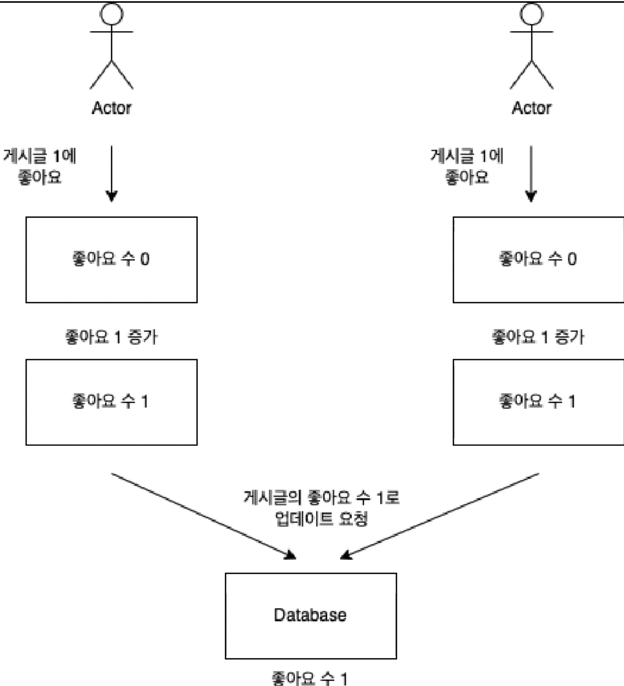

## 동시성 문제


동시에 2명의 유저가 좋아요를 누르게 된다면, 데이터를 불러오는 시점과 업데이트 되는 시점이 다르기 때문에 문제가 발생합니다.  
두명의 유저가 좋아요를 누르는 순간은 동일하기 때문에, 두 유저의 좋아요 수는 0이 됩니다. 이후 각각 한개씩 좋아요를 증가시켰습니다.  
근데 결과를 보면 최종적으로 1개의 좋아요만 업데이트가 되었습니다. 이런 현상을 update Lost 갱신 유실 현상이라고 합니다.  


"어떻게 이 문제를 해결할 수 있을까요?"  

Mysql에 경우에는 유니크한 대상의 인서트나 업데이트를 위해서 로우 한개의 데이터에 락을 걸어줍니다.  
지금과 같은 경우에는 게시글 1번이라는 유니크한 대상이 있기 때문에 1번의 게시글에 대한 데이터에 락이 걸립니다.  
동시 요청이 들어온다고 하는 경우, 먼저 들어온 update문을 처리하는 동안, 다른 update문은 데이터에 접근할 수 없이 대기가 걸리게 됩니다.  

MySQL의 InnoDB에서는 UPDATE 쿼리르 사용할 때 자동으로 레코드 락을 걸어줍니다.  
다른 해결 방법은 DB의 isolation level을 Serializable로 올리거나, 락을 사용하는 방식이 존재합니다. 
락을 사용하는 경우에는 성능적인 문제가 조금 존재합니다.  

쿼리 문으로 해결할 수 있는 경우엔 DB에서 처리하면 됩니다. 
좋아요나 댓글 수를 올려주는 것들은 따로 업데이트 쿼리를 사용해서 하는 것이 더 좋다고 생각합니다.  

기존 코드를 변경해 보겠습니다.  
```java
    @Modifying
    @Query(value = "UPDATE PostEntity p "
    +"SET p.likeCount = :#{#postEntity.likeCount},"
    +"p.modDate = now() "
    +"WHERE p.id = :#{#postEntity.id}")
    void updatePostLikeCount(PostEntity postEntity);
```
현제 이 코드는 쿼리 실행 시점의 값을 의존합니다. 이 말은 likeCount를 업데이트하는 쿼리가 명시적으로 현재 값을 증가시키는 연산(p.likeCount = p.likeCount + 1)이 아닌,
외부에서 전달된 값을 직접 사용하기 때문에 이런 경쟁 조건에 더욱 취약합니다.  

```java
 @Modifying
    @Query(value = "UPDATE PostEntity p "
    +"SET p.likeCount = p.likeCount + :likeCount,"
    +"p.modDate = now() "
    +"WHERE p.id = :#{#postEntity.id}")
    void updatePostLikeCount(Long postId, Integer likeCount);
```
이러한 코드로 변경을 해주면 동시성 문제가 발생하지 않게 됩니다.  

이렇게 해주면 update 좋아요 갱신 유실은 해결이 됩니다.  

같은 유저와 같은 게시글에 좋아요 요청이 동시에 들어오면 어떻게 될까?  
미리 맞추어놨따.
```java
@Override
    @Transactional
    public void like(Post post, User user) {
        LikeEntity likeEntity = new LikeEntity(post, user);
        entityManager.persist(likeEntity);
        jpaPostRepository.updatePostLikeCount(post.getId(), 1);
    }
```
persist를 통해서 insert문이 2번 수행되면 unique값을 항상 보장해주기때문에 하나만 저장이되고 다른 하나는 DB에서 실패처리가 됩니다.

LikeEntity의 post_id와 user_id 조합에 대해 UNIQUE 제약 조건이 설정되어 있다면, 동일한 post_id와 user_id 조합으로 두 번 INSERT를 시도할 경우, 첫 번째 
INSERT는 성공하고 두 번째는 **데이터베이스에서 예외(SQLIntegrityConstraintViolationException 또는 ConstraintViolationException)**로 처리됩니다.  

이렇게 구현하게 되면, 기존의 객체로 만든것보다 덜 유연하고, 테스트를 위해서 외부 라이브러리를 사용해야 한다는 단점이 존재합니다.  


방법 2. UNIQUE 제약 조건 활용
쿠폰 발급 로직에서 중복 확인을 하지 않고 바로 저장을 시도하며, 중복 발급 시 DB의 UNIQUE 제약 조건에 의존해 처리합니다.
```java
@Transactional
public void issueCoupon(Long userId, String couponCode) {
try {
CouponEntity coupon = new CouponEntity(couponCode, userId);
couponRepository.save(coupon);
} catch (DataIntegrityViolationException e) {
throw new IllegalArgumentException("이미 발급된 쿠폰입니다.", e);
}
}
```
장점: 중복 확인 쿼리를 생략하여 성능 향상.
단점: DB 제약 조건 위반을 통한 예외 처리로 인해 테스트가 다소 까다로울 수 있음.

DB의 UNIQUE 제약 조건으로 인에 key값이 하나만 존재해야 하므로, insert 두번 호출시
여기서 말하는 제약 조건이란 중복된 값을 가질 수 없는 조건을 의미합니다.

어떤 기능은 도메인으로 빼서 유연하게 가지고 가고, 테스트를 만들기 쉽게 해야겠다.
어떤 것은 정합성이 중요하기 때문에 레파지토리에서 DB가 해결하도록 한다를 잘 설계해주면 좋습니다.