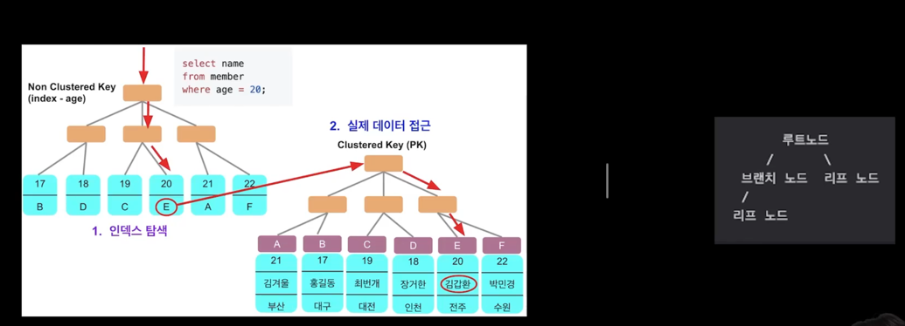
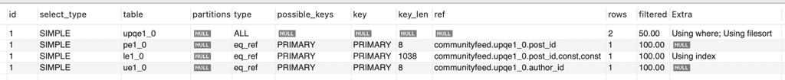
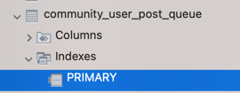
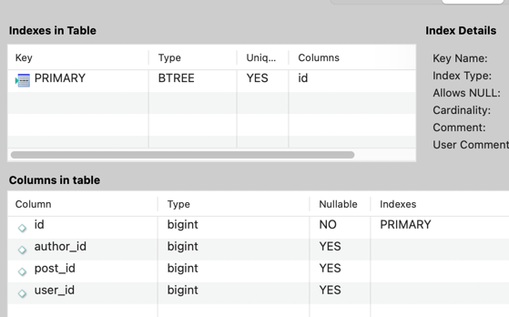
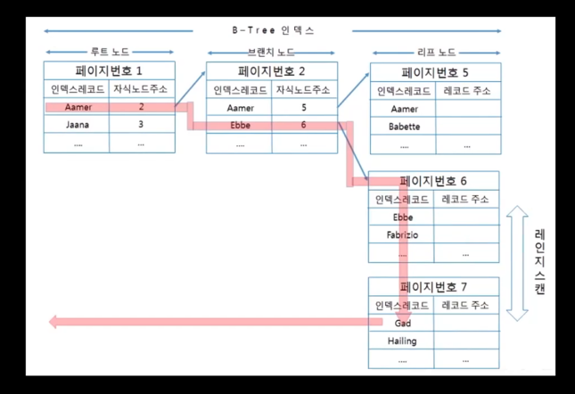

지난시간 DB작업이 계속 처리 되지 않고 오랜 시간이 지나면, Connection Pool이 부족해지고, 에러가 발생하게 됩니다.  
추가로 row Lock 쿼리를 통해 Lost Update 문제를 해결하였습니다.  

가장 큰 문제는 실제 Production에서 데이터가 많아 졌을때 발생하게 됩니다.  

조회에서의 성능을 드라마틱하게 올려줄 수 있는 것은 캐싱과 인덱스입니다.  

주니어 개발자가 가장 많이 하는 실수가 현업에서의 데이터 누적으로 인한 문제를 가장 많이 만나게 됩니다.  
인덱스를 통해서 대형 사고를 막을 수 있습니다.  

인덱스는 무엇일까?  
책보면 나오는 목차입니다.  

어떻게 인덱스는 빠르게 데이터를 찾아줄까?
B+Tree 구조이기 때문입니다.  B+Tree 구조는 인덱스의 리프 노드에는 항상 레코드 값을 찾을 주소 값을 갖고 있습니다.  
각 B+ Tree 리프노드에는 데이터들이 저장되는 것이 아닌, 데이터들의 PK가 저장되어 있는 Primary Key index가 따로 설정이 되어 있습니다.  

B+ Tree에서 리프 노드로 인덱스를 탐색하고, 그 탐색 한 인덱스는 PK(클러스터드 인덱스)이므로 바로 데이터 조회가 가능합니다.  

단, 항상 이런 인덱스르 통해서 접근하는 것이 빠르지만은 않습니다.  

인덱스를 거치고 데이터를 접근하는 것이기 때문에 즉 한 계층이 더 생기는 것이기 때문에,
전체 테이블의 20%가 넘는 데이터가 인덱스 대상에 속해 있으면 더 느리게 반환됩니다.

왜? 인덱스라는 하나의 게층이 더 생기기 때문이다.

중요한 점은 인덱스의 칼럼 순서입니다.
인덱스를 생성할 때에는 조건문이 조회하는 순서에 맞게 생성을 해주어야 합니다.  

### 피드 조회 전략 살펴보기
```sql
select
    pe1_0.id,
    pe1_0.content,
    ue1_0.id,
    ue1_0.name,
    ue1_0.profile_image_url,
    pe1_0.reg_date,
    pe1_0.mod_date,
    pe1_0.comment_count,
    pe1_0.like_count,
    (le1_0.target_id is not null
        and le1_0.target_type is not null
        and le1_0.user_id is not null)
from
    community_user_post_queue upqe1_0
        join
    community_post pe1_0
    on upqe1_0.post_id=pe1_0.id
        join
    community_user ue1_0
    on upqe1_0.author_id=ue1_0.id
        left join
    community_like le1_0
    on pe1_0.id=le1_0.target_id
        and le1_0.target_type='POST'
        and le1_0.user_id=1
where
    upqe1_0.user_id=1
order by
    upqe1_0.post_id desc
limit
    20
```
이 쿼리문이 mysql에서 어떻게 데이터를 조회하는지 살펴보자  

```sql
explain select
            pe1_0.id,
            pe1_0.content,
            ue1_0.id,
            ue1_0.name,
            ue1_0.profile_image_url,
            pe1_0.reg_date,
            pe1_0.mod_date,
            pe1_0.comment_count,
            pe1_0.like_count,
            (le1_0.target_id is not null
                and le1_0.target_type is not null
                and le1_0.user_id is not null)
        from
            community_user_post_queue upqe1_0
                join
            community_post pe1_0
            on upqe1_0.post_id=pe1_0.id
                join
            community_user ue1_0
            on upqe1_0.author_id=ue1_0.id
                left join
            community_like le1_0
            on pe1_0.id=le1_0.target_id
                and le1_0.target_type='POST'
                and le1_0.user_id=1
        where
            upqe1_0.user_id=1
        order by
            upqe1_0.post_id desc
        limit
            20
```
이렇게 쿼리문 앞에 explain을 추가해주면 됩니다.  


여기서 보이는 Type ALL은 테이블 전체를 검색한다는 뜻입니다.
이제 조회 컬럼 순서대로 인덱스를 추가해보도록 하겠습니다.  





post_id와 user_id로 인덱스를 생성한 후, api를 요청한 결과  
api 호출 속도가 207ms -> 34ms로 줄었습니다.

```sql
CREATE INDEX `idx_community_user_post_queue_post_id_user_id` ON communityfeed (post_id, user_id);
```

인덱스가 추가되는 경우 주의할 점은 쿼리의 조건문 순서에 맞게 작성해야 한다는 점입니다. 

DB조회 타입으로는 ALL, Ref, Const, Range, Index가 존재합니다.   
Const는 유니크키로 한건을 조회할 때 발생합니다.  

각각 어떠한 동작이 일어날까요? 
Const : 유니크 키 한건을 조회할 때 사용이 됩니다., id로 검색하니 바로 클러스터 키에 접근해서 데이터를 가져와 제일 빠릅니다.  

정렬 조건은 Index 생성시 미리 맞춰주면 Extra부분에 using file sort라는 부분이 작성되지 않습니다.  

다른 종류로는 Range 종류가 있습니다.  
Range는 Index Range Scan접근의 한 방법입니다. 
Range 접근도 상당히 빠릅니다.  



Index Range Scan은 검색할 인덱스의 범위가 결정되었을 때 사용하는 방식입니다.
쉽게 말해, 일정 범위만 스캔하게 됩니다.  

Const,Ref,Range는 속도가 빠른 편에 속합니다.

Index는 인덱스 Full Scan을 의미합니다.  
테이블 전체를 의미하는 것보단 좀 낫긴 하지만 인덱스가 걸린 전체 부분을 끝까지 확인하는 것입니다.  
Index Range스캔과는 비교했을땐, 성능이 좋진 않습니다.  


가지고 오는 데이터 갯수에 제한을 걸어두어야 합니다.  
어떤 한 리스트를 조회를 해도 결국에는 너무 많은 경우 장애로 이어질 수 있습니다.  
하지만, 이런 인덱스도 엄청나게 많은 숫자 앞에서는 크게 효과를 누릴 수 없습니다.  
