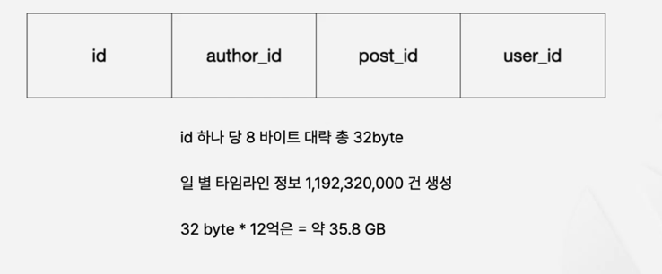
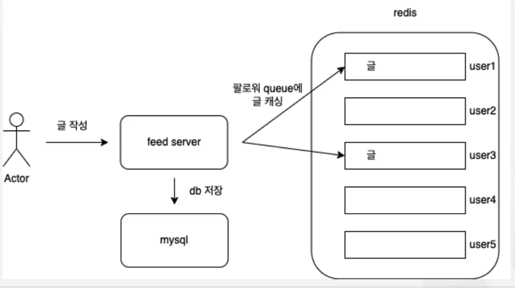
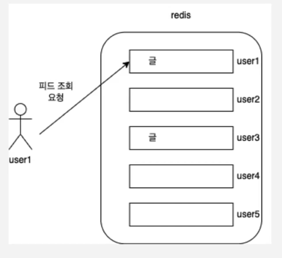
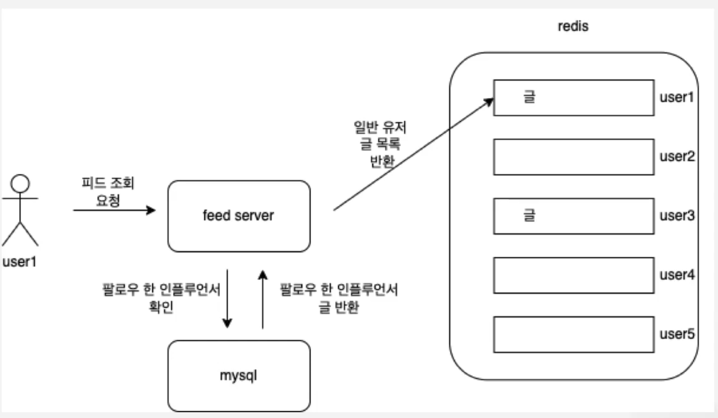

### 확장을 위한 수치 설정

X(구 트위터)를 기준으로 3억 5천명의 유저
글 작성은 초당 4,600회, 피크 타임 12,000회
타임 라인 조회 초당 30만 회
유저 당 평균 팔로워수 75명   

조회나 작성이 데이터를 변경하는 작업보다 크다면 어떤 식으로 작성하는게 좋을까요?!

국내에서 사용한다고 가정을 하고, 10분의 1사이즈로 줄입니다.  
천만명의 유저
글작성 초당 460회, 피크 타임 1200회  
타임 라인 조회 초당 3만회  
유저당 평균 팔로우 수 30명  

글 작성 데이터 보단, 글 조회 데이터가 압도적으로 많습니다.  

### 확장을 위한 수치 설정  

user_post_queue 테이블  

32byte인 이유는 각 Long자료형은 8byte이기 때문입니다.  

지금의 구조로는 현재 요청을 감당하기 힘들게 됩니다.  
테이블의 사이즈, 조회하는 방법도 매우 비효율적입니다.  
특히 초당 30만의 피드 조회를 감당할 수 없습니다.  

저장 뿐만 아니라 조회도 문제이다. 조회는 저장의 60배나 됩니다.  

### 어떻게 할까?
조회때의 데이터를 빠르게 전달하는 것과 데이터를 효율적으로 저장하기 위해 피드 데이터의 구조를 변경하고 캐싱을 도입하는 것을 해결이 가능합니다.  

### 프로세서 및 플랜 작성  

글을 작성하면, 우선 DB에 글을 넣어준 후에, Redis에 각 팔로워 queue에 글을 캐싱해 주는 것입니다.  

피드 조회 요청이 오는 경우 다음과 같이 됩니다.  

하지만, 이 구조에도 문제가 존재합니다.  
인플루언서같이 팔로워가 많은 경우에는 문제가 됩니다.  
유저별 queue에 피드를 넣어주기 때문에, 데이터 복사가 생긴다는 것입니다.

트위터는 인플루언서들만 따로 처리하는 방식으로 문제를 해결했습니다.  

인플루언서가 작성한 글들은 따로 DB에서 반환을하게 됩니다.  

### 안정성을 어떻게 확보할 수 있을까?
클린 아키텍처를 통해서 최대한 비즈니스 로직에 영향이 가지 않도록 만들었습니다.  
이런 데이터 구조와 방법이 바뀌었을 때는 어떻게 검증할 수 있을까요?  
바로 인수 테스트를 통해 작성이 가능합니다.  

단위 테스트의 한계를 막기 위해서 인수 테스트를 도입합니다.  

