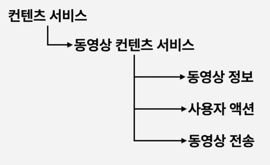
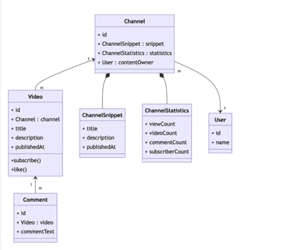
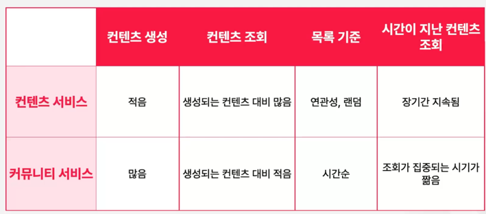
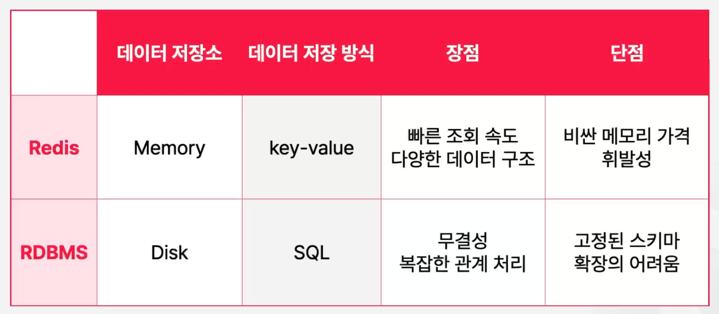

### 동영상 서비스 컨텐츠 구성

비디오가 전송이 되는 정도만 처리하게 됩니다.  

### 동영상 관련 객체간 관계

### 컨텐츠 서비스 vs 커뮤니티 서비스

컨텐츠 서비스 : 사용자가 소비할 컨텐츠(기사, 동영상, 이미지 등)를 제공하는 것이 핵심  
커뮤니티 서비스 : 사용자 간의 소통과 상호작용을 촉진하는 것이 핵심  

### Redis vs RDBMS

Redis는 메모리에 데이터를 저장하기 때문에, 휘발성이다.
단, 따로 디스크에 저장할 수는 있다.  
데이터의 연관관계를 맺기에는 무리가 있을 수 있다.  

### Cache
자주 사용하는 데이터나 값을 미리 복사해 놓는 임시 저장소  

Cache 사용을 고려할 상황  
- 접근 시간에 비해 원래 데이터를 접근하는 시간이 오래 걸리는 경우
- 반복적으로 동일한 결과를 돌려주는 경우

채널 스니펫(Channel Snippet)은 유튜브 API에서 특정 채널의 주요 정보를 제공하는 JSON 객체입니다.
즉, 유튜브 채널의 기본 정보(이름, 설명, 썸네일, 국가 등)를 포함하는 데이터 구조입니다.

1대1 관계에서 @Embedded를 선언하는 이유   
@Embedded를 사용하는 이유는 엔티티 내에서 재사용 가능한 값 객체(VO, Value Object)를 캡슐화하여 관리하기 위해서입니다. @Embedded를 활용하면 1대1 관계를 표현하면서도 테이블을 분리하지 않고 동일한 테이블에 포함할 수 있습니다.