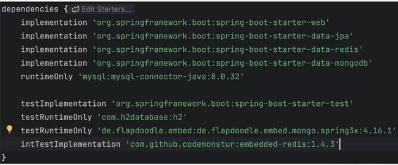
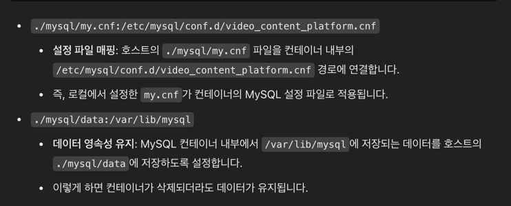

### Spring + Redis
RedisTemplate  
Redis Operation에 대응되는 method를 제공합니다.  

RedisRepository  
Spring Data 에서 제공하는 interface로 접근합니다.  

@RedisHash  
Spring Data 에서 사용하는 Redis에 hash로 저장될 데이터를 의미합니다.  
Spring Data Redis에서 특정 객체를 Redis의 Hash 자료구조에 저장할 때 사용합니다.  

### 의존성 설정





volumes 설정은 Docker 컨테이너 내부의 데이터를 로컬에 저장하여 데이터의 영속성을 유지(Persistence) 하기 위한 과정입니다.

docker-compose 설정
```java
services:
  mysql:
    image: mysql:8.0
    container_name: video_content_platform-mysql
    volumes:
      - ./mysql/my.cnf:/etc/mysql/conf.d/video_content_platform.cnf
      - ./mysql/data:/var/lib/mysql

    ports:
      - '3306:3306'
    environment:
      - MYSQL_DATABASE=video_content_platform
      - MYSQL_USER=local
      - MYSQL_PASSWORD=local
    restart: always

  redis:
    image: redis:7.2.5
    container_name: video_content_platform-redis
    ports:
      - '6379:6379'
    restart: always

  mongodb:
    image: mongo:6.0.16
    container_name: video_content_platform-mongodb
    ports:
      - '27017:27017'
    volumes:
      - ./mongodb/data:/data
    environment:
      - MONGO_INITDB_ROOT_USERNAME=local
      - MONGO_INITDB_ROOT_PASSWORD=local
      - MONGO_INITDB_DATABASE=video_content_platform
```