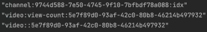

### Video View Count
- Video 조회와 조회수 증가 API 분리
- Video 조회수 증가 마다 Video 데이터 갱신은 부하가 높은 작업
- Redis Key 분리 - video:view-count
- 조회수 증가시 Video 전체 변경 대신 **VideoViewCount**만 증가
- Video 조회시 VideoViewCount **정보 추가 조회해서 결합**

비디오 뷰 카운트 키만 따로 증가시켜줍니다. 
왜? 비디오 조회는 기존 비디오 자체 값에 변화를 주지 않는다.  
따로 분리~!  

(1) 조회와 조회수 증가 API는 분리
(2) 조회를 하면서, 조회수 증가시키는 API를 동시에 호출합니다.

Trade Off
이렇게 되면 비디오 정보를 가져올때 매번 Video 조회수에 대한 값을 합치는 작업이 필요합니다.  

```java
@PostMapping("{videoId}/view")
    public void increaseVideoViewCount(@PathVariable String videoId) {
        videoUseCase.increaseViewCount(videoId);
    }
```
조회수 값을 변경을 하는 것이기 때문에, GetMapping이라고 볼 수는 없습니다.  


```java
@Override
    public void increaseViewCount(String videoId) {
        saveVideoPort.incrementViewCount(videoId);
    }
```

```java
    @Override
    public void incrementViewCount(String videoId) {
        var videoViewCountKey = getVideoViewCountKey(videoId);
        redisTemplate.opsForValue().increment(videoViewCountKey);

//        Using RedisAtomicLong
//        RedisAtomicLong redisAtomicLong = new RedisAtomicLong(videoViewCountKey, redisTemplate.getConnectionFactory());
//        redisAtomicLong.incrementAndGet();

//        stringRedisTemplate.opsForSet().add(getVideoViewCountSetKey(), videoId);
    }
```

요 기능 같은 경우에는 RedisRepository를 사용하는 것이 아닌, RedisTemplate을 사용하게 됩니다.  
그 이유는 Spring Data Redis에서 Redis의 Set 자료구조를 다루려면 RedisTemplate을 사용하려고 하기 때문입니다.

```java
public static String getVideoViewCountKey(String videoId) {
        return VIDEO_VIEW_COUNT + SEPARATOR +  videoId;
    }
```
getVideoCountKey에 해당하는 메서드는 위에처럼 별도의 Key를 만들어줍니다.    
형태는 // video:view-count::1111 이런 형식이 됩니다.  

다른 방법으로는 RedisAtomic을 사용하는 방법이 존재합니다.  
사용된 increment메서드는 아래와 같습니다.
```java
@Override
	public Long increment(K key, long delta) {

		byte[] rawKey = rawKey(key);
		return execute(connection -> connection.incrBy(rawKey, delta));
	}
```
타입에 따라 AtomicLong, AtomicInteger, AtomicDouble이 존재합니다.  

```java
@Override
    public List<Video> listVideos(String channelId) {
        return loadVideoPort.loadVideoByChannel(channelId).stream()
            .map(video -> {
                var viewCount = loadVideoPort.getViewCount(video.getId());
                var likeCount = videoLikePort.getVideoLikeCount(video.getId());
                video.bindCount(viewCount, likeCount);
                return video;
            })
            .toList();
    }
```
조회를 할때, redis에서 값을 가져와 바인딩 해줍니다.  
```java
package com.example.mytv.domain.video;

import java.io.Serializable;
import java.time.LocalDateTime;
import lombok.AllArgsConstructor;
import lombok.Builder;
import lombok.Getter;
import lombok.NoArgsConstructor;
import lombok.ToString;

@AllArgsConstructor
@NoArgsConstructor
@Getter
@Builder
public class Video implements Serializable {
    private String id;
    private String title;
    private String description;
    private String thumbnailUrl;
    private String fileUrl;
    private String channelId;
    private Long viewCount;
    private Long likeCount;
    private LocalDateTime publishedAt;

    public void bindCount(long viewCount, Long likeCount) {
        this.viewCount = viewCount;
        this.likeCount = likeCount;
    }
}

```

조회수 증가에 대한 부분을 DB에 내장하게 되면 굉장한 부하를 줄 수 있습니다.  
조회수가 증가할 때마다 DB에 지속적으로 Write(쓰기) 연산이 발생하기 때문입니다.  
조회할 때마다 DB를 읽고(SELECT), 수정(UPDATE)해야 함  
트래픽이 많아질수록 DB에 과부하 발생  
병목 현상 발생 가능 (Concurrency Issue)  
DB Lock 문제 가능성 (동시 업데이트 시 충돌 발생 가능)  


Redis에 저장되는 구조는 다음과 같습니다.  



Cache이용하는 방법  

RedisRepository, Spring Cache, 