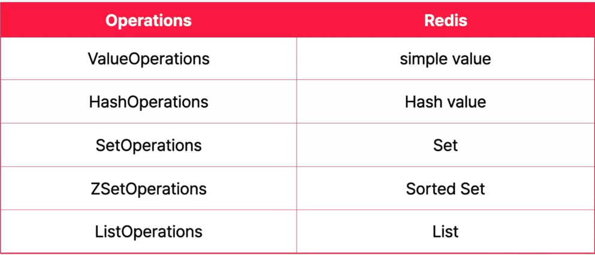

### 사용자 도메인 설계

### RedisTemplate Operations

### Value Operations

### Hash Operations

### Set Operations

Redis에서 INTERSECT는 여러 집합(Set) 또는 정렬된 집합(Sorted Set, ZSet)의 교집합을 구하는 연산입니다.  
INTERSECT가 사용되는 예제
Set<String> commonTags = redisTemplate.opsForSet().intersect("user:tags:1", "user:tags:2");  
사용자 A와 B가 공통으로 관심 있는 태그 리스트를 찾을 때 사용 가능합니다.

### ZSetOperations

WEIGHTS를 사용하여 가중치 조정이 가능합니다.
ZINTER 2 zset1 zset2 WEIGHTS 2 0.5
결과 (각 ZSet의 점수를 가중치에 맞게 변경)

1) "Alice" 2.0  (1 from zset1 * 2 + 2 from zset2 * 0.5)
2) "Bob" 4.0    (2 from zset1 * 2 + 1 from zset2 * 0.5)
   ➡ WEIGHTS 2 0.5를 사용하여 zset1의 점수를 2배로, zset2의 점수를 0.5배로 조정!
   ➡ 즉, zset1의 영향력이 더 커지도록 가중치를 설정 가능.

### ListOperations

