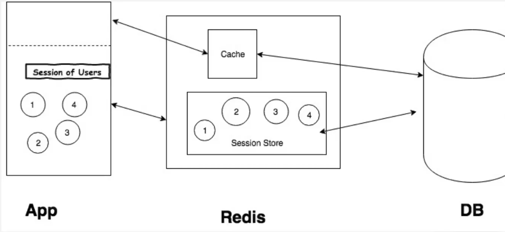

UserApiController
```java
package com.example.mytv.adapter.in.api;

import com.example.mytv.domain.user.User;
import org.springframework.web.bind.annotation.GetMapping;
import org.springframework.web.bind.annotation.RequestMapping;
import org.springframework.web.bind.annotation.RequestParam;
import org.springframework.web.bind.annotation.RestController;

@RestController
@RequestMapping("/api/v1/users")
public class UserApiController {
    @GetMapping
    public User getUSer(User user) {
        return user;
    }
}

```
userId는 내부적으로 Key로 사용하기 때문에, path로 요청해서 하는 건 좋지 않습니다.  
레디스에 인증을 위해 토큰을 저장합니다.  

### Redis를 활용한 User Session 정보 조회


세션 인증 토큰을 DB에서 관리하게 되는 경우, 상당한 부하가 발생할 수 있습니다.  

```java
package com.example.mytv.adapter.out;

import com.example.mytv.application.port.out.UserSessionPort;
import com.example.mytv.common.RedisKeyGenerator;
import org.springframework.data.redis.core.StringRedisTemplate;
import org.springframework.stereotype.Component;

@Component
public class UserSessionPersistenceAdapter implements UserSessionPort {
    private final StringRedisTemplate stringRedisTemplate;

    public UserSessionPersistenceAdapter(StringRedisTemplate stringRedisTemplate) {
        this.stringRedisTemplate = stringRedisTemplate;
    }

    @Override
    public String getUserId(String authKey) {
        var valOperations = stringRedisTemplate.opsForValue();
        return stringRedisTemplate.opsForValue().get(RedisKeyGenerator.getUserSessionKey(authKey));
    }
}
```
레디스에서 세션을 키로하는 value(유저 ID)를 반환받습니다.  


Resolver
```java
package com.example.mytv.adapter.in.resolver;

import com.example.mytv.adapter.in.api.attribute.HeaderAttribute;
import com.example.mytv.application.port.out.LoadUserPort;
import com.example.mytv.application.port.out.UserSessionPort;
import com.example.mytv.domain.user.User;
import com.example.mytv.exception.UnauthorizedException;
import java.util.Optional;

import org.springframework.core.MethodParameter;
import org.springframework.stereotype.Component;
import org.springframework.web.bind.support.WebDataBinderFactory;
import org.springframework.web.context.request.NativeWebRequest;
import org.springframework.web.method.support.HandlerMethodArgumentResolver;
import org.springframework.web.method.support.ModelAndViewContainer;

@Component
public class UserHandlerMethodArgumentResolver implements HandlerMethodArgumentResolver {
    private UserSessionPort userSessionPort;
    private LoadUserPort loadUserPort;

    // @Autowired(required = false) 와 동일 효과
    public UserHandlerMethodArgumentResolver(Optional<UserSessionPort> userSessionPort, Optional<LoadUserPort> loadUserPort) {
        userSessionPort.ifPresent(port -> this.userSessionPort = port);
        loadUserPort.ifPresent(port -> this.loadUserPort = port);
    }

    @Override
    public boolean supportsParameter(MethodParameter methodParameter) {
        return methodParameter.getParameterType().equals(User.class);
    }

    @Override
    public Object resolveArgument(MethodParameter methodParameter, ModelAndViewContainer modelAndViewContainer, NativeWebRequest nativeWebRequest, WebDataBinderFactory webDataBinderFactory) throws Exception {
        var authKey = nativeWebRequest.getHeader(HeaderAttribute.X_AUTH_KEY);
        if (authKey == null) {
            return null;
        }
        var userId = userSessionPort.getUserId(authKey);
        if (userId == null) {
            throw new UnauthorizedException();
        }
        return loadUserPort.loadUser(userId).orElse(null);
    }
}
```

Resolver를 만들어준 후, MVC config에 등록해줍니다.  
```java
package com.example.mytv.config;

import com.example.mytv.adapter.in.resolver.UserHandlerMethodArgumentResolver;
import java.util.List;
import org.springframework.context.annotation.Configuration;
import org.springframework.web.method.support.HandlerMethodArgumentResolver;
import org.springframework.web.servlet.config.annotation.WebMvcConfigurer;

@Configuration
public class WebMVcConfig implements WebMvcConfigurer {
    private final UserHandlerMethodArgumentResolver userHandlerMethodArgumentResolver;

    public WebMVcConfig(UserHandlerMethodArgumentResolver userHandlerMethodArgumentResolver) {
        this.userHandlerMethodArgumentResolver = userHandlerMethodArgumentResolver;
    }

    @Override
    public void addArgumentResolvers(List<HandlerMethodArgumentResolver> resolvers) {
        WebMvcConfigurer.super.addArgumentResolvers(resolvers);
        resolvers.add(userHandlerMethodArgumentResolver);
    }
}

```

```java
// @Autowired(required = false) 와 동일 효과
    public UserHandlerMethodArgumentResolver(Optional<UserSessionPort> userSessionPort, Optional<LoadUserPort> loadUserPort) {
        userSessionPort.ifPresent(port -> this.userSessionPort = port);
        loadUserPort.ifPresent(port -> this.loadUserPort = port);
    }
```
이 코드는 특정 DI과정에서 특정 빈이 존재하지 않을 수도 있는 경우를 처리하기 위해 사용됩니다.  
의존성 주입이 선택적으로 존재할 때, Optional<>을 활용해서 안전하게 주입하는 방식입니다.  


@Autowired(required = false)를 사용하여 선택적 주입
특정 빈이 존재하면 주입하고, 존재하지 않으면 null로 설정됩니다.  
강제적인 의존성을 제거할 때 유용합니다.  

ControllerAdvice.class
```java
package com.example.mytv.adapter.in.api.advice;

import com.example.mytv.adapter.in.api.dto.ErrorResponse;
import com.example.mytv.exception.BadRequestException;
import com.example.mytv.exception.DomainNotFoundException;
import com.example.mytv.exception.ForbiddenRequestException;
import com.example.mytv.exception.UnauthorizedException;
import java.time.LocalDateTime;
import org.springframework.http.HttpStatus;
import org.springframework.web.bind.annotation.ExceptionHandler;
import org.springframework.web.bind.annotation.ResponseStatus;
import org.springframework.web.bind.annotation.RestControllerAdvice;

@RestControllerAdvice
public class ControllerAdvice {
    @ExceptionHandler(BadRequestException.class)
    @ResponseStatus(HttpStatus.BAD_REQUEST)
    public ErrorResponse handleBadRequest(Exception ex) {
        return ErrorResponse.builder()
            .type("badRequest")
            .detail(ex.getMessage())
            .timestamp(LocalDateTime.now())
            .build();
    }

    @ExceptionHandler(UnauthorizedException.class)
    @ResponseStatus(HttpStatus.UNAUTHORIZED)
    public ErrorResponse handleUnauthorized(Exception ex) {
        return ErrorResponse.builder()
            .type("unauthorized")
            .detail(ex.getMessage())
            .timestamp(LocalDateTime.now())
            .build();
    }
    @ExceptionHandler(ForbiddenRequestException.class)
    @ResponseStatus(HttpStatus.FORBIDDEN)
    public ErrorResponse handleForbidden(Exception ex) {
        return ErrorResponse.builder()
            .type("forbidden")
            .detail(ex.getMessage())
            .timestamp(LocalDateTime.now())
            .build();
    }

    @ExceptionHandler(DomainNotFoundException.class)
    @ResponseStatus(HttpStatus.NOT_FOUND)
    public ErrorResponse handleDomainNotFound(Exception ex) {
        return ErrorResponse.builder()
            .type("notFound")
            .detail(ex.getMessage())
            .timestamp(LocalDateTime.now())
            .build();
    }
}

```