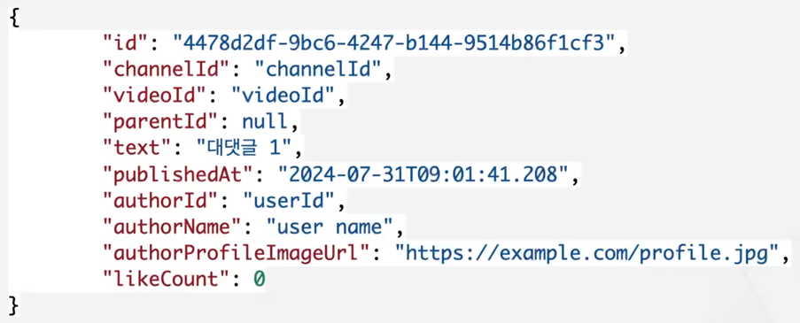
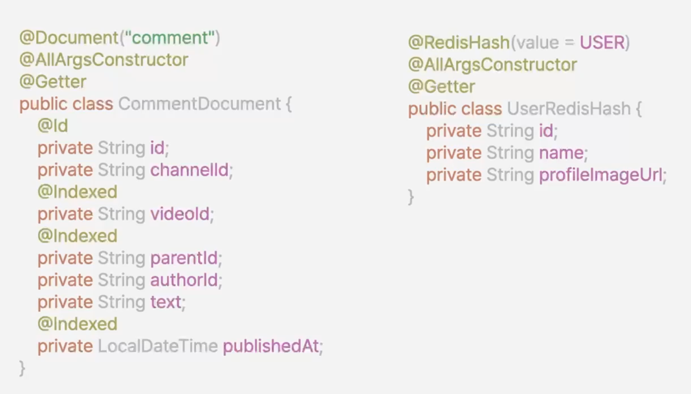

### 댓글 구조


### 댓글 내용 + 작성자 + 댓글 좋아요  


### Comment
```java
package com.example.mytv.domain.comment;

import java.time.LocalDateTime;
import lombok.AllArgsConstructor;
import lombok.Builder;
import lombok.Getter;
import lombok.ToString;

@AllArgsConstructor
@Builder
@Getter
@ToString
public class Comment {
    private String id;
    private String channelId;
    private String videoId;
    private String parentId;
    private String authorId;
    private String text;
    private LocalDateTime publishedAt;

    public void updateText(String text) {
        this.text = text;
    }
}

```

```java
package com.example.mytv.adapter.in.api;

import com.example.mytv.adapter.in.api.dto.CommandResponse;
import com.example.mytv.adapter.in.api.dto.CommentRequest;
import com.example.mytv.application.port.in.CommentUseCase;
import com.example.mytv.domain.comment.CommentResponse;
import com.example.mytv.domain.user.User;

import java.util.List;
import org.springframework.web.bind.annotation.DeleteMapping;
import org.springframework.web.bind.annotation.GetMapping;
import org.springframework.web.bind.annotation.PathVariable;
import org.springframework.web.bind.annotation.PostMapping;
import org.springframework.web.bind.annotation.PutMapping;
import org.springframework.web.bind.annotation.RequestBody;
import org.springframework.web.bind.annotation.RequestMapping;
import org.springframework.web.bind.annotation.RequestParam;
import org.springframework.web.bind.annotation.RestController;

@RestController
@RequestMapping("/api/v1/comments")
public class CommentApiController {
    private final CommentUseCase commentUseCase;

    public CommentApiController(CommentUseCase commentUseCase) {
        this.commentUseCase = commentUseCase;
    }

    @PostMapping
    CommandResponse createComment(
        User user,
        @RequestBody CommentRequest commentRequest
    ) {
        var comment = commentUseCase.createComment(user, commentRequest);
        return new CommandResponse(comment.getId());
    }

    @PutMapping("{commentId}")
    CommandResponse updateComment(
        User user,
        @PathVariable String commentId,
        @RequestBody CommentRequest commentRequest
    ) {
        var updateComment = commentUseCase.updateComment(commentId, user, commentRequest);
        return new CommandResponse(updateComment.getId());
    }

    @DeleteMapping("{commentId}")
    void deleteComment(
        User user,
        @PathVariable String commentId
    ) {
        commentUseCase.deleteComment(commentId, user);
    }

    @GetMapping(params = {"commentId"})
    CommentResponse getComment(@RequestParam String commentId) {
        return commentUseCase.getComment(commentId);
    }

    @GetMapping(value = "list", params = {"videoId", "order", "offset", "maxSize"})
    List<CommentResponse> listComments(
        User user,
        @RequestParam String videoId,
        @RequestParam(defaultValue = "time") String order,
        @RequestParam String offset,
        @RequestParam Integer maxSize
    ) {
        return commentUseCase.listComments(user, videoId, order, offset, maxSize);
    }

    @GetMapping(value = "reply", params = {"parentId"})
    List<CommentResponse> listReplyComments(
        @RequestParam String parentId,
        @RequestParam String offset,
        @RequestParam Integer maxSize
    ) {
        return commentUseCase.listReplies(parentId, offset, maxSize);
    }
}
```

@Document란?
해당 클래스가 MongoDB 컬렉션과 매핑되는 도메인 객체임을 나타냅니다.  

댓글 저장
```java
@Override
    public Comment saveComment(Comment comment) {
        var commentDocument = CommentDocument.from(comment);

        return commentMongoRepository.save(commentDocument)
            .toDomain();
    }
```

CommentService
```java
package com.example.mytv.application;

import com.example.mytv.adapter.in.api.dto.CommentRequest;
import com.example.mytv.application.port.in.CommentUseCase;
import com.example.mytv.application.port.out.CommentBlockPort;
import com.example.mytv.application.port.out.CommentLikePort;
import com.example.mytv.application.port.out.CommentPort;
import com.example.mytv.application.port.out.LoadUserPort;
import com.example.mytv.domain.comment.Comment;
import com.example.mytv.domain.comment.CommentResponse;
import com.example.mytv.domain.user.User;
import com.example.mytv.exception.BadRequestException;
import com.example.mytv.exception.DomainNotFoundException;
import com.example.mytv.exception.ForbiddenRequestException;
import org.springframework.beans.factory.annotation.Autowired;
import org.springframework.beans.factory.annotation.Qualifier;
import org.springframework.stereotype.Service;

import java.time.LocalDateTime;
import java.util.Collections;
import java.util.List;
import java.util.Objects;
import java.util.UUID;
import java.util.stream.Collectors;

@Service
public class CommentService implements CommentUseCase {
    private final CommentPort commentPort;
    private final LoadUserPort loadUserPort;
    private final CommentLikePort commentLikePort;
    private final CommentBlockPort commentBlockPort;

    public CommentService(CommentPort commentPort, @Qualifier("userCachePersistenceAdapter") LoadUserPort loadUserPort, CommentLikePort commentLikePort, CommentBlockPort commentBlockPort) {
        this.commentPort = commentPort;
        this.loadUserPort = loadUserPort;
        this.commentLikePort = commentLikePort;
        this.commentBlockPort = commentBlockPort;
    }

    @Override
    public Comment createComment(User user, CommentRequest commentRequest) {
        var comment = Comment.builder()
            .id(UUID.randomUUID().toString())
            .channelId(commentRequest.getChannelId())
            .videoId(commentRequest.getVideoId())
            .parentId(commentRequest.getParentId())
            .text(commentRequest.getText())
            .authorId(user.getId())
            .publishedAt(LocalDateTime.now())
            .build();

        return commentPort.saveComment(comment);
    }

    @Override
    public Comment updateComment(String commentId, User user, CommentRequest commentRequest) {
        var comment = commentPort.loadComment(commentId)
            .orElseThrow(() -> new DomainNotFoundException("Comment Not Found."));

        if (!Objects.equals(comment.getAuthorId(), user.getId())) {
            throw new ForbiddenRequestException("The request might not be properly authorized.");
        }
        if (!equalMetaData(comment, commentRequest)) {
            throw new BadRequestException("Request metadata is invalid.");
        }

        comment.updateText(commentRequest.getText());

        return commentPort.saveComment(comment);
    }

    @Override
    public void deleteComment(String commentId, User user) {
        var comment = commentPort.loadComment(commentId)
            .orElseThrow(() -> new DomainNotFoundException("Comment Not Found."));

        if (!Objects.equals(comment.getAuthorId(), user.getId())) {
            throw new ForbiddenRequestException("The request might not be properly authorized.");
        }

        commentPort.deleteComment(commentId);
    }

    /**
     * user -> redis user:{userId} 로 조회
     * commentLike -> redis comment:like:{commentId} 로 부터 조회
     */
    @Override
    public CommentResponse getComment(String commentId) {
        // mongodb
        var comment = commentPort.loadComment(commentId)
            .orElseThrow(() -> new DomainNotFoundException("Comment Not Found."));

        return buildComment(comment);
//        // redis
//        var user = loadUserPort.loadUser(comment.getAuthorId())
//            .orElse(User.defaultUser(comment.getAuthorId()));
//        // redis
//        var commentLikeCount = commentLikePort.getCommentLikeCount(comment.getId());
//
//        return CommentResponse.from(comment, user, commentLikeCount);
    }

    @Override
    public List<CommentResponse> listComments(String videoId, String order, String offset, Integer maxSize) {
        var list = commentPort.listComment(videoId, order, offset, maxSize).stream()
            .map(comment -> {
                var user = loadUserPort.loadUser(comment.getAuthorId())
                    .orElse(User.defaultUser(comment.getAuthorId()));
                var commentLikeCount = commentLikePort.getCommentLikeCount(comment.getId());
                var replies = commentPort.listReply(comment.getId(), offset, 100).stream()
                    .map(this::buildComment)
                    .toList();
                return CommentResponse.from(comment, user, commentLikeCount, replies);
            })
            .collect(Collectors.toList());
        commentPort.getPinnedComment(videoId)
            .ifPresent(pinnedComment -> {
                var pinnedCommentResponse = buildComment(pinnedComment);
                list.add(0, pinnedCommentResponse);
            });

        return list;
    }

    @Override
    public List<CommentResponse> listComments(User user, String videoId, String order, String offset, Integer maxSize) {
        var commentBlocks = commentBlockPort.getUserCommentBlocks(user.getId());

        return commentPort.listComment(videoId, order, offset, maxSize).stream()
            .filter(comment -> !commentBlocks.contains(comment.getId()))
            .map(comment -> {
                var author = loadUserPort.loadUser(comment.getAuthorId())
                    .orElse(User.defaultUser(comment.getAuthorId()));
                var commentLikeCount = commentLikePort.getCommentLikeCount(comment.getId());
                var replies = commentPort.listReply(comment.getId(), offset, 100).stream()
                    .map(this::buildComment)
                    .toList();
                return CommentResponse.from(comment, author, commentLikeCount, replies);
            })
            .toList();
    }

    @Override
    public List<CommentResponse> listReplies(String parentId, String offset, Integer maxSize) {
        return commentPort.listReply(parentId, offset, maxSize).stream()
            .map(this::buildComment)
            .collect(Collectors.toList());
    }

    private boolean equalMetaData(Comment comment, CommentRequest commentRequest) {
        return Objects.equals(comment.getChannelId(), commentRequest.getChannelId()) &&
            Objects.equals(comment.getVideoId(), commentRequest.getVideoId()) &&
            Objects.equals(comment.getParentId(), commentRequest.getParentId());
    }

    private CommentResponse buildComment(Comment comment) {
        var user = loadUserPort.loadUser(comment.getAuthorId())
                .orElse(User.defaultUser(comment.getAuthorId()));
        var commentLikeCount = commentLikePort.getCommentLikeCount(comment.getId());
        return CommentResponse.from(comment, user, commentLikeCount);
    }

//    var replies = commentPort.listReply(parentId, offset, maxSize);
//    var users = getUserMap(replies.stream().map(Comment::getAuthorId).toList());
//
//    private Map<String, User> getUserMap(List<String> userIds) {
//        return loadUserPort.loadAllUsers(userIds).stream()
//            .collect(Collectors.toMap(User::getId, Function.identity()));
//    }
}

```

@SpyBean이란?
Spring Boot의 테스트 환경에서 사용하는 어노테이션으로, 기존의 빈(Bean)을 감싸서 부분적으로 **메서드를 스파이(SPY)**할 수 있도록 해주는 기능을 합니다.
Spring Boot의 @MockBean과 유사하지만, @SpyBean은 실제 빈(Bean)의 동작을 유지하면서 **일부 메서드만 감시(Spy)하거나 스텁(stub)할 수 있다는 차이점**이 있습니다.


```java
package com.example.mytv.adapter.out.mongo.comment;

import java.time.LocalDateTime;
import java.util.Collection;
import java.util.List;
import org.springframework.data.domain.Limit;
import org.springframework.data.repository.CrudRepository;

public interface CommentMongoRepository extends CrudRepository<CommentDocument, String> {
    List<CommentDocument> findAllByVideoIdAndParentIdAndPublishedAtLessThanEqualOrderByPublishedAtDesc(String videoId, String parentId, LocalDateTime offset, Limit limit);

    List<CommentDocument> findAllByParentIdAndPublishedAtLessThanEqualOrderByPublishedAtDesc(String parentId, LocalDateTime offset, Limit limit);
}
```
mongoDB를 사용하는 것도 CrudRepository를 사용해서 구현할 수 있습니다. 
