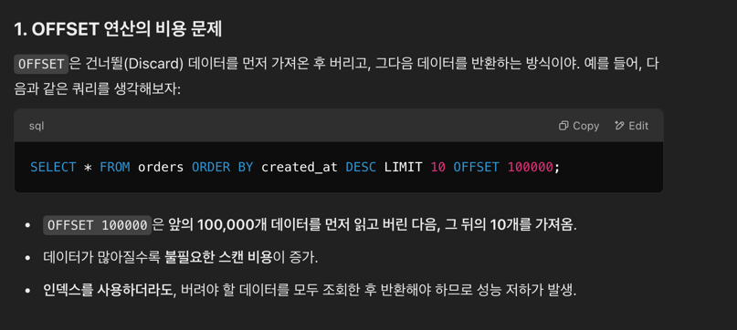

### 댓글 목록 방식
페이지 단위 방식  
page + size 기반  
Page slice 정보 + Content 목록  
특징
- Spring Data에서 Pageable 인터페이스를 사용
- Page 단위 offset을 찾기 위한 성능 이슈
- 대상 Content의 count를 매번 계산해야 한다.
- 목록 조회시 신규 컨텐츠 생성되면 slice간 중복 컨텐츠 노출  

쉽게 말해, Offset방식과 Cursor방식이 존재합니다.  

최근엔 page 기반으로 잘 안하려고 한다.  
offset 연산에서 성능 이슈가 발생한다.

커서 기반 방식  
- cursor offset + maxSize 기반
- offset 이후의 목록을 최대 maxSize 만큼 반환
- 특징 
  - Page slice의 직접적인 이동 불가
  - 조회 기준이 되는 offset을 지정

Cursor 기반 방식은 특정 컬럼(예: id, created_at)을 기준으로 정렬해야 해서, 정렬 기준을 바꾸는 것이 어렵다.

예를 들어, created_at DESC를 기준으로 페이지네이션하면 문제없지만,
ORDER BY price DESC, created_at DESC처럼 다중 정렬이 필요하면 구현이 까다로워질 수 있음.  
또한, 일부 컬럼은 커서로 사용하기 어려움 (예: text 같은 가변 길이 문자열).  

Cursor 기반 페이지네이션은 일반적으로 다음 페이지로만 이동하는 구조라서, 이전 페이지로 이동하는 기능을 지원하기 어렵다.  
OFFSET 기반에서는 5페이지에서 4페이지로 쉽게 이동할 수 있지만,  
Cursor 기반에서는 이전 페이지의 커서 값을 저장하고 있어야 가능함.  
이 때문에, 무한 스크롤(Endless Scrolling)에는 적합하지만, 일반적인 페이지네이션 UI(1, 2, 3, ... 페이지)에는 부적합하다.  

