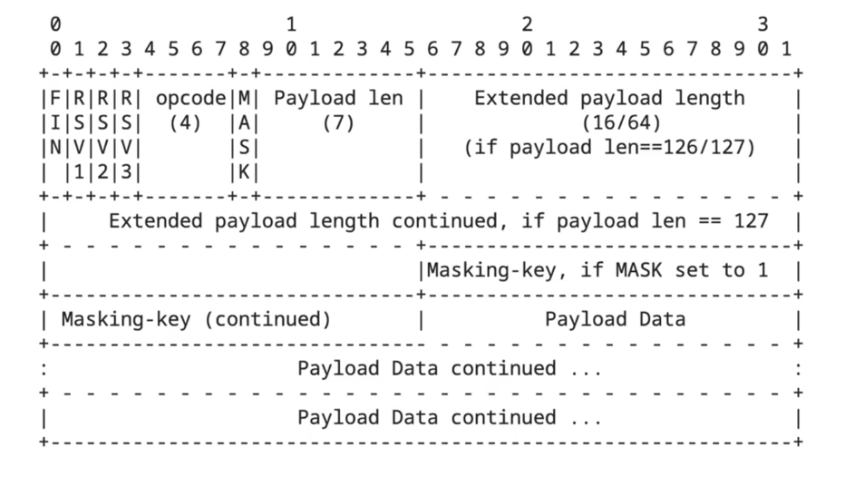

### WebSocket이란?

TCP기반의 연결을 통해 서버와 클라이언트간의 메시지를 주고 받기 위한 통신 프로토콜입니다.  

### WebSocket의 특징과 사용
- 양방향/실시간/효율적인 통신
- 브라우저 호환성, 구현의 복잡성
- 채팅, 인터넷 게임, 주식 거래 사이트, 협업 툴

지속적인 연결을 유지한다는 특징이 있기 때문에, stateful합니다.  

### Web Socket과 HTTP 비교

HTTP 프로토콜 : 반이중 통신  
한 번의 리퀘스트와  리스폰스를 주고 받기 위해서는 3-way handshake라는 과정을 거쳐야 하는데 10번의 데이터를 주고 받기 위해서는 핸드 쉐이크도 10번이 필요합니다.  
이로 인한 오버헤드도 HTTP 단점 중 하나 입니다.  

웹 소켓은 서버로 연결을 맺기 위한 최초의 핸드쉐이크 과정을 통해서 연결이 맺어진 이후에는 클라이언트와 서버 각자 원하는 시점에 원하는 데이터를 보낼 수 있게 됩니다.  
속도가 빨라 채팅이나 게임 같이 실시간성으로 데이터를 주고받아야 하는 어플리케이션을 구현하는데 있어서  HTTP에 비해 굉장한 이점을 갖게 됩니다.  

### Web Socket 이전의 실시간 통신 방식

Polling 방식  
서버에 일정간격으로 요청을 반복합니다.  

LongPolling 방식  
서버에서 응답이 있을 때까지 **연결을 지속**합니다.  

Streaming 방식  
한번의 연결로 서버에서 다수의 응답을 받습니다.  

### Web Socket 핸드쉐이크 과정

최초 요청은 HTTP 프로토콜을 이용해 이루어지고, 클라이언트에서 서버로 보내는 최초의 요청은
Get메서드를 이용해 웹소켓 프로토콜로의 업그레이드 요청을 보냅니다.  서버에서는 이에대한 응답으로 일반적인 서버의 응답코드에서 내려주는 200이 아닌, 101을 내려주게 됩니다.  

이후엔 HTTP가 아닌 웹소켓 프로토콜을 이용해 데이터를 자유자재로 주고받을 수 있게 됩니다. 
웹소켓이 주고 받는 데이터 형태는 프레임이라는 데이터 형식을 사용하게 됩니다.  

### Frame 구조

프레임은 웹소켓 프로토콜에서 사용하는 가장 작은 단위의 데이터입니다.  

크게 헤더와 페이로드로 구성되어 있으며 비트 단위로 구분이 됩니다.  
첫번째 비트는 FIN으로 불리우고, 데이터의 마지막 프레임 여부를 알려줍니다.  

RSV1,2,3는 핸드쉐이크 과정에서 웹소켓 익스텐션스라는 헤더를 통해 별도로 정의하지 않는다면 기본값으로 0을 사용합니다.  

opcode : payload에 대해 어떻게 해석해야 하는지에 대한 값을 담아줍니다.  
opcode를 통해 payload에 들어있는 데이터가 이진 데이터인지 텍스트인지 전체 데이터의 일부인지등에 대해 알 수 있습니다.  

mask : 현재 프레임이 마스킹되어 있는지에 대한 여부를 나타내는 플래그 입니다.  
mask는 클라이언트에서 서버로 보낼 때 필수적으로 적용되는 보안 기능입니다.  

WebSocket은 프록시 서버 및 중간 공격자를 방지하기 위해 클라이언트에서 서버로 보내는 모든 메시지를 마스킹해야 해.  
이는 XOR 연산을 통해 데이터를 변형하여, 프록시 서버가 데이터를 쉽게 읽지 못하도록 함.  

클라이언트에서 서버로 전송되는 데이터인 경우에는 무조건 1로 설정이 되어 있어야 합니다.  

payload length : 페이로드이 길이  
페이로드의 길이가 0에서 125사이일 때는 최초의 7비트를 이용해 길이를 표현합니다.  
그보다 클 경우에는 최초의 7비트를 126으로 고정하고, 그 이후해 2바이트를 사용하여 16비트 언사인드 인티저 형태로 표기하거나  
그보다도 길이가 클 경우 최초의 7비트를 127로 고정하고 그 이후에 8바이트를 사용해서 64비트 언서인드 인티저로 길이를 표현합니다.  

페이로드의 길이 비트 이후에는 마스크 비트가 1일경우엔 4바이트의 마스킹 키 값을 담고,
이어서 페이로드 데이터를 담게 됩니다.  웹소켓 프로토콜 상자에서 주고 받는 모든 데이터는 프레임을 통해서 송수신하게 됩니다.  

웹 소켓 프로토콜은 어플리케이션 레벨의 프로토콜이 아니기 때문에,
주고 받는 메시지 성격에 대한 충분한 정보가 없습니다.  

Simple Text Oriented Message Protocol  
그렇기 때문에 프레임워크나 컨테이너가 메시지를 어떻게 처리해야할지 알 수가 없습니다.  
단순한 어플리케이션에서 사용하기에는 너무 낮은 수준의 기능을 제공합니다.

웹소켓 RFC에서는 웹소켓 프로토콜을 위해서 작동하는 서브 프로토콜의 사용을 정의하고 있습니다.  

그러한 **서브 프로토콜의 하나로 스톰프**가 있습니다.  

기본적으로 publish와 subscribe 구조로 되어 있어서, 메시지를 전송하고 받아서 처리하는 부분의 구분이 확실합니다.  
스톰프도 프레임을 기반으로 한 프로토콜입니다.  

스톰프의 커맨드, 헤더, 그리고 본문으로 이루어진 간단한 구조입니다.  

사용되는 커맨드는 클라이언트와 서버가 구분이 되어있습니다.  

### WebSocket 지원과 한계
브라우저 별로 웹소켓을 지원하는 상황이 다릅니다.  

다행히도, 웹 소켓을 사용할 수 없는 상황에도 웹소켓을 모방할 수 있는 기능들을 제공하는 
소켓.io나 sockjs와 같은 Js 라이브러리가 있습니다.  

