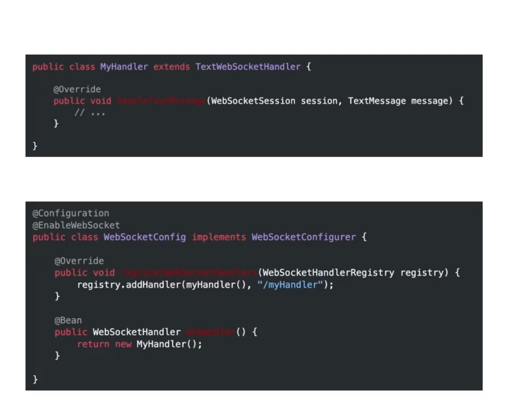
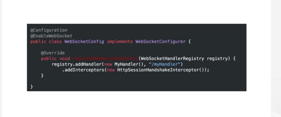
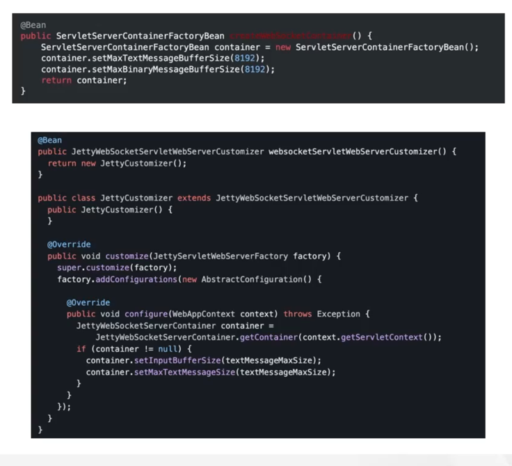
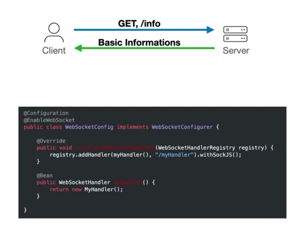
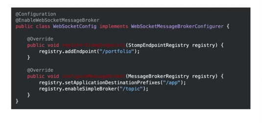
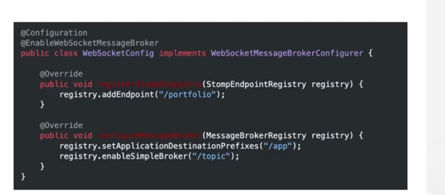
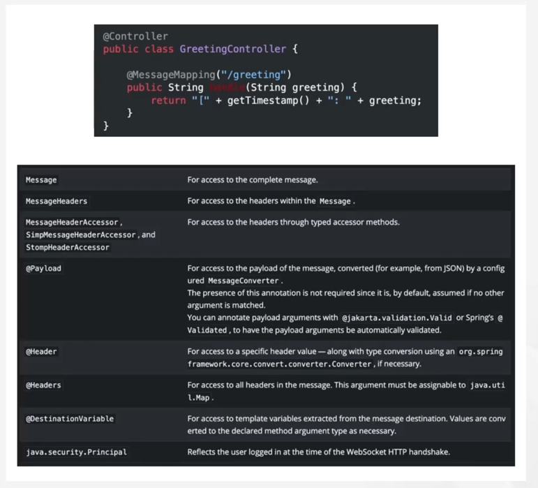
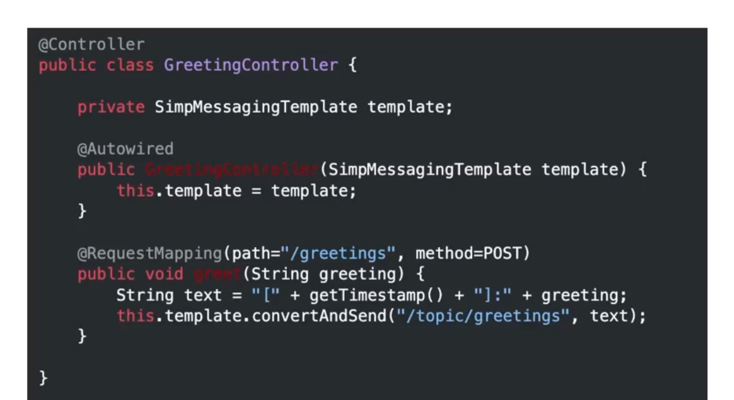
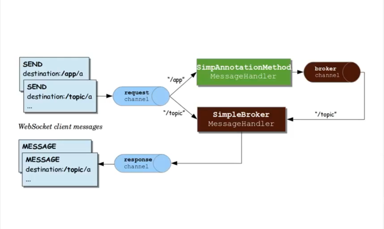

### WebSocket과 Spring Framework

(1) Web Socket API
WebSocket 메시지를 다룰 수 있는 API 제공   

(2) SockJs Fallback
WebSocket이 정상적으로 작동하지 않는 환경을 위한 SockJS 프로토콜 지원

(3) STOMP
STOMP 브로커 기능을 제공  

### WebSocketAPI

WebSocketHandler  

binaryWebsocket Handler
TextWebsocket Handler

WebSocket HandShake

HandShake Intercetpor를 제공합니다.  

핸드 쉐이크 과정중에 일어나는 인증, 서브 프로토콜 협상 등의 여러가지 부가적인 작업들을 제어할 수 있습니다.  

Configuring the Server  

웹소켓의 메시지 버퍼 사이즈, 각종 타임아웃과 같은 설정을 손쉽게 제어할 수 있습니다.  

Tomcat과 Jetty는 둘 다 자바 웹 어플리케이션을 실행하는 서블릿 컨테이너(웹 서버)입니다.  

### SockJs
WebSocket을 사용할 수 없는 환경 지원  

클라이언트가 웹소켓, 스트리밍, 롱폴링 통신 방식 중에서 적절한 방식을 선택하기 위해서는 서버로 요청를 보내서 세션 쿠키의 사용 여부등 여러가지 기본적인 정보를 받아야 합니다.  
프록시에서 연결이 끊기는 것을 방지하기 위해서 서버에서는 hearbeat을 지속적으로 보내주어야 합니다.  

### STOMP

메시지 관련 프로토콜  

Annotated Controllers

로직이 수행된 후 return되는 string은 스톰프 메시지의 페이로드로 변환되어,
토픽 그리팅즈를 구독하고 있는 클라이언트에게 메시지를 반환하게 딥니다.

Sendings Messages  

서버에서 원하는 메시지를 원하는 겅로의 클라이언트로 보낼 수 있게 됩니다.  

Flow of Messages

clientInboundChannel  
웹소켓 클라이언트로부터 받은 메시지를 서버로 넘겨주는 역할을 합니다.  

brokerChannel  
서버 내에서 발생하는 **메시지를 심플 브로커에게 전달**하는 역할을 합니다.  

SimpleBroker  
클라이어트들로부터 받은 **구독 요청들을 메모리에 관리**하고 있다가 목적지가 일치하는 메시지가 들어오는 경우,
**해당 하는 클라이언트에게 메시지를 전송하는 역할**을 합니다.  

clientOutboundChannel  
서버의 메시지를 웹 소켓 클라이언트로 전달하는 역할을 합니다.  

