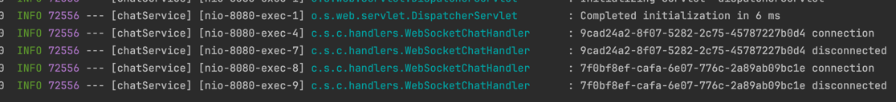

### WebSocket Handler 구현

WebSocketChatHandler
```java
package com.sangyunpark99.chatservice.handlers;

import lombok.extern.slf4j.Slf4j;
import org.springframework.stereotype.Component;
import org.springframework.web.socket.CloseStatus;
import org.springframework.web.socket.WebSocketMessage;
import org.springframework.web.socket.WebSocketSession;
import org.springframework.web.socket.handler.TextWebSocketHandler;

@Slf4j
@Component
public class WebSocketChatHandler extends TextWebSocketHandler {

    @Override
    public void afterConnectionClosed(WebSocketSession session, CloseStatus status) throws Exception { // 웹소켓 클라이언트가
        log.info("{} disconnected", session.getId());
    }

    @Override
    public void afterConnectionEstablished(WebSocketSession session) throws Exception { // 메시지를 처리하는 로직을 작성
        log.info("{} connection", session.getId());
    }

    @Override
    public void handleMessage(WebSocketSession session, WebSocketMessage<?> message) throws Exception { // 연결을 끊었을때
        // 처리하는 로직
        //log.info("{} disconnected", session.getId());
    }
}

```

Configuration
```java
package com.sangyunpark99.chatservice.configuration;

import com.sangyunpark99.chatservice.handlers.WebSocketChatHandler;
import lombok.RequiredArgsConstructor;
import org.springframework.context.annotation.Configuration;
import org.springframework.web.socket.config.annotation.EnableWebSocket;
import org.springframework.web.socket.config.annotation.WebSocketConfigurer;
import org.springframework.web.socket.config.annotation.WebSocketHandlerRegistry;

@EnableWebSocket
@Configuration
@RequiredArgsConstructor
public class WebSocketConfiguration implements WebSocketConfigurer {

    private final WebSocketChatHandler webSocketChatHandler;

    @Override
    public void registerWebSocketHandlers(WebSocketHandlerRegistry registry) {
        registry.addHandler(webSocketChatHandler, "/ws/chats");
    }
}

```
/ws/chat 경로로 들어오는 경우, webSocketChatHandler를 실행해 줍니다.  



지정해준대로 로그가 잘 나오게 됩니다.  

### 클라이언트에서 메시지 전송 시, 다른 클라이언트로 메시지를 전달하는 기능  

그러기 위해선, 현재 서버에 접속되어 있는 클라이언트들이 어떤건지 알아야 한다.  

```java
package com.sangyunpark99.chatservice.handlers;

import lombok.extern.slf4j.Slf4j;
import org.springframework.stereotype.Component;
import org.springframework.web.socket.CloseStatus;
import org.springframework.web.socket.WebSocketMessage;
import org.springframework.web.socket.WebSocketSession;
import org.springframework.web.socket.handler.TextWebSocketHandler;

import java.util.HashMap;
import java.util.Map;

@Slf4j
@Component
public class WebSocketChatHandler extends TextWebSocketHandler {

    final Map<String, WebSocketSession> webSocketSessionMap = new HashMap<>();

    @Override
    public void afterConnectionClosed(WebSocketSession session, CloseStatus status) throws Exception { // 웹소켓 클라이언트가
        log.info("{} disconnected", session.getId());
    }

    @Override
    public void afterConnectionEstablished(WebSocketSession session) throws Exception { // 메시지를 처리하는 로직을 작성
        log.info("{} connection", session.getId());
    }

    @Override
    public void handleMessage(WebSocketSession session, WebSocketMessage<?> message) throws Exception { // 연결을 끊었을때
        // 처리하는 로직
        //log.info("{} disconnected", session.getId());
    }
}
```
webSocketSessionMap을 하나 생성해서, 서버에 접속한 클라이언트들을 관리해줍니다.  

afterConnectionEstablished에서 웹소켓 클라이언트가 서버로 접근했을 때, 해당 클라이언트를 저장해 주도록 합니다.  