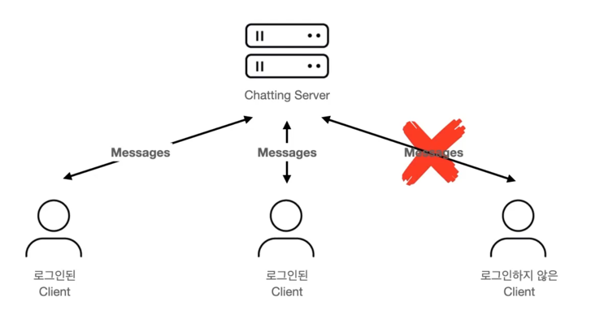
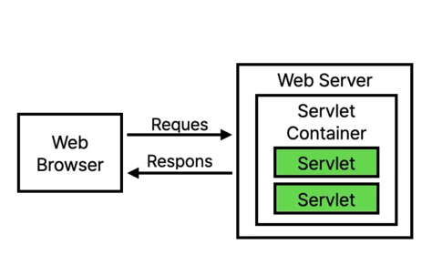
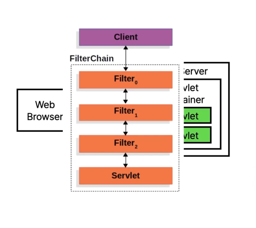
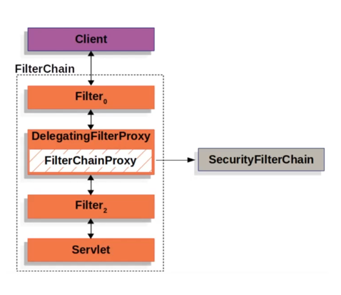
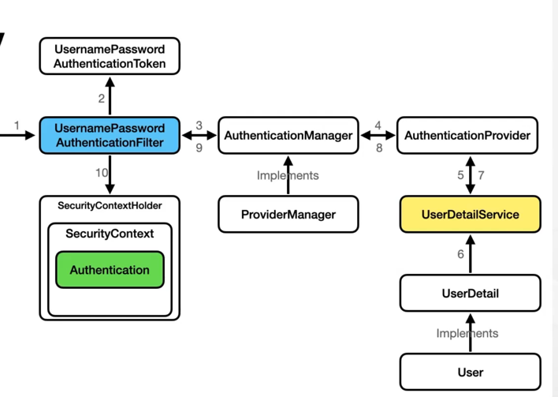

### 로그인 기능




### Spring Security란

인증 및 인가 ,접근 제어 기능을 제공하는 스프링의 하위 프레임워크  



스프링 부트에서는 톰캣이라고 하는 웹 서버를 내장하고 있는데, 이 톰캣이 우리가 작성한 서블릿 코드를 실행할 수 있게 해주는 서블릿 컨테이너 입니다.  





계층화된 필터 안에 스프링 시큐리티가 어떻게 적용되어 있는지를 보여주고 있습니다.  
복수계의 필터 중에 하나로 삽입되어 있으나 여러개의 시큐리티 필터 체인을 구성하고 있고, 새로운 시큐리티 필터 체인을 추가하거나 기존의 것을 수정하는 것으로 다양한 
기능을 확장할 수 있도록 되어 있습니다.

### Form Login Flow



build.gradle에 dependency 추가

```java
dependencies {
    implementation 'org.springframework.boot:spring-boot-starter-data-jpa'
    implementation 'org.springframework.boot:spring-boot-starter-web'
    implementation 'org.springframework.boot:spring-boot-starter-security'
    implementation 'org.springframework.boot:spring-boot-starter-websocket'
    compileOnly 'org.projectlombok:lombok'
    annotationProcessor 'org.projectlombok:lombok'
    testImplementation 'org.springframework.boot:spring-boot-starter-test'
    testRuntimeOnly 'org.junit.platform:junit-platform-launcher'

    runtimeOnly 'com.mysql:mysql-connector-j'
}
```