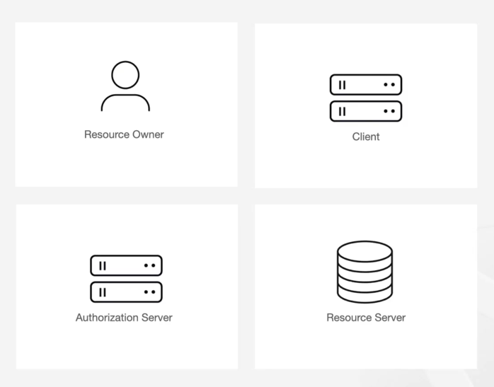
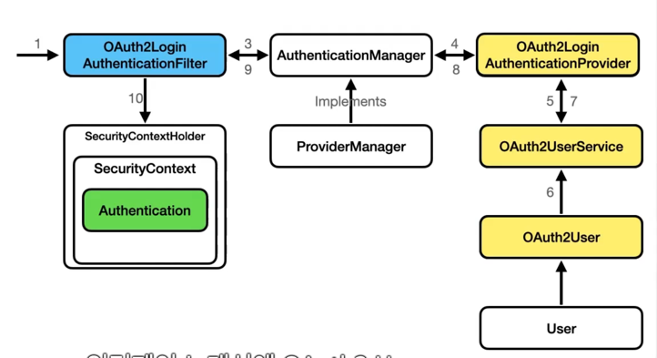

### 로그인 기능 고도화하기  

### OAuth2
Open Authorization Protocol  
사용자의 ID와 비밀번호를 공유하지 않고도 다른 서버에서 제공하고 있는 정보에 사용자를 대신해서 접근할 수 있는 기능을 제공합니다.  
구글이나 카카오톡 같이 신뢰할 수 있는 서비스 제공자를 통해서 제3의 서비스에 로그인할 수 있습니다.  그렇기 때문에 다양한 신규 서비스에서 많이 사용되고 있는 기술 입니다.  

### OAuth2에서 정의하는 4개의 롤


Resource owner : 사용자  
Client : 사용자 인증을 통해 카카오톡에 저장되어 있는 사용자 정보에 접근하고자 하는 어플리케이션 (서버)
Authorization Server : 사용자의 인증을 받은 클라이언트에게 엑세스 토큰을 발급해줄 수 있는 서버 (카카오톡 인증 서버)
Resourcing Server : 사용자의 정보를 담고 있는 서버 (카카오톡 API 서버)

### Authorization Code Grant Flow


Spring Security에서는 Oauth2 클라이언트라는 추가적인 모듈을 제공하고 있습니다.  
해당 모듈을 프로젝트의 종속성으로 추가하게 되면, Spring Boot의 Auto Configuration이 작동해 oauth2가 기본으로 설정이 됩니다.  
 
이로 인하여 더 이상 인증 과정에서 username, password Authentication Filter, username password Authentication Token,
User Details Service,  UserDetails가 사용되지 않고, Oauth2로그인을 위해 구현된 Oauth2 로그인 Authentication Filter,
Oauth2 로그인 Authentication Provider OAuth2UserService, OAuth2User, 

로그인 과정을 커스터마이징 하기 위해서는 User Detail Service 인터페이스 대신에 OAuth2 User Service 인터페이스를 사용해야 합니다.  

```java
spring:
  application:
    name: chatService
  security:
    oauth2:
      client:
        registration:
          kakao:
            client-id: eb7c38ae9a2414fca51b2b06cffcfdda
            client-secret: 520deAyeSsoWrSIci1ZW50zj8cYxXTcJ
            scope:
              - profile_nickname
            redirect-uri: "http://localhost:8080/login/oauth2/code/kakao"
            client-name: kakao
            authorization-grant-type: authorization_code
            client-authentication-method: client_secret_post
        provider:
        kakao:
        authorization-uri: https://kauth.kakao.com/oauth/authorize
        token-uri: https://kauth.kakao.com/oauth/token
        user-info-uri: https://kapi.kakao.com/v2/user/name
        user-name-attribute: id
```


Spring Security에서 OAuth2 Provider는 OAuth2를 제공하는 인증 서버(Authorization Server)를 의미합니다.  
즉, provider.kakao는 Kakao가 OAuth2를 제공하는 서버임을 명시하는 설정입니다.  

Spring Boot는 Google, GitHub 등 일부 OAuth2 제공자를 기본적으로 지원합니다.
그러나 Kakao, Naver 같은 제공자는 기본 내장되어 있지 않기 때문에 직접 Provider를 설정해야 합니다.  


