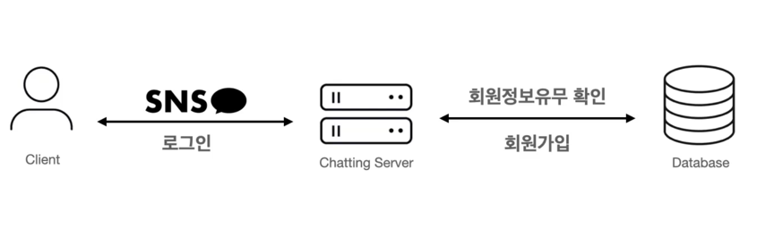
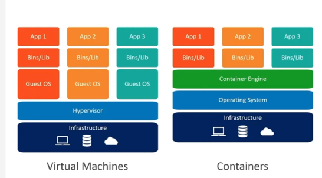
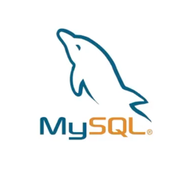

### 회원 가입




### Docker란
컨테이너 기반의 오픈소스 가상화 플랫폼  




### MySQL이란?
대표적인 오프소스 관계형 데이터베이스  



도커 생성
```docker
 docker run --name chat-service-database \
  -e MYSQL_ROOT_PASSWORD=****\
  -e MYSQL_DATABASE=chat_service_db \
  -e MYSQL_USER=chat_service_user \
  -e MYSQL_PASSWORD=****\
  -p 3308:3306 \
  -d mysql:latest
```

```docker
 docker exec -it chat-service-database /bin/bash
```
/bin/bash 접속


