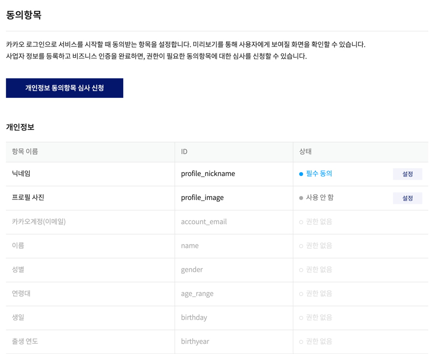
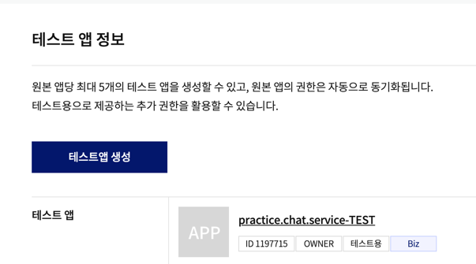

### 회원 정보 가져오기



정보를 받아오기 위해서는 개인정보 동의항목 심사 신청을 합니다.  




Biz앱으로 전환 후, 테스트 앱으로 만듭니다.  

yml또한 변경해 줍니다.  
client_id,client_secret  

추가로 보안을 위해 yml을 ignore처리 해줍니다.  

ignore처리 후, 처리가 잘 안된다면, git cache를 삭제해줍니다.
```java
git rm --cached ./src/main/resources/application.yml
```
application.yml 파일이 존재하는 경로의 캐시를 지워주면 됩니다.  


