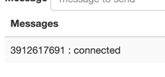

### 회원가입 엔티티 생성

Member entity
```java
package com.sangyunpark99.chatservice.entities;

import com.sangyunpark99.chatservice.entities.enums.Gender;
import jakarta.persistence.*;

import java.time.LocalDateTime;

@Entity
public class Member {

    @Column(name = "member_id")
    @Id @GeneratedValue(strategy = GenerationType.IDENTITY)
    private Long id;

    private String email;

    private String nickName;

    private String name;

    @Enumerated(EnumType.STRING)
    private Gender gender;

    private String phoneNumber;

    private LocalDateTime birthDay;

    private String role;
}

```

Gender Enum
```java
package com.sangyunpark99.chatservice.entities.enums;

public enum Gender {
    MAIE, FEMALE
}
```

OAuth2 서비스
```java
package com.sangyunpark99.chatservice.services;

import org.springframework.security.oauth2.client.userinfo.DefaultOAuth2UserService;;
import org.springframework.stereotype.Service;

@Service
public class CustomOAuth2UserService extends DefaultOAuth2UserService {


}
```

Kakao에서 정보 가져오기
```java
package com.sangyunpark99.chatservice.services;

import com.sangyunpark99.chatservice.entities.Member;
import com.sangyunpark99.chatservice.entities.enums.Gender;
import com.sangyunpark99.chatservice.repository.MemberRepository;
import lombok.RequiredArgsConstructor;
import org.springframework.security.oauth2.client.userinfo.DefaultOAuth2UserService;
import org.springframework.security.oauth2.client.userinfo.OAuth2UserRequest;
import org.springframework.security.oauth2.core.OAuth2AuthenticationException;
import org.springframework.security.oauth2.core.user.OAuth2User;
import org.springframework.stereotype.Service;
import org.springframework.transaction.annotation.Propagation;
import org.springframework.transaction.annotation.Transactional;

import java.time.LocalDate;
import java.time.format.DateTimeFormatter;
import java.util.Map;

@Service
@RequiredArgsConstructor
public class CustomOAuth2UserService extends DefaultOAuth2UserService {

    private final MemberRepository memberRepository;

    @Override
    @Transactional(readOnly = true, propagation = Propagation.NOT_SUPPORTED)
    public OAuth2User loadUser(OAuth2UserRequest userRequest) throws OAuth2AuthenticationException {
        OAuth2User oAuth2User = super.loadUser(userRequest);

        Map<String, Object> attributes = oAuth2User.getAttribute("kakao_account");
        String email = (String) attributes.get("email"); // down casting

        Member member = memberRepository.findByEmail(email).orElseGet(() -> registerMember(attributes));

        return oAuth2User;
    }

    @Transactional
    public Member registerMember(Map<String, Object> attributeMap) {
        Member member = Member.builder()
                .email((String) attributeMap.get("email"))
                .nickName((String)((Map) attributeMap.get("profile")).get("nickname"))
                .name((String) attributeMap.get("name"))
                .phoneNumber((String) attributeMap.get("phone_number"))
                .gender(Gender.valueOf(((String) attributeMap.get("gender")).toUpperCase()))
                .birthDay(getBirthDay(attributeMap))
                .role("USER_ROLE")
                .build();

        return memberRepository.save(member);
    }

    private LocalDate getBirthDay(Map<String, Object> attributeMode) {
        String birthYear = (String) attributeMode.get("birthyear");
        String birthDay = (String) attributeMode.get("birthday");

        return LocalDate.parse(birthYear + birthDay, DateTimeFormatter.BASIC_ISO_DATE);
    }
}

```

StompChatController 응답값 변환
```java
package com.sangyunpark99.chatservice.controllers;

import com.sangyunpark99.chatservice.controllers.dto.ChatMessage;
import lombok.extern.slf4j.Slf4j;
import org.springframework.messaging.handler.annotation.MessageMapping;
import org.springframework.messaging.handler.annotation.Payload;
import org.springframework.messaging.handler.annotation.SendTo;
import org.springframework.security.core.annotation.AuthenticationPrincipal;
import org.springframework.stereotype.Controller;

import java.security.Principal;
import java.util.Map;

@Slf4j
@Controller
public class StompChatController {

    @MessageMapping("/chats") // /pub/chats
    @SendTo("/sub/chats") // 입력한 구독경로로 메시지를 전달
    public ChatMessage handleMessage(@AuthenticationPrincipal Principal principal,
                                     @Payload Map<String, String> payload) {
        log.info("{} send {}", principal.getName(), payload);

        // /pub/chats로 메시지를 발행하게 된다면, 저 경로로 발행된 메시지들은 이 메시지 맵핑 chats로 되어 있는 곳으로 전달되게 됩니다.
        return new ChatMessage(principal.getName(),payload.get("message"));
    }
}
```
유저 정보는 Spring security에서 제공하는 principal을 통해 가져옵니다.  

Principal이 원하는 값을 가져오지 못합니다.  


원하는 값을 가져올 수 있도록 코드를 수정해주어야 합니다.  

OAuth2User를 커스터마이징 해줍니다.  
```java
package com.sangyunpark99.chatservice.vos;

import com.sangyunpark99.chatservice.entities.Member;
import org.springframework.security.core.GrantedAuthority;
import org.springframework.security.oauth2.core.user.OAuth2User;

import java.util.Collection;
import java.util.List;
import java.util.Map;

public class CustomOAuth2User implements OAuth2User {

    private Member member;
    private Map<String, Object> attributes;

    public CustomOAuth2User(Member member, Map<String, Object> attributes) {
        this.member = member;
        this.attributes = attributes;
    }

    @Override
    public Map<String, Object> getAttributes() {
        return this.attributes;
    }

    @Override
    public Collection<? extends GrantedAuthority> getAuthorities() {
        return List.of(() -> member.getRole());
    }

    @Override
    public String getName() {
        return member.getName();
    }
}
```

```java
package com.sangyunpark99.chatservice.services;

import com.sangyunpark99.chatservice.entities.Member;
import com.sangyunpark99.chatservice.entities.enums.Gender;
import com.sangyunpark99.chatservice.repository.MemberRepository;
import com.sangyunpark99.chatservice.vos.CustomOAuth2User;
import lombok.RequiredArgsConstructor;
import org.springframework.security.oauth2.client.userinfo.DefaultOAuth2UserService;
import org.springframework.security.oauth2.client.userinfo.OAuth2UserRequest;
import org.springframework.security.oauth2.core.OAuth2AuthenticationException;
import org.springframework.security.oauth2.core.user.OAuth2User;
import org.springframework.stereotype.Service;
import org.springframework.transaction.annotation.Transactional;

import java.time.LocalDate;
import java.time.format.DateTimeFormatter;
import java.util.Map;

@Service
@RequiredArgsConstructor
public class CustomOAuth2UserService extends DefaultOAuth2UserService {

    private final MemberRepository memberRepository;

    @Override
    public OAuth2User loadUser(OAuth2UserRequest userRequest) throws OAuth2AuthenticationException {
        OAuth2User oAuth2User = super.loadUser(userRequest);

        Map<String, Object> attributes = oAuth2User.getAttribute("kakao_account");
        String email = (String) attributes.get("email"); // down casting

        Member member = memberRepository.findByEmail(email).orElseGet(() -> registerMember(attributes));
        CustomOAuth2User user = new CustomOAuth2User(member, attributes);

        return user;
    }

    @Transactional
    public Member registerMember(Map<String, Object> attributeMap) {
        Member member = Member.builder()
                .email((String) attributeMap.get("email"))
                .nickName((String)((Map) attributeMap.get("profile")).get("nickname"))
                .name((String) attributeMap.get("name"))
                .phoneNumber((String) attributeMap.get("phone_number"))
                .gender(Gender.valueOf(((String) attributeMap.get("gender")).toUpperCase()))
                .birthDay(getBirthDay(attributeMap))
                .role("USER_ROLE")
                .build();

        return memberRepository.save(member);
    }

    private LocalDate getBirthDay(Map<String, Object> attributeMode) {
        String birthYear = (String) attributeMode.get("birthyear");
        String birthDay = (String) attributeMode.get("birthday");

        return LocalDate.parse(birthYear + birthDay, DateTimeFormatter.BASIC_ISO_DATE);
    }
}
```
조회만 호출하는 loadUser에는 트랜잭션을 처리하지 않고, registerMember가 호출될때, 트랜잭션을 선언해 주었다.  
이렇게 되면 조회땐 Transaction을 생성하는 비용을 줄일 수 있고, 저장할 때 만 트랜잭션 사용이 가능하다.

