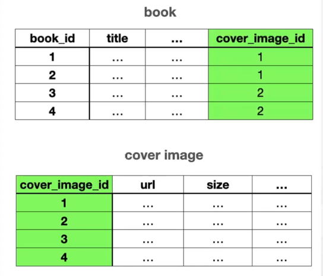
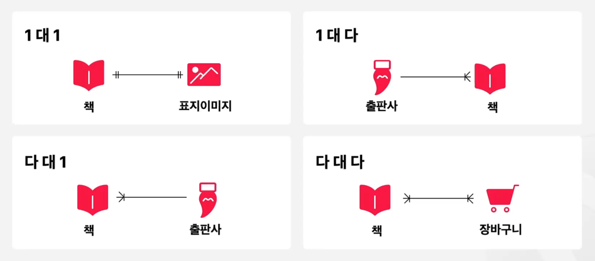

### JPA의 연관관계


채팅방 구현하기  

사용자는 채팅방을 개설할 수 있어야 합니다.  
이미 개설된 채팅방에 참여한다거나 참여하는 채팅방에서 나올 수 있어야 합니다.  
본인이 참여한 채팅방 목록을 확인할 수 있어야 합니다.  

### 도메인 모델과 연관관계

도메인 모델 : 소프트웨어에서 해결하고자 하는 특정한 영역  


도메인 모델간의 논리적인 연결을 연결 관계라고 합니다.  



DB에서 연관관계를 표현하기 위해서는 외래키를 사용합니다.  


### 연관관계의 종류


연관관계의 방향성도 존재한다.  
한쪽만 참조하는 경우 : 단방향  
양쪽다 참조하는 경우 : 양방향  


### JPA 연관관계 정의
1대1


1대N, N대1


lazyLoading : N+1, Lazy  
LazyInitializationException ->  OSIV(Open Session In View) 설정이 꺼져 있거나, 트랜잭션 범위를 벗어난 경우 발생한다.

N대M  


### 채팅방과 사용자의 연관관계  


사용자와 채팅방은 다대다 구조입니다.  


### 엔티티 정의하기

멤버와 채팅방이 다대다 관계이므로 일대다 다대일 구조로 만들어줍니다.  
그 이유는 다대다 관계는 중간 테이블에 데이터가 id밖에 존재하지 않기 때문입니다. join으로 가져오는 데에는 너무 많은 리소스가 듭니다.  

```java
package com.sangyunpark99.chatservice.entities;

import jakarta.persistence.*;

import java.time.LocalDateTime;
import java.util.HashSet;
import java.util.Set;

@Entity
public class Chatroom {

    @Id @GeneratedValue(strategy = GenerationType.IDENTITY)
    @Column(name = "chatroom_id")
    private Long id;

    private String title;

    private LocalDateTime createdAt;

    @OneToMany(mappedBy = "chatroom")
    private Set<MemberChatRoomMapping> memberChatRoomMappings = new HashSet<>();
}

```

```java
package com.sangyunpark99.chatservice.entities;

import com.sangyunpark99.chatservice.entities.enums.Gender;
import jakarta.persistence.*;
import lombok.Builder;
import lombok.Getter;
import lombok.NoArgsConstructor;

import java.time.LocalDate;
import java.util.Set;

@Getter
@Entity
@NoArgsConstructor
public class Member {

    @Column(name = "member_id")
    @Id @GeneratedValue(strategy = GenerationType.IDENTITY)
    private Long id;

    private String email;

    private String nickName;

    private String name;

    @Enumerated(EnumType.STRING)
    private Gender gender;

    private String phoneNumber;

    private LocalDate birthDay;

    private String role;

    @OneToMany(mappedBy = "member")
    private Set<MemberChatRoomMapping> memberChatRoomMappings;

    @Builder
    public Member(String email, String nickName, Gender gender, String phoneNumber, LocalDate birthDay,
                  String role, String name) {
        this.email = email;
        this.name = name;
        this.nickName = nickName;
        this.gender = gender;
        this.phoneNumber = phoneNumber;
        this.birthDay = birthDay;
        this.role = role;
    }
}
```

```java
package com.sangyunpark99.chatservice.entities;

import jakarta.persistence.*;

@Entity
public class MemberChatRoomMapping {

    @Column(name = "member_chatroom_mapping_id")
    @Id @GeneratedValue(strategy = GenerationType.IDENTITY)
    private Long id;

    @JoinColumn(name = "member_id")
    @ManyToOne(fetch = FetchType.LAZY)
    private Member member; // 한명의 회원은 여러개의 매핑을 가질 수 있다.

    @JoinColumn(name = "chatroom_id")
    @ManyToOne(fetch = FetchType.LAZY)
    private Chatroom chatroom; // 채팅방은 여러개의 매핑을 가질 수 있다.
}
```
