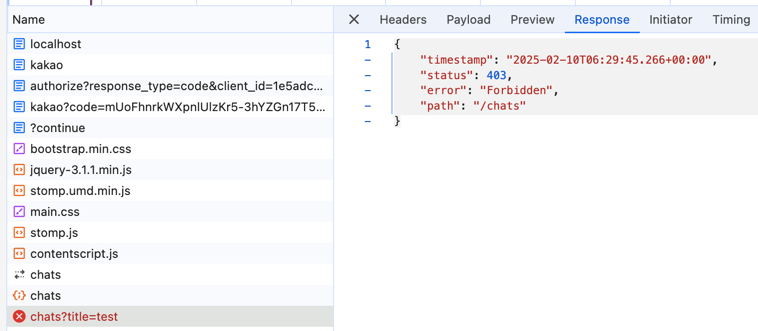

### 채팅방 기능

csrf() 오류 발생


Spring Securitiy 자체적으로 csrf를 방지해 줍니다.  
교차 사이트 요청 위조(Cross-Site Request Forgery, CSRF)는 신뢰할 수 있는 사용자를 사칭해 웹 사이트에 원하지 않는 명령을 보내는 공격입니다. 

Spring Security의 기본 설정을 변경해주도록 하겠습니다.  

```java
package com.sangyunpark99.chatservice.configuration;

import org.springframework.context.annotation.Bean;
import org.springframework.context.annotation.Configuration;
import org.springframework.security.config.Customizer;
import org.springframework.security.config.annotation.web.builders.HttpSecurity;
import org.springframework.security.web.SecurityFilterChain;

@Configuration
public class SecurityConfiguration {

    @Bean
    public SecurityFilterChain securityFilterChain(HttpSecurity httpSecurity) throws Exception {
        return httpSecurity
                .authorizeHttpRequests(request -> request.anyRequest().authenticated()) // 모든 request 인증 처리
                .oauth2Login(Customizer.withDefaults()) // Oauth2활성화
                .csrf(csrf -> csrf.disable()) // csrf 취소
                .build();
    }
}

```