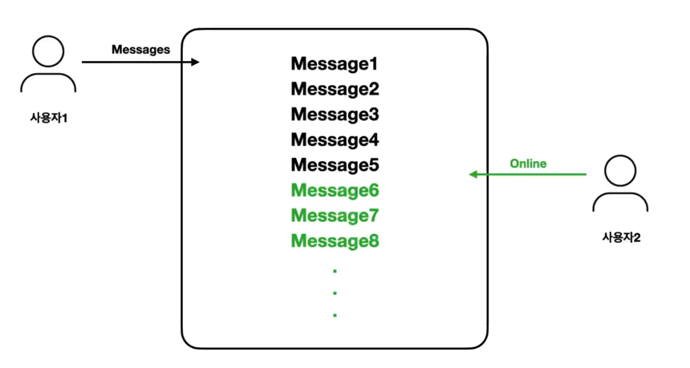
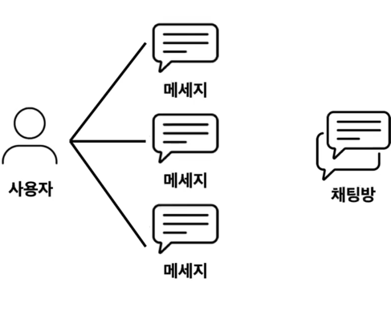
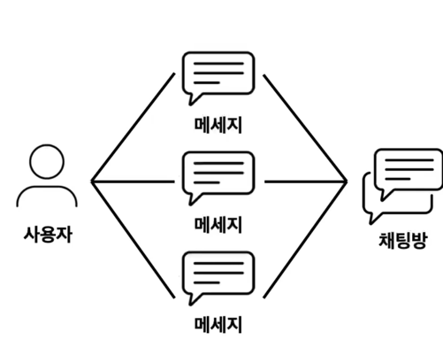
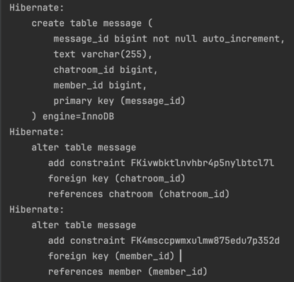

### 과거 메시지 표시하기




과거 메시지를 표시하기 위해선 메시지를 데이터베이스에 저장해야 합니다.  
그리고 사용자와 채팅방 그리고 메시지의 연관관계를 알아야 합니다.

### 메시지와 연관관계


사용자는 자신이 작성한 모든 메시지들에 대해선 꼭 알고 있지 않아도 됩니다.  
반면 메시지는 자신의 작성자에 대해 알고 있어야 하므로, 단방향 연관관계 입니다.




하나의 채팅방에는 여러개의 메시지가 작성될 수 있습니다.  
하나의 메시지는 하나의 채팅방에만 존재할 수 있습니다.  

메시지와 채팅방의 연관관계는 일대다 관계입니다.  
채팅방은 메시지를 모두 알 필요가 없습니다.  추후에 채팅방 내에서 작성된 메시지가 너무 많아지는 경우 문제의 여지가 될 수 있습니다.  
반면, 메시지는 자신이 어떤 채팅방에 소속되어 있는지에 대한 메시지를 갖고 있어야 합니다.  
채팅방과 채팅은 단방향 연관관계를 가집니다.  


```java
package com.sangyunpark99.chatservice.entities;

import jakarta.persistence.*;

@Entity
public class Message {

    @Id
    @Column(name = "message_id")
    @GeneratedValue(strategy = GenerationType.IDENTITY)
    private Long id;

    private String text;

    @JoinColumn(name = "member_id")
    @ManyToOne(fetch = FetchType.LAZY)
    private Member member;

    @JoinColumn(name = "chatroom_id")
    @ManyToOne(fetch = FetchType.LAZY)
    private Chatroom chatroom;

}
```




### Service
```java
    public List<Message> getMessages(Long chatroomId) {
        return messageJpaRepository.findAllByChatroomId(chatroomId);
    }
```

```java
@GetMapping("/{chatroomId}/messages")
    public List<ChatMessage> getMessages(@PathVariable(name = "chatroomId") Long chatroomId) {
        List<Message> messages = chatService.getMessages(chatroomId);
        return messages.stream().map(message -> new ChatMessage(message.getMember().getName(), message.getText())).collect(Collectors.toList());
    }
```

```java
Hibernate: 
    select
        m1_0.member_id,
        m1_0.birth_day,
        m1_0.email,
        m1_0.gender,
        m1_0.name,
        m1_0.nick_name,
        m1_0.phone_number,
        m1_0.role 
    from
        member m1_0 
    where
        m1_0.member_id=?
```