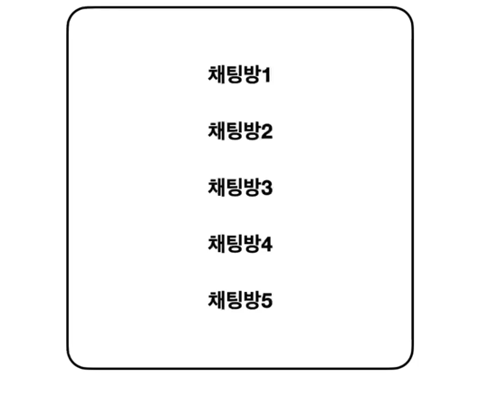
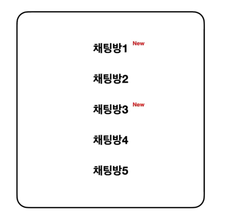

### 신규 메시지 알림 기능 구현하기



사용자가 참여하고 있는 여러 채팅방 중에서 사용자가 확인하지 않은 메시지가 있는 채팅방에 신규 메시지 알림  
  

이는 데이터베이스에 저장되어 있는 데이터를 이용하여 채팅방 목록을 가져올 때 적용해야 합니다.  

MemberChatRoomMapping
```java
package com.sangyunpark99.chatservice.entities;

import jakarta.persistence.*;
import lombok.AccessLevel;
import lombok.Builder;
import lombok.Getter;
import lombok.NoArgsConstructor;

import java.time.LocalDateTime;

@Getter
@Entity
@NoArgsConstructor(access = AccessLevel.PROTECTED)
public class MemberChatRoomMapping {

    @Column(name = "member_chatroom_mapping_id")
    @Id @GeneratedValue(strategy = GenerationType.IDENTITY)
    private Long id;

    @JoinColumn(name = "member_id")
    @ManyToOne(fetch = FetchType.LAZY)
    private Member member; // 한명의 회원은 여러개의 매핑을 가질 수 있다.

    @JoinColumn(name = "chatroom_id")
    @ManyToOne(fetch = FetchType.LAZY)
    private Chatroom chatroom; // 채팅방은 여러개의 매핑을 가질 수 있다.

    private LocalDateTime lastCheckedAt;

    @Builder
    public MemberChatRoomMapping(Member member, Chatroom chatroom) {
        this.member = member;
        this.chatroom = chatroom;
    }
}
```

Message
```java
package com.sangyunpark99.chatservice.entities;

import jakarta.persistence.*;
import lombok.AccessLevel;
import lombok.Builder;
import lombok.Getter;
import lombok.NoArgsConstructor;

import java.time.LocalDateTime;

@Getter
@Entity
@NoArgsConstructor(access = AccessLevel.PROTECTED)
public class Message {

    @Id
    @Column(name = "message_id")
    @GeneratedValue(strategy = GenerationType.IDENTITY)
    private Long id;

    private String text;

    @JoinColumn(name = "member_id")
    @ManyToOne(fetch = FetchType.LAZY)
    private Member member;

    @JoinColumn(name = "chatroom_id")
    @ManyToOne(fetch = FetchType.LAZY)
    private Chatroom chatroom;

    private LocalDateTime createdAt;

    @Builder
    public Message(String text, Member member, Chatroom chatroom) {
        this.text = text;
        this.member = member;
        this.chatroom = chatroom;
    }
}

```

만약  private LocalDateTime lastCheckedAt;  
보다  private LocalDateTime createdAt;가 더 최근인 경우엔 읽지 않은 메시지 입니다.  

```java
package com.sangyunpark99.chatservice.entities;

import jakarta.persistence.*;
import lombok.AccessLevel;
import lombok.Builder;
import lombok.Getter;
import lombok.NoArgsConstructor;

import java.time.LocalDateTime;
import java.util.HashSet;
import java.util.Set;

@Getter
@Entity
@NoArgsConstructor(access = AccessLevel.PROTECTED)
public class Chatroom {

    @Id @GeneratedValue(strategy = GenerationType.IDENTITY)
    @Column(name = "chatroom_id")
    private Long id;

    @Transient
    Boolean hasNewMessage;

    private String title;

    private LocalDateTime createdAt;

    @OneToMany(mappedBy = "chatroom")
    private Set<MemberChatRoomMapping> memberChatRoomMappings = new HashSet<>();

    @Builder
    public Chatroom(String title, LocalDateTime createdAt) {
        this.title = title;
        this.createdAt = createdAt;
    }
}
```
@Transient 속성은 테이블에 적용이 되지 않습니다.  

```java
 public List<Chatroom> getChatRooms(Member member) {

        List<MemberChatRoomMapping> memberChatRoomMappings =
        memberChatRoomMappingJpaRepository.findAllByMemberId(member.getId());

        return memberChatRoomMappings
        .stream().map(
        (memberChatRoomMapping) -> {
        Chatroom chatroom = memberChatRoomMapping.getChatroom();
        chatroom.setHasNewMessage();
        return chatroom;
        }
        ).collect(Collectors.toList());
}
```
가져오려는 채팅방에 새로운 메시지가 존재하는지에 대한 여부를 파악해준다. setHasMessage()를 사용해서 @Transient의 값을 변경해 줍니다.  

서버에서 stomp 메시지를 발행하는 경우 사용하는 함수  
```java
@Slf4j
@Controller
@RequiredArgsConstructor
public class StompChatController {

    private final ChatService chatService;
    private final SimpMessagingTemplate simpMessagingTemplate;

    @MessageMapping("/chats/{chatroomId}") // /pub/chats
    @SendTo("/sub/chats/{chatroomId}") // 입력한 구독경로로 메시지를 전달
    public ChatMessage handleMessage(@AuthenticationPrincipal Principal principal,
                                     @DestinationVariable Long chatroomId,
                                     @Payload Map<String, String> payload) {
        log.info("{} send {} in {}", principal.getName(), payload, chatroomId);

        CustomOAuth2User user = (CustomOAuth2User) ((OAuth2AuthenticationToken) principal).getPrincipal();
        chatService.saveMessage(user.getMember(), chatroomId, payload.get("message"));
        // /pub/chats로 메시지를 발행하게 된다면, 저 경로로 발행된 메시지들은 이 메시지 맵핑 chats로 되어 있는 곳으로 전달되게 됩니다.
        simpMessagingTemplate.convertAndSend("/sub/chat/news", chatroomId);
        return new ChatMessage(principal.getName(),payload.get("message"));
    }
}
```
SimpMessagingTemplate를 사용해서 사용자에게 메시지를 발행할 수 있습니다.  

```javascript
function renderChatrooms(chatrooms) {
  $("#chatroom-list").html("");
  for (let i = 0; i < chatrooms.length; i++) {
    $("#chatroom-list").append(
        "<tr onclick='joinChatroom(" + chatrooms[i].id + ")'><td>"
        + chatrooms[i].id + "</td><td>" + chatrooms[i].title
        + "</td><td>"
        + chatrooms[i].memberCount + "</td><td>" + chatrooms[i].createdAt
        + "</td></tr>"
    );
  }
}
```
hasNewMessage가 신규 메시지인 경우 이미지를 보여줍니다.  

```javascript
stompClient.onConnect = (frame) => {
  setConnected(true);
  showChatrooms();
  stompClient.subscribe('/sub/chats/news',
      (chatMessage) => {
        toggleNewMessageIcon(JSON.parse(chatMessage.body), true);
      });
  console.log('Connected: ' + frame);
};
```

채팅방을 이동한 경우, 이전 채팅방에서 잇었던 시간을 기준으로 메시지를 new처리 해줍니다.  
```java
@Transactional
    public boolean joinChatRoom(Member member, Long newChatroomId, Long currentChatroomId) { // 채팅방 유저 가입

        if(currentChatroomId != null) { // 바로 채팅방에 들어가는 경우
            updateLastCheckedAt(member, currentChatroomId);
        }

        if (memberChatRoomMappingJpaRepository.existsByMemberIdAndChatroomId(member.getId(), newChatroomId)) {
            log.info("이미 참여한 채팅방입니다!");
            return false;
        }

        Chatroom chatroom =
                chatRoomJpaRepository.findById(newChatroomId).orElseThrow(() -> new IllegalArgumentException(
                "채팅방이 존재하지 않습니다."));

        MemberChatRoomMapping memberChatRoomMapping = MemberChatRoomMapping.builder()
                .chatroom(chatroom)
                .member(member)
                .build();

        memberChatRoomMappingJpaRepository.save(memberChatRoomMapping);

        return true;
    }
```
```java
@Transactional
    public void updateLastCheckedAt(Member member, Long currentChatroomId) {
        MemberChatRoomMapping memberChatRoomMappings =
                memberChatRoomMappingJpaRepository.findByMemberIdAndChatroomId(member.getId(), currentChatroomId);

        memberChatRoomMappings.updateCheckedAt();
    }
```

```java
function joinChatroom(chatroomId) {
  let currentChatroomId = $("#chatroom-id").val();

  $.ajax({
    type: 'POST',
    dataType: 'json',
    url: '/chats/' + chatroomId + getRequestParam(currentChatroomId),
    success: function (data) {
      console.log('data: ', data);
      enterChatroom(chatroomId, data);
    },
    error: function (request, status, error) {
      console.log('request: ', request);
      console.log('error: ', error);
    },
  })
}
```
기존에 참여하고 있었던 방이 존재하는 경우 currentChatroomId를 넘겨줍니다.  


