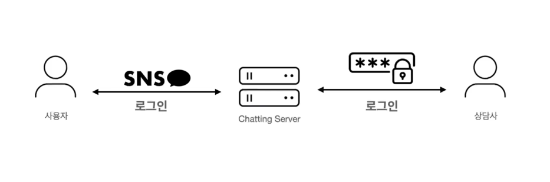
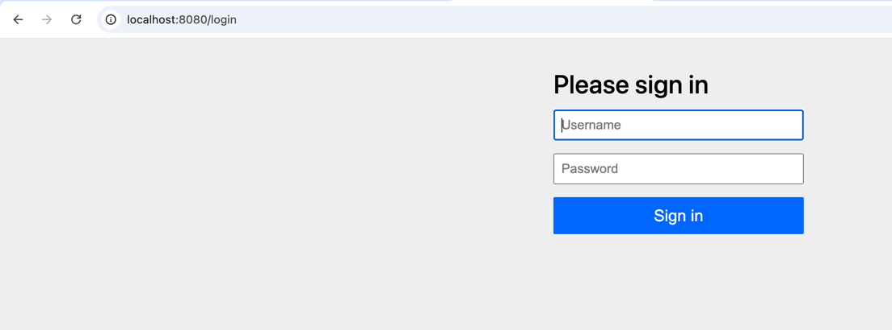

### 상담사 기능 구현하기



사용자가 아닌 상담사로 로그인을 하는 경우에는 시큐리티의 oauth2로그인 필터를 타는 것이 아닌,  
새로 이메일, 비밀번호로 로그인할 수 있는 필터를 타게 해줍니다. (폼 로그인)  

```java
.securityMatcher("/consultants/**", "/login")
```
별도로 '/login' 경로를 제공해주는 이유는 로그인 페이지 화면을 구현하지 않고, **Spring Security에서 제공하는 로그인 폼 화면을 사용**하기 위해서 입니다.  

```java
    @Bean
    public SecurityFilterChain consultantSecurityFilterChain(HttpSecurity httpSecurity) throws Exception {
        return httpSecurity
                .securityMatcher("/consultants/**", "/login")
                .authorizeHttpRequests(request -> request.anyRequest().authenticated())
                .formLogin(Customizer.withDefaults())
                .csrf(csrf -> csrf.disable())
                .build();
    }
```
기존에 oauth2방식에 formLogin 방식으로 변환해 줍니다.  

하나의 어플리케이션에 대해서 두개의 필터를 등록해주었습니다. 등록시 @Bean 어노테이션을 사용합니다.  
이런 경우 어떤 필터가 먼저 적용이 될지는 스프링 차원에선 보장될 수 없으니, 명시적으로 설정을 해줘야 합니다.  

**@Order라는 어노테이션**을 사용합니다.
```java
package com.sangyunpark99.chatservice.configuration;

import org.springframework.context.annotation.Bean;
import org.springframework.context.annotation.Configuration;
import org.springframework.core.annotation.Order;
import org.springframework.security.config.Customizer;
import org.springframework.security.config.annotation.web.builders.HttpSecurity;
import org.springframework.security.web.SecurityFilterChain;

@Configuration
public class SecurityConfiguration {

    @Order(2)
    @Bean
    public SecurityFilterChain securityFilterChain(HttpSecurity httpSecurity) throws Exception {
        return httpSecurity
                .authorizeHttpRequests(request -> request.anyRequest().authenticated())
                .oauth2Login(Customizer.withDefaults())
                .csrf(csrf -> csrf.disable())
                .build();
    }

    @Order(1)
    @Bean
    public SecurityFilterChain consultantSecurityFilterChain(HttpSecurity httpSecurity) throws Exception {
        return httpSecurity
                .securityMatcher("/consultants/**", "/login")
                .authorizeHttpRequests(request -> request.anyRequest().authenticated())
                .formLogin(Customizer.withDefaults())
                .csrf(csrf -> csrf.disable())
                .build();
    }
}
```
consultantSecurityFilterChain에 1을 줌으로 인해 먼저 필터링 되도록 해줍니다.


/consultants에 접속하는 경우 /login 페이지로 리다아렉트 됩니다.  

.securityMatcher("/consultants/**", "/login")는 **특정 URL 패턴에 대해 보안 설정을 적용할 경로를 지정하는 역할**


**폼 로그인을 하기 위해서는 UserDetailsService라고 하는 인터페이스를 구현**해주어야 합니다.  

UserDetails는 interface이므로, 해당 interface를 구현해주는 클래스를 만들어줘야 합니다.  

```java
package com.sangyunpark99.chatservice.services;

import com.sangyunpark99.chatservice.entities.Member;
import com.sangyunpark99.chatservice.repository.MemberJpaRepository;
import com.sangyunpark99.chatservice.vos.CustomUserDetails;
import lombok.RequiredArgsConstructor;
import lombok.extern.slf4j.Slf4j;
import org.springframework.security.access.AccessDeniedException;
import org.springframework.security.core.userdetails.UserDetails;
import org.springframework.security.core.userdetails.UserDetailsService;
import org.springframework.security.core.userdetails.UsernameNotFoundException;
import org.springframework.stereotype.Service;

@Slf4j
@RequiredArgsConstructor
@Service
public class CustomUserDetailsService implements UserDetailsService {

    private final MemberJpaRepository memberJpaRepository;

    @Override
    public UserDetails loadUserByUsername(String username) throws UsernameNotFoundException {

        Member member = memberJpaRepository.findByName(username).orElseThrow(() -> new IllegalArgumentException(
                "존재하지 않는 유저입니다."));
        if(member.getRole() != "ROLE_CONSULTANT") {
            throw new AccessDeniedException("상담사가 이닙니다.");
        }

        return new CustomUserDetails(member);
    }
}

```
인터페이스를 반환해줄 수 없으니 구현체로 사용할 클래스를 생성해서 반환해줍니다.

```java
package com.sangyunpark99.chatservice.vos;

import com.sangyunpark99.chatservice.entities.Member;
import org.springframework.security.core.GrantedAuthority;
import org.springframework.security.core.authority.SimpleGrantedAuthority;
import org.springframework.security.core.userdetails.UserDetails;

import java.util.Collection;
import java.util.List;

public class CustomUserDetails implements UserDetails {

    private Member member;

    public Member getMember() {
        return member;
    }

    @Override
    public Collection<? extends GrantedAuthority> getAuthorities() {
        return List.of(new SimpleGrantedAuthority(member.getRole()));
    }

    @Override
    public String getPassword() {
        return this.member.getPassword();
    }

    @Override
    public String getUsername() {
        return this.member.getName();
    }
}

```

역할을 처리할 때, 기존에 string으로 처리하던 부분을 enum으로 처리해줍니다.   
enum을 사용하는 이유 : 휴먼 에러를 줄이고, 코드를 간결하게 할 수 있습니다.  

```java
package com.sangyunpark99.chatservice.entities.enums;

import java.util.Arrays;

public enum Role {
    USER("ROLE_USER"), CONSULTANT("ROLE_CONSULTANT");

    private String code;

    Role(String code) {
        this.code = code;
    }

    public String getCode() {
        return this.code;
    }

    public static Role fromCode(String code) {
        return Arrays.stream(Role.values())
                .filter(role -> role.getCode().equals(code))
                .findFirst()
                .orElseThrow();
    }
}
```

Spring Security에서 멤버를 제어하기 위해서는 멤버의 패스워드를 패스워드 인코더라고 하는 클래스릁 통해서 **인코딩이 된 값이 들어가야** 합니다.  
왜? Spring Security에서 무조건 비밀번호 값을 디코딩하기 때문입니다.  

```java
package com.sangyunpark99.chatservice.configuration;

import org.springframework.context.annotation.Bean;
import org.springframework.context.annotation.Configuration;
import org.springframework.core.annotation.Order;
import org.springframework.security.config.Customizer;
import org.springframework.security.config.annotation.web.builders.HttpSecurity;
import org.springframework.security.crypto.bcrypt.BCryptPasswordEncoder;
import org.springframework.security.crypto.password.PasswordEncoder;
import org.springframework.security.web.SecurityFilterChain;

@Configuration
public class SecurityConfiguration {

    @Order(2)
    @Bean
    public SecurityFilterChain securityFilterChain(HttpSecurity httpSecurity) throws Exception {
        return httpSecurity
                .authorizeHttpRequests(request -> request.anyRequest().authenticated())
                .oauth2Login(Customizer.withDefaults())
                .csrf(csrf -> csrf.disable())
                .build();
    }

    @Order(1)
    @Bean
    public SecurityFilterChain consultantSecurityFilterChain(HttpSecurity httpSecurity) throws Exception {
        return httpSecurity
                .securityMatcher("/consultants/**", "/login")
                .authorizeHttpRequests(request -> request.anyRequest().authenticated())
                .formLogin(Customizer.withDefaults())
                .csrf(csrf -> csrf.disable())
                .build();
    }

    @Bean
    public PasswordEncoder passwordEncoder() {
        return new BCryptPasswordEncoder();
    }
}
```
@Bean을 사용해 PasswordEncoder를 등록해줍니다.  

보통 사용자를 등록을 할때는 패스워드 두번을 입력합니다.  
Member를 통해서 값을 가져오기 보다는 MemberDto 객체를 통해서 가져와야 합니다.  

```java
public Member saveMember(Member member) {
        return memberJpaRepository.save(member);
    }
```

이렇게 Member를 통해서 값을 받아오는 것이 아닌, MemberDto를 따로 선언해주고 값을 가져옵니다.
```java
package com.sangyunpark99.chatservice.controllers.dto;

public record MemberDto(Long id, String email, String name, String password) {
}

```

```java
package com.sangyunpark99.chatservice.controllers.dto;

import com.sangyunpark99.chatservice.entities.Member;
import com.sangyunpark99.chatservice.entities.enums.Gender;
import com.sangyunpark99.chatservice.entities.enums.Role;

import java.time.LocalDate;

public record MemberDto(
        Long id,
        String email,
        String name,
        String password,
        String confirmPassword,
        String nickName,
        Gender gender,
        String phoneNumber,
        LocalDate birthday,
        Role role
) {

    public static MemberDto from(Member member) {
        return new MemberDto(
                member.getId(),
                member.getEmail(),
                member.getName(),
                null,
                null,
                member.getNickName(),
                member.getGender(),
                member.getPhoneNumber(),
                member.getBirthDay(),
                member.getRole()
        );
    }

    public static Member to(MemberDto memberDto) {
        return Member.builder()
                .id(memberDto.id)
                .nickName(memberDto.nickName)
                .email(memberDto.email)
                .name(memberDto.name)
                .gender(memberDto.gender)
                .phoneNumber(memberDto.phoneNumber)
                .birthDay(memberDto.birthday)
                .role(memberDto.role)
                .build();
    }
}

```
비밀번호에 대한 정보는 Controller 단에서 다뤄줄 일이 없다.  
패스워드는 인코딩을 해야하므로 따로 선언해주지 않습니다.  

회원을 저장하는 메서드를 구현해줍니다.  

```java

    public Member saveMember(MemberDto memberDto) {

        Member member = MemberDto.to(memberDto);
        member.updatePassword(memberDto.password(), memberDto.confirmPassword(), passwordEncoder);

        return memberJpaRepository.save(member);
    }
```
MemberDto.to 스태틱 메서드에서는 비밀번호를 따로 다뤄주지 않기 때문에 updatePassword로 Member 엔티티의 비밀번호를 업데이트 해줍니다.  

Member 엔티티에 선언된 updatePassword 메서드는 아래와 같습니다.
```java
    public void updatePassword(String password, String confirmedPassword, PasswordEncoder passwordEncoder) {
        if(!password.equals(confirmedPassword)) {
            throw new IllegalArgumentException("패스워드가 일치하지 않습니다.");
        }

        this.password = passwordEncoder.encode(password); // 인코딩한 패스워드를 저장
    }
```

엔티티가 프레젠테이션 레이어까지 가는 것은 옳지 않은 방법입니다.  
Entitty를 Dto로 변환해서 반환해줍니다.  

Dto 사용 일관성을 위해서 아래와 같이 코드를 수정합니다.  
```java
public MemberDto saveMember(MemberDto memberDto) {

        Member member = MemberDto.to(memberDto);
        member.updatePassword(memberDto.password(), memberDto.confirmPassword(), passwordEncoder);

        member = memberJpaRepository.save(member);
        
        return MemberDto.from(member);
    }
```
Dto를 반환해주도록 합니다.  

ConsultantController
```java
package com.sangyunpark99.chatservice.controllers;

import com.sangyunpark99.chatservice.controllers.dto.MemberDto;
import com.sangyunpark99.chatservice.services.CustomUserDetailsService;
import lombok.RequiredArgsConstructor;
import lombok.extern.slf4j.Slf4j;
import org.springframework.web.bind.annotation.PostMapping;
import org.springframework.web.bind.annotation.RequestBody;
import org.springframework.web.bind.annotation.RequestMapping;
import org.springframework.web.bind.annotation.RestController;

@Slf4j
@RequiredArgsConstructor
@RequestMapping("/consultants")
@RestController
public class ConsultantController {

    private final CustomUserDetailsService customUserDetailsService;

    @PostMapping
    public MemberDto saveMember(@RequestBody MemberDto memberDto) {
        return customUserDetailsService.saveMember(memberDto);
    }
}

```

Controller를 테스트하기 위해서 여러 방법이 존재하지만, 인텔리제이가 제공하는 방법을 사용해보자.  


인텔리제이에서 HTTP 요청 하는 방법


```java
@Order(1)
    @Bean
    public SecurityFilterChain consultantSecurityFilterChain(HttpSecurity httpSecurity) throws Exception {
        return httpSecurity
                .securityMatcher("/consultants/**", "/login")
                .authorizeHttpRequests(
                        request ->
                                request.requestMatchers(HttpMethod.POST, "/consultants").permitAll()
                                .anyRequest().authenticated()
                )
                .formLogin(Customizer.withDefaults())
                .csrf(csrf -> csrf.disable())
                .build();
    }
```
Http test시 로그인 창으로 redirect되는걸 방지하기 위해 /consultants url은 permitAll을 해줍니다.  