### 서비스 확장 고려하기

단순한 구성!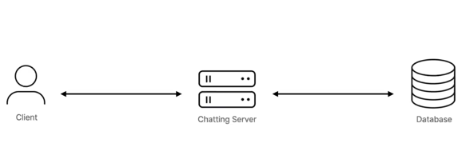

수십, 수백, 수천명의 사용자가 이러한 구조일때 서비스를 사용해도 문제가 없습니다.  

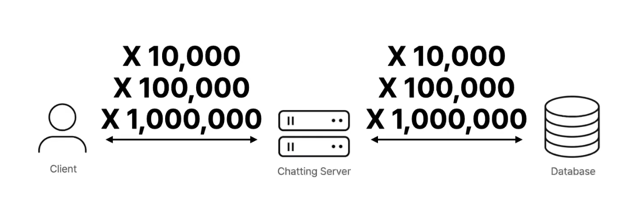
트래픽이 이렇게 많이 몰리게 되면 어떻게 해야할까요? 
 

### 웹 서버 단에서 생각해보기

웹 서버의 성능을 향상시키는 방법
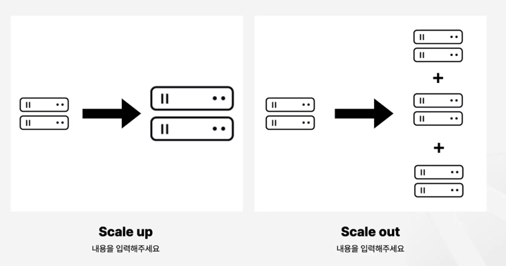

Scale-up : 서버의 하드웨어를 업그레이드 (매우 단순)
Scale-out : 서버의 갯수를 추가 (서비스의 가용성이 높습니다.)

하드웨어의 한계 때문에 단일 서버로 트래픽을 처리하는 것은 한계가 있을 수 있다.

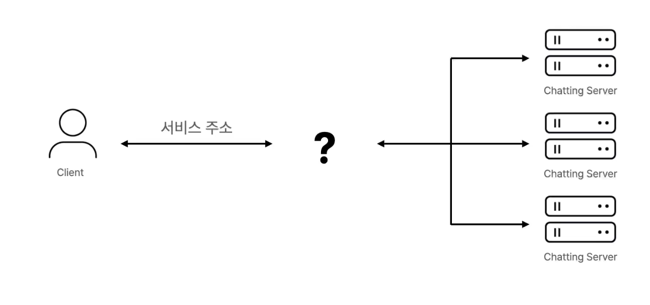

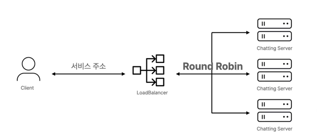

먼저 트래픽을 분배하는 방법입니다.  
로드 밸런서를 통해 서버 부하를 줄여줍니다.
대부분 사용되는 알고리즘 라운드 로빈을 사용합니다.  

세션 관리에 문제가 존재합니다.  
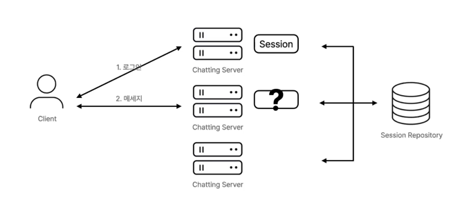

레디스로 세션 관리를 해줍니다.  

JWT(JSON Web Token)를 사용하면 스케일 아웃된 서버 환경에서 세션을 관리하는 부담이 줄어들고, 여러 개의 서버(분산 환경)에서도 인증 처리가 더 편리해집니다.  

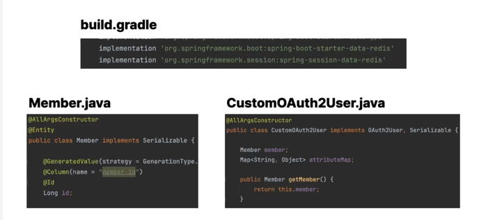

서로 다른 서버에 웹소켓 커넥션을 맺고 있는 사용자들끼리 메시지를 어떻게 주고 받을까요?  
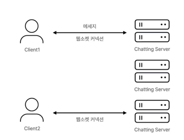

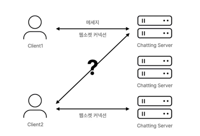
이렇게 해주는 것은 불가능합니다.

따라서,
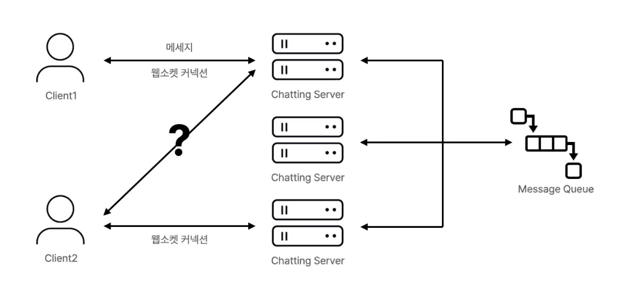
외부의 메시지 브로커를 사용합니다.  
message queue를 사용해서 분산 환경에서 처리해줍니다.  

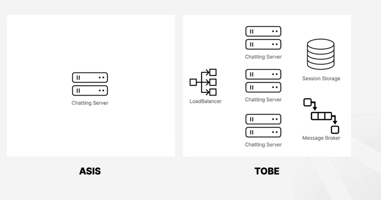
