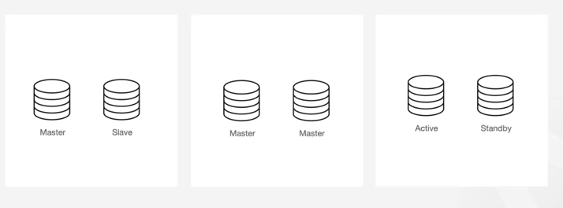
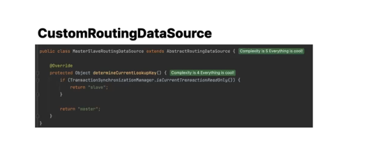
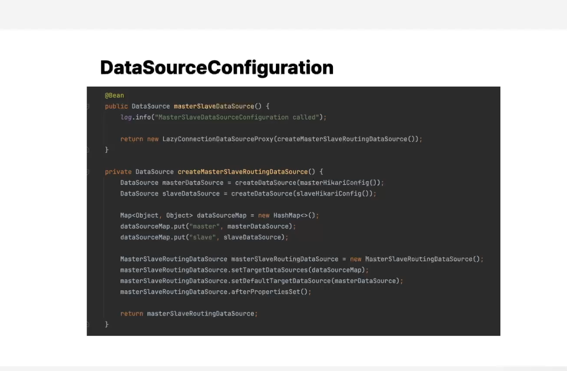
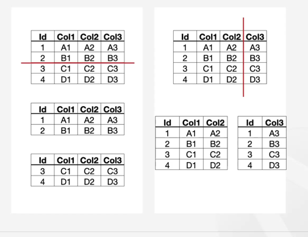
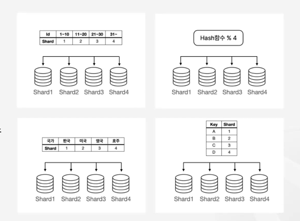
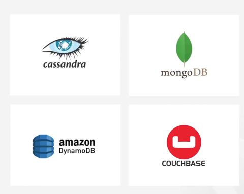

### 서비스 확장 - 데이터베이스

### 클러스터링

여러 서버를 하나의 시스템처럼 작동하게 만드는 기술
복수개의 데이터베이스 인스턴스를 묶어서 하나의 논리적인 인스턴스로 동작하도록 하는 기술을 말합니다.  

여러 서버의 작업을 분산시킴으로써 성능을 높일 수 있고,
일부 인스턴스가 장애가 발생하더라도 다른 인스턴스가 이를 대체할 수 있기때문에, 지속적으로 안정적인 서비스를 운영할 수 있습니다.  

(1) Master-slave 구조
한대의 마스터 노드와 여러대의 슬레이브 노드로 구성이 됩니다.  
마스터 노드에선 쓰기 작업을 진행하고 슬레이브 노드에선 읽기 작업을 담당하도록 구성하여 쓰기에 비해 읽기의 비중이 높은 서비스에서는 슬레이브 노드를 추가함으로써 성능이 향상되게 합니다.  
단, 마스터에 쓰인 데이터가 슬레이브에 적용되기까지 지연이 발생할 수 있습니다.  

(2) Master-Master 구조
여러 마스터 노드가 서로의 데이터를 복제하면서 각 마스터 노드에서 읽기와 쓰기 작업을 모두 처리할 수 있습니다.  
하나의 마스터 노드가 실패하더라도 다른 마스터 노드로 계속해서 서비스 할 수 있기 때문에 서비스 가용성을 올릴 수 있고 필요시에는 마스터 노드를 추가해서 시스템 성능을 확장할 수 있습니다.  
단, 데이터 충돌방지와 일관성 유지를 위해서 추가적인 관리가 필요하다는 단점이 존재합니다.  

(3) 액티브 스탠바이 구조
한 대의 액티브 데이터베이스와 한대 또는 복수계의 스탠바이 데이터베이스로 구성됩니다. 
액티브 노드는 모든 읽기와 쓰기 작업을 처리하고, 스탠바이는 액티브 노드의 장애 시에만 활성화 합니다.  
서비스 중단이 최소화됩니다.  

현재 트랜잭션이 readonly일때는 slave를 그렇지 않은 경우엔 마스터 데이터베이스를 바라보는 커스텀 라우팅 데이터 소스를 정의해주고 
이를 데이터 소스 컨피규레이션에 레이지 커넥션 데이터 소스 프록시를 통해서 등록해주기만 하면 읽기용 트랜잭션은 슬레이브 데이터베이스 대상으로, 쓰기용 트랜잭션은 마스터 데이터베이스 대상으로 동작하도록 손쉽게 
서비스를 개선할 수 있습니다.

### 파티셔닝

데이터를 보다 관리하기 쉽게 논리적인 조각으로 나누는 기법  

데이터 베이스의 테이블을 여러 부분으로 나눠서 각 부분을 별도의 파티션으로 저장하는 방법입니다.  

파티셔닝의 주된 목적은 성능 향상과 데이터 관리의 효율성을 높이는 것입니다.  

수평 파티셔닝 : 데이터를 행으로 분할하는 것을 말합니다.

수직 파티셔닝 : 데이터를 열을 기준으로 분할하는 것을 말합니다.  

Spring에서 엔티티를 행(수평) 또는 열(수직) 기준으로 분리하는 것과 비슷합니다.
수평 파티셔닝 (행 기준 분리) → 엔티티의 데이터를 ID, 날짜, 국가 등의 기준으로 나눠서 관리하는 방식
수직 파티셔닝 (열 기준 분리) → 엔티티의 컬럼을 기능별로 나눠서 다른 테이블로 분리하는 방식입니다.

### 샤딩

데이터를 여러 데이터베이스 인스턴스에 분산 저장하는 기법  

### NoSQL

대용량 데이터를 처리하는데 적합한 데이터 베이

📌 Cassandra의 실무 사용 사례
 1. 대용량 로그 데이터 저장  
Netflix, Uber, Facebook 같은 기업들은 서비스 로그, 클릭 로그, 트랜잭션 로그 저장에 Cassandra를 활용
수십억 개의 이벤트를 빠르게 기록하면서 노드 장애에도 끄떡없음  
 2. IoT 데이터 처리  
IoT 센서에서 발생하는 수백만 개의 데이터 포인트를 빠르게 저장하고 분석
실시간 데이터 스트리밍과 함께 활용 가능  
 3. 글로벌 사용자 데이터 저장  
멀티 리전 배포 가능 → 사용자가 미국, 유럽, 아시아에 있어도 빠른 응답 제공
SNS, 메시징 서비스에서 유저 프로필, 게시물 데이터 저장

자동 샤딩을 지원합니다.  

